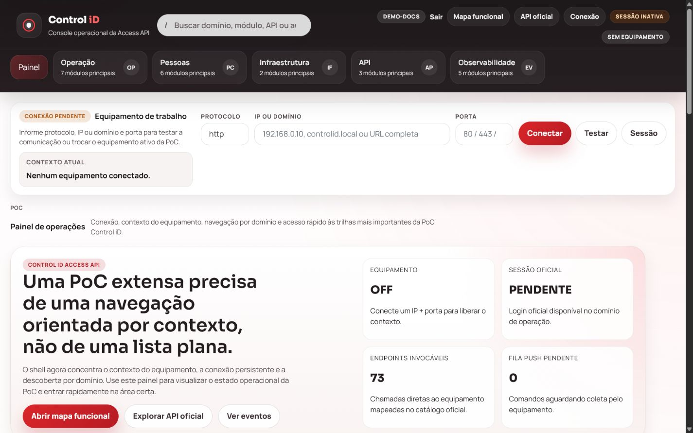
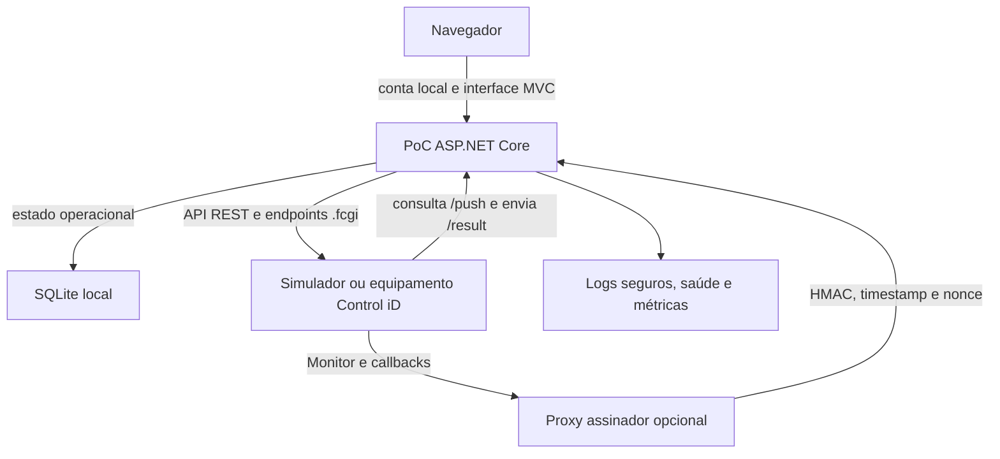
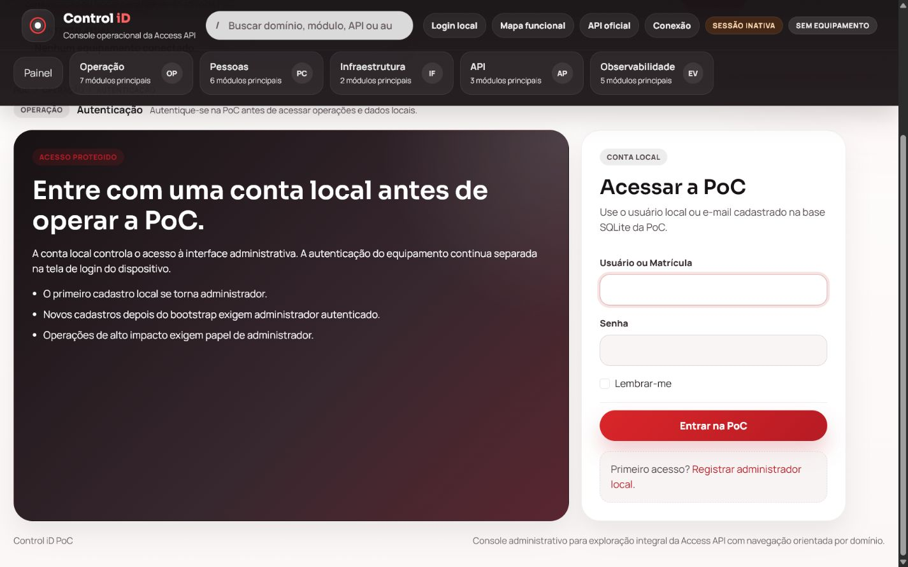
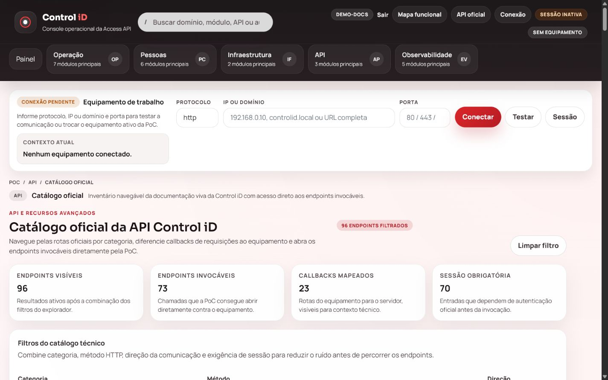

# Integração.ControlID.PoC

> **Guia** · Público: novos usuários, integração, desenvolvimento e operação · Responsável: Engenharia · Última validação: 2026-08-13.

PoC web em ASP.NET Core para demonstrar e validar a integração com a **API de
Controle de Acesso da Control iD**. O simulador incluído cobre os fluxos
principais sem exigir equipamento físico.

[](https://github.com/DanielCosta3415/integracao-controlid-poc/actions/workflows/ci.yml)




## Sumário

- [O que esta PoC demonstra](#o-que-esta-poc-demonstra)
- [Stack tecnológica e ambiente obrigatório](#stack-tecnológica-e-ambiente-obrigatório)
- [Estado, limites e fontes oficiais](#estado-limites-e-fontes-oficiais)
- [O que funciona sem e com aparelho](#o-que-funciona-sem-e-com-aparelho)
- [Início rápido sem equipamento](#início-rápido-sem-equipamento)
- [Arquitetura resumida](#arquitetura-resumida)
- [Conta local e sessão Control iD](#conta-local-e-sessão-control-id)
- [Proteções essenciais](#proteções-essenciais)
- [Desenvolvimento e validação](#desenvolvimento-e-validação)
- [Validação com equipamento real](#validação-com-equipamento-real)
- [Documentação, suporte e licença](#documentação-suporte-e-licença)

## O que esta PoC demonstra

A solução demonstra sessão, endpoints `.fcgi`, objetos, modos de operação,
callbacks, Monitor, Push, erros determinísticos e estado SQLite. Não substitui
o software oficial nem representa controle de acesso pronto para produção.

## Stack tecnológica e ambiente obrigatório

| Frente | Tecnologias adotadas | Finalidade na PoC |
| --- | --- | --- |
| Plataforma e ambiente de execução | .NET 10 LTS, SDK `10.0.302` e ASP.NET Core 10 MVC/Razor | Hospedar a aplicação web, compor dependências, processar rotas e renderizar a interface |
| Linguagens | C#, Razor, HTML5, CSS3, JavaScript e PowerShell | Implementar servidor, interface, automações e verificações operacionais |
| Interface | Views Razor, Bootstrap 5.1, jQuery 3.6 e JavaScript progressivo | Oferecer telas responsivas, formulários, feedback e acessibilidade |
| Integração Control iD | `HttpClient`, endpoints `.fcgi`, callbacks, Monitor, Push, simulador determinístico e proxy assinador | Exercitar contratos da Access API com ou sem equipamento físico |
| Dados | Entity Framework Core `10.0.11`, provedor SQLite, migrações e SQLite local | Persistir contas, eventos, filas e estado operacional da PoC |
| Segurança | Autenticação local por cookie, papéis `Administrator`/`Operator`, antiforgery, HMAC, listas de permissão e Data Protection | Proteger interface, saídas para equipamentos e ingressos externos |
| Observabilidade | Serilog, ID de correlação, verificações de saúde e métricas em formato Prometheus | Apoiar diagnóstico, prontidão e operação |
| API e documentação técnica | Swashbuckle e OpenAPI em `Development` | Expor e inspecionar contratos HTTP quando explicitamente habilitados |
| Qualidade | xUnit, ASP.NET Core MVC Testing, Playwright, axe, verificação integrada e testes de contrato | Cobrir regras, integração, navegador, acessibilidade e regressões |
| Compilação e dependências | CLI `dotnet`, NuGet com arquivos de bloqueio, `dotnet-ef` `10.0.11` e `dotnet format` | Garantir restauração, compilação e análise reproduzíveis |
| Infraestrutura e integração contínua | Docker multiestágio, Docker Compose e GitHub Actions | Validar imagem Linux não privilegiada e critérios de qualidade a cada envio |
| IDE obrigatória | Visual Studio 2026 18.6 ou mais recente | Carregar, executar e depurar completamente a solução `net10.0` com a banda `10.0.3xx` |

> [!IMPORTANT]
> O **Visual Studio 2026 18.6 ou mais recente é obrigatório para a experiência
> completa de desenvolvimento desta PoC**, incluindo carregamento da solução,
> execução por perfis, depuração integrada e gerenciamento dos projetos de teste.
> O Visual Studio 2022 não oferece suporte oficial ao destino `net10.0`. Os
> comandos da CLI `dotnet` continuam necessários para automação e reprodução dos
> critérios de qualidade, mas não substituem a IDE no fluxo completo adotado
> pelo projeto.
> Consulte a [matriz oficial entre SDK, MSBuild e Visual
> Studio](https://learn.microsoft.com/pt-br/dotnet/core/porting/versioning-sdk-msbuild-vs).

## Estado, limites e fontes oficiais

| Item | Estado atual |
| --- | --- |
| Maturidade | PoC operacional para estudo, demonstração e homologação controlada |
| Contrato simulado | Coberto pelo simulador determinístico e por testes automatizados |
| Compatibilidade física | Depende de modelo, firmware, licença, configuração e topologia de rede |
| Persistência | SQLite local, adequado a uma instância; não representa arquitetura distribuída |
| Implantação | Contêiner reproduzível, sem provedor de produção definido |
| Segurança e LGPD | Controles técnicos presentes; decisões jurídicas e ambientais permanecem externas |

Não use a PoC em acesso crítico ou com dados reais sem homologação. Use dados
fictícios e mantenha fotos, biometrias, credenciais e outros dados pessoais ou
sensíveis fora do Git.

Esta implementação é independente: não é oficial, homologada nem suportada pela
Control iD. Confirme contratos e capacidades nas fontes do fabricante:

- [documentação oficial da API de Controle de Acesso](https://www.controlid.com.br/docs/access-api-pt/);
- [exemplos oficiais de integração](https://github.com/controlid/integracao/tree/master/Controle%20de%20Acesso);
- [notas oficiais de firmware da linha de acesso](https://www.controlid.com.br/access_v2/changelog_pt-br.pdf).

## O que funciona sem e com aparelho

| Capacidade | Sem aparelho | Com aparelho | Exige homologação física |
| --- | --- | --- | --- |
| Conta local, papéis e navegação | Completa | Completa | Não |
| Login e sessão da API Control iD | Simulada | Real | Sim |
| Catálogo e contratos `.fcgi` | Simulados | Reais | Sim |
| Objetos, Monitor, callbacks e Push | Simulados | Reais | Sim |
| Timeouts, erros e respostas inesperadas | Determinísticos | Dependem do ambiente | Sim |
| Ações de porta, catraca, câmera ou cadastro físico | Não executadas | Dependem do produto | Sim |
| Compatibilidade de modelo, firmware e licença | Apenas hipótese documentada | Verificável | Sim |

Um aparelho é necessário para validar comportamento físico, firmware, licença,
desempenho real, rede do local ou particularidades do produto.

## Início rápido sem equipamento

### Pré-requisitos

- Git;
- Visual Studio 2026 18.6 ou mais recente, com a carga de trabalho
  **ASP.NET e desenvolvimento Web**;
- .NET SDK `10.0.302`, conforme `global.json`;
- Windows PowerShell 5.1 ou PowerShell 7.

O Visual Studio 2026 é requisito do fluxo completo. Execute os comandos abaixo
no terminal integrado da IDE ou em um PowerShell aberto na raiz do repositório.

### 1. Preparar o repositório

```powershell
git clone https://github.com/DanielCosta3415/integracao-controlid-poc.git
cd .\integracao-controlid-poc
dotnet --version
dotnet restore .\Integracao.ControlID.PoC.sln --locked-mode
dotnet restore .\tools\ControlIdDeviceStub\ControlIdDeviceStub.csproj --locked-mode
dotnet tool restore
```

O resultado de `dotnet --version` deve pertencer à banda `10.0.3xx` aceita por
`global.json`.

### 2. Iniciar o simulador no Terminal 1

```powershell
dotnet run --project .\tools\ControlIdDeviceStub\ControlIdDeviceStub.csproj --no-launch-profile
```

O simulador escuta em `http://127.0.0.1:6600` e aceita exclusivamente as
credenciais fictícias `stub-admin` e `stub-password`.

### 3. Configurar e iniciar a PoC no Terminal 2

```powershell
dotnet user-secrets set "ControlIDApi:DefaultDeviceUrl" "http://127.0.0.1:6600"
dotnet user-secrets set "ControlIDApi:DefaultUsername" "stub-admin"
dotnet user-secrets set "ControlIDApi:DefaultPassword" "stub-password"
dotnet user-secrets set "ControlIDApi:RequireAllowedDeviceHosts" "true"
dotnet user-secrets set "ControlIDApi:AllowedDeviceHosts:0" "127.0.0.1"
dotnet run --project .\Integracao.ControlID.PoC.csproj
```

Abra `https://localhost:5001` ou `http://localhost:5000`:

1. Em `/Auth/Register`, crie a primeira conta local com dados fictícios e senha
   de 12 a 128 caracteres. Ela receberá o papel `Administrator`.
2. Entre em `/Auth/LocalLogin`.
3. Em `/Auth/Login`, confirme a conexão com o simulador.
4. Em `OfficialApi`, invoque `system_information.fcgi`.
5. Em `/Development/Simulator`, altere o cenário ou perfil simulado quando
   quiser exercitar falhas.

### Resultado esperado

Ao final, a interface deve indicar conta local autenticada, origem `Simulado`,
sessão Control iD válida e sucesso em `system_information.fcgi`. O endpoint
`/health/ready` deve estar saudável, sem credenciais em logs ou no Git.

Para executar essa jornada automaticamente:

```powershell
powershell -ExecutionPolicy Bypass -File .\tools\smoke-localhost.ps1
```

O relatório é criado localmente em `artifacts/smoke/`; esse diretório é ignorado
pelo Git e, por isso, não é vinculado como arquivo versionado neste README.

## Arquitetura resumida



Os pontos de entrada são `Program.cs`, `Controllers/`, `Services/`, `Models/`,
`Data/`, `Views/`, `tests/` e `tools/`. O
[mapa de responsabilidades](docs/arquitetura/project-file-responsibilities.md)
explica os módulos e a direção das dependências sem listar manualmente cada
arquivo.

## Conta local e sessão Control iD

O fluxo humano usa duas autenticações distintas:

| Credencial | Protege | Origem | Duração |
| --- | --- | --- | --- |
| Conta local | Interface e funções da própria PoC | SQLite local | Sessão da aplicação |
| Sessão Control iD | Chamadas ao simulador ou equipamento | `login.fcgi` | Sessão emitida pelo alvo |

- `Administrator` pode executar escritas, ações físicas, consultas sensíveis e
  administração local.
- `Operator` pode navegar, diagnosticar, conectar e autenticar um alvo, mas não
  pode executar operações administrativas protegidas.

Não há SSO, MFA, promoção automática ou recuperação de senha sem a senha atual.
Consulte a [administração de contas locais](docs/seguranca-privacidade/local-account-administration.md)
para a matriz completa de permissões.

## Proteções essenciais

- O invocador manual do catálogo oficial é exclusivo de `Administrator`; a
  sessão Control iD permanece no servidor e não integra formulário ou HTML.
- Sessões oficiais, biometrias, cartões, QR Codes, fotos, configurações e cargas
  operacionais sensíveis são protegidos antes da gravação no SQLite.
- Em desenvolvimento, preserve `artifacts/runtime/data-protection-keys` junto do
  banco local. Fora de `Development`, chaveiro persistente protegido por
  certificado, HTTPS e volume criptografado atestado são obrigatórios.
- Callbacks e Push de equipamento não usam cookie de navegador nem antiforgery:
  a fronteira correta é chave compartilhada, HMAC, timestamp, nonce, allowlist e
  limite de requisições.
- Logs neutralizam separadores de registro e pseudonimizam identificadores. Os
  endpoints públicos de saúde expõem apenas o estado geral; detalhes exigem
  `Administrator`.
- No GitHub, Dependabot, secret scanning, push protection, CodeQL gerenciado e
  proteção contra exclusão/force-push de `main` complementam os checks locais.

Detalhes, configuração e conversão segura de dados legados estão em
[fortalecimento da segurança](docs/seguranca-privacidade/security-hardening.md)
e [modelo de dados e recuperação](docs/dados/data-model-and-recovery.md).

## Desenvolvimento e validação

### Ciclo comum

```powershell
dotnet build .\Integracao.ControlID.PoC.sln --no-restore -v:minimal
dotnet test .\tests\Integracao.ControlID.PoC.Tests\Integracao.ControlID.PoC.Tests.csproj --no-build -v:minimal
dotnet format .\Integracao.ControlID.PoC.sln --verify-no-changes --no-restore -v:minimal
powershell -ExecutionPolicy Bypass -File .\tools\validate-documentation.ps1
git diff --check
```

A compilação C# também verifica tipos. A análise estática combina avisos como
erros, compilação e verificação de formatação.

### Validação completa sem aparelho

```powershell
powershell -ExecutionPolicy Bypass -File .\tools\test-readiness-gates.ps1
```

### Liberação estrita

```powershell
powershell -ExecutionPolicy Bypass -File .\tools\test-readiness-gates.ps1 -ReleaseGate
```

O modo estrito falha quando falta evidência física, externa, operacional ou
humana exigida. A [estratégia de testes](docs/qualidade/testing-strategy.md) e os
[critérios de CI/CD](docs/qualidade/ci-cd-quality-gates.md) detalham cada gate.

### Diagnóstico rápido

| Sintoma | Primeira verificação | Referência |
| --- | --- | --- |
| Não conecta ao alvo | URL, porta, timeout e allowlist | [Diagnóstico Control iD](docs/operacao/troubleshooting-controlid.md) |
| Callback não aparece | Chave, assinatura, nonce e IP permitido | [Monitor e callbacks](docs/integracao-controlid/monitor-implementation.md) |
| Push não entrega | Consultas a `/push`, resultados em `/result` e fila local | [Implementação Push](docs/integracao-controlid/push-implementation.md) |
| `/metrics` não responde | Métricas habilitadas e conta `Administrator` | [Observabilidade](docs/operacao/observability-runbook.md) |

## Validação com equipamento real

Antes de conectar hardware, registre modelo, firmware, licença, topologia e
janela de teste. Faça backup e evite ativos de produção.

O teste físico é opcional, não roda na CI e exige credenciais somente no ambiente:

```powershell
$env:CONTROLID_DEVICE_URL = "http://<equipamento-ou-host>:8080"
$env:CONTROLID_USERNAME = "<usuario>"
$env:CONTROLID_PASSWORD = "<senha>"
powershell -ExecutionPolicy Bypass -File .\tools\contract-controlid-device.ps1
```

Consulte a [matriz de compatibilidade](docs/integracao-controlid/device-compatibility-matrix.md),
as [topologias de rede](docs/integracao-controlid/network-topologies.md) e a
[matriz de validação de endpoints](docs/integracao-controlid/endpoint-validation-matrix.md)
antes de declarar suporte a qualquer produto ou firmware.

## Glossário mínimo

| Termo | Significado neste projeto |
| --- | --- |
| Allowlist | Lista explícita de hosts ou IPs aos quais a PoC permite conexão |
| Callback | Requisição enviada pelo equipamento para um endpoint da PoC |
| Gate | Conjunto automatizado de verificações que aprova ou bloqueia uma etapa |
| HMAC | Assinatura que comprova integridade e posse de uma chave compartilhada |
| Monitor | Mecanismo Control iD que envia eventos assíncronos ao servidor |
| Nonce | Valor de uso único empregado para impedir repetição de requisições |
| Push | Consulta periódica do equipamento por comandos e envio de resultados |
| Simulador ou stub | Serviço local determinístico que reproduz contratos sem hardware |

## Documentação, suporte e licença

Consulte a [central de documentação](docs/README.md) ou as rotas principais:

- [FAQ e perguntas de primeiro contato](docs/primeiros-passos/faq.md);
- [percurso por perfil](docs/primeiros-passos/persona-guides.md);
- [integração técnica de novos desenvolvedores](docs/primeiros-passos/developer-onboarding.md);
- [contratos da integração Control iD](docs/integracao-controlid/integration-contracts.md);
- [segurança e privacidade](docs/seguranca-privacidade/README.md);
- [qualidade e testes](docs/qualidade/README.md);
- [operação](docs/operacao/README.md) e [resposta a incidentes](docs/operacao/incident-response-and-dr.md).

Use [SUPPORT.md](SUPPORT.md) para solicitar ajuda, [SECURITY.md](SECURITY.md)
para relatar vulnerabilidades e [CONTRIBUTING.md](CONTRIBUTING.md) antes de
propor uma mudança. Agentes de código devem seguir [AGENTS.md](AGENTS.md).

O repositório não possui licença de código aberto. A ausência de uma licença
permissiva não autoriza uso, cópia, modificação ou redistribuição. Consulte o
[aviso de licenciamento](LICENSE) e as licenças próprias das dependências
vendorizadas.

<details>
<summary>Ver outras telas da PoC</summary>





</details>
