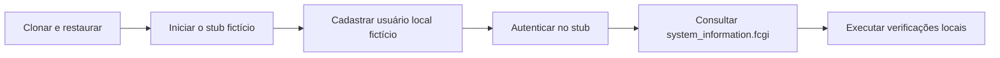

# Integração.ControlID.PoC

> **Documento vivo** · Público: novos usuários, desenvolvimento e operação · Responsável: mantenedores · Última validação: 2026-08-03.

PoC web em ASP.NET Core 8 MVC/Razor para exploração operacional e técnica da
Access API da Control iD. A aplicação ajuda um time técnico a conectar um
equipamento, autenticar, navegar pelo catálogo oficial, testar fluxos de
hardware, receber callbacks, operar Push, persistir estado local em SQLite e
validar readiness antes de evoluir a integração.

Trate este repositório como uma PoC operacional: ele pode lidar com dados
pessoais, credenciais, sessões, fotos, biometria, cartões, QR Codes, logs de
acesso e payloads de callbacks. Use dados fictícios em desenvolvimento e mantenha
segredos fora do Git.

## Estado, escopo e não objetivos

| Item | Estado atual |
| --- | --- |
| Maturidade | PoC operacional, adequada para desenvolvimento, demonstração e homologação controlada |
| Equipamentos | Contrato simulado pelo stub; compatibilidade física depende de modelo, firmware e licença |
| Persistência | SQLite local para uma instância; não representa arquitetura distribuída |
| Implantação | Contêiner reproduzível, sem provedor de produção escolhido |
| Privacidade | Controles técnicos presentes; decisões jurídicas e do controlador permanecem externas |

Não são objetivos desta PoC substituir o software oficial do fabricante, operar
controle de acesso crítico sem homologação, oferecer alta disponibilidade ou
declarar conformidade jurídica. O gate estrito impede tratar essas dependências
como concluídas sem evidência humana e ambiental.

## Comece aqui

Leitura recomendada para um novo desenvolvedor:

1. `README.md`: resumo, setup, comandos e links principais.
2. `AGENTS.md`: regras permanentes para agentes e contribuidores automatizados.
3. `docs/README.md`: índice da documentação técnica.
4. `docs/developer-onboarding.md`: trilha completa para configurar, executar,
   testar, diagnosticar e entregar com segurança.
5. `docs/architecture-overview.md`: camadas, fluxos críticos e limites de
   arquitetura.
6. `docs/product-acceptance-criteria.md`: requisitos, critérios de aceite e
   rastreabilidade.
7. `docs/adrs/`: decisões arquiteturais registradas.

## Tecnologias

| Área | Tecnologia |
| --- | --- |
| Linguagens | C#, Razor, HTML, CSS, JavaScript e PowerShell |
| Runtime/SDK | .NET 8, SDK pinado em `global.json` |
| Web | ASP.NET Core MVC/Razor |
| Banco | SQLite com Entity Framework Core |
| Logs | Serilog em console e arquivo rolling |
| Observabilidade | Health checks, `/metrics` Prometheus text e `System.Diagnostics.Metrics` |
| Testes | xUnit |
| Smoke/contrato | PowerShell com stub local em `tools/ControlIdDeviceStub` |
| CI | GitHub Actions em `.github/workflows/ci.yml` |
| Container | `Dockerfile` e `docker-compose.yml` |
| Dependências | NuGet com `packages.lock.json` |

Não há gerenciador de pacotes do frontend configurado. `npm`, `pnpm` e `yarn` não fazem
parte do fluxo do projeto.

## Estrutura

| Caminho | Papel |
| --- | --- |
| `Program.cs` | Bootstrap da aplicação, DI, middlewares, rotas, health checks, SQLite e validações de runtime |
| `Controllers/` | Rotas MVC, callbacks, Push, catálogo oficial e fluxos operacionais |
| `Services/` | Integrações Control iD, regras reutilizáveis, repositórios, observabilidade, segurança e factories |
| `Data/` | `IntegracaoControlIDContext` e migrations EF Core |
| `Models/` | Modelos da API Control iD e entidades locais |
| `ViewModels/` | DTOs/ViewModels usados pelas views Razor |
| `Views/` | Telas Razor e parciais compartilhadas |
| `Middlewares/` | Correlation ID, tratamento de erro, headers, sessão e request logging |
| `Options/` | Opções de configuração tipadas |
| `tests/` | Testes xUnit |
| `tools/` | Scripts de smoke, readiness, auditoria, backup, scanners e stubs |
| `docs/` | Documentação técnica, guias operacionais, ADRs, relatórios e registros de alterações |
| `wwwroot/` | CSS/JS globais, assets e bibliotecas vendorizadas |

Mapa detalhado: `docs/project-file-responsibilities.md`.

## Requisitos

- .NET SDK 8 compatível com `global.json`.
- Windows PowerShell 5+ ou PowerShell 7+.
- Git.
- Docker opcional para validar container.
- Ferramentas externas opcionais para release estrito: Semgrep, OSV Scanner,
  OWASP ZAP, axe e Docker.

## Configuração local

Restaure dependências a partir da raiz:

```powershell
dotnet restore .\Integracao.ControlID.PoC.sln --locked-mode
dotnet restore .\tools\ControlIdDeviceStub\ControlIdDeviceStub.csproj --locked-mode
dotnet restore .\tools\ControlIdCallbackSigningProxy\ControlIdCallbackSigningProxy.csproj --locked-mode
```

Configure segredos fora do repositório. Para desenvolvimento local, prefira User
Secrets ou variáveis de ambiente:

```powershell
dotnet user-secrets set "ControlIDApi:DefaultDeviceUrl" "http://<equipamento-ou-host>:8080"
dotnet user-secrets set "ControlIDApi:DefaultUsername" "<usuario>"
dotnet user-secrets set "ControlIDApi:DefaultPassword" "<senha>"
dotnet user-secrets set "CallbackSecurity:SharedKey" "<segredo-local>"
dotnet user-secrets set "CallbackSecurity:RequireSharedKey" "true"
dotnet user-secrets set "CallbackSecurity:RequireSignedRequests" "true"
dotnet user-secrets set "ControlIDApi:RequireAllowedDeviceHosts" "true"
dotnet user-secrets set "ControlIDApi:AllowedDeviceHosts:0" "<equipamento-ou-host>"
```

Para equipamentos sem assinatura HMAC nativa, use o proxy assinador local:

```powershell
dotnet user-secrets set --project .\tools\ControlIdCallbackSigningProxy\ControlIdCallbackSigningProxy.csproj "Proxy:SharedKey" "<mesmo-segredo-da-poc>"
dotnet user-secrets set --project .\tools\ControlIdCallbackSigningProxy\ControlIdCallbackSigningProxy.csproj "Proxy:AllowedRemoteIps:0" "<ip-do-equipamento>"
dotnet run --project .\tools\ControlIdCallbackSigningProxy\ControlIdCallbackSigningProxy.csproj --urls http://localhost:6700
```

## Execução local

Aplicação principal:

```powershell
dotnet run --project .\Integracao.ControlID.PoC.csproj
```

Stub local do equipamento:

```powershell
dotnet run --project .\tools\ControlIdDeviceStub\ControlIdDeviceStub.csproj --no-launch-profile
```

Smoke local com app e stub:

```powershell
powershell -ExecutionPolicy Bypass -File .\tools\smoke-localhost.ps1
```

O relatório mais recente é gravado em `artifacts/smoke/localhost-smoke-latest.md`;
o script interrompe imediatamente se a compilação da aplicação ou do simulador falhar.

Em `Development`, a especificação OpenAPI fica disponível em
`/swagger/v1/swagger.json` e a UI em `/swagger` quando `OpenApi:Enabled=true`.

## Primeira experiência com o stub

Este roteiro leva do clone ao primeiro fluxo autenticado sem equipamento físico:

1. Execute o stub; ele escuta em `http://127.0.0.1:6600`.
2. Configure `ControlIDApi:DefaultDeviceUrl` com essa URL. O stub aceita as
   credenciais fictícias `stub-admin` e `stub-password`.
3. Execute a aplicação e abra `http://localhost:5000` ou
   `https://localhost:5001`, conforme `Properties/launchSettings.json`.
4. No primeiro acesso, abra `/Auth/Register`, cadastre dados fictícios e uma
   senha de 12 a 128 caracteres. O primeiro usuário local recebe o papel
   `Administrator`; cadastros seguintes exigem um administrador autenticado.
5. Entre em `/Auth/LocalLogin`, conecte-se ao stub em `/Auth/Login` e confirme a
   sessão em `/Auth/Status`.
6. Abra `OfficialApi`, consulte `system_information.fcgi` e confirme resposta de
   sucesso sem dados pessoais reais.

Resultado esperado: shell autenticado, sessão Control iD válida, readiness
saudável e nenhuma credencial registrada em logs ou arquivos versionados. Para
uma validação automatizada equivalente, execute `tools/smoke-localhost.ps1`.

## Comandos oficiais

Build e testes:

```powershell
dotnet build .\Integracao.ControlID.PoC.sln --no-restore -v:minimal
dotnet test .\Integracao.ControlID.PoC.sln --no-build -v:minimal
```

Formatação, análise estática e verificação de tipos:

```powershell
dotnet format .\Integracao.ControlID.PoC.sln --verify-no-changes --no-restore -v:minimal
git diff --check
```

Observações:

- Não existe análise estática separada; `dotnet build` com avisos como erro e
  `dotnet format --verify-no-changes` são as verificações oficiais.
- Não existe verificação de tipos separada; essa verificação é feita pela própria compilação C#.
- Para corrigir formatação, use `dotnet format .\Integracao.ControlID.PoC.sln -v:minimal`
  e registre o efeito mecânico.

Auditorias e prontidão:

```powershell
powershell -ExecutionPolicy Bypass -File .\tools\validate-documentation.ps1
powershell -ExecutionPolicy Bypass -File .\tools\scan-secrets.ps1
powershell -ExecutionPolicy Bypass -File .\tools\audit-supply-chain.ps1
powershell -ExecutionPolicy Bypass -File .\tools\observability-check.ps1 -OfflineValidateOnly
powershell -ExecutionPolicy Bypass -File .\tools\operational-readiness-check.ps1
powershell -ExecutionPolicy Bypass -File .\tools\finops-capacity-check.ps1
powershell -ExecutionPolicy Bypass -File .\tools\contract-controlid-stub.ps1
powershell -ExecutionPolicy Bypass -File .\tools\test-readiness-gates.ps1
```

O validador documental padrão é determinístico e não usa rede. Em uma auditoria
conectada, acrescente `-CheckExternalUrls` para conferir também a disponibilidade
das referências externas, sem alterar o gate off-line da CI.

Critério estrito de liberação:

```powershell
powershell -ExecutionPolicy Bypass -File .\tools\test-readiness-gates.ps1 -ReleaseGate
```

`-ReleaseGate` exige teste integrado, cobertura, auditoria da cadeia de suprimentos,
construção do contêiner, observabilidade on-line, `ops.local.json` preenchido fora
do Git, FinOps/capacidade sem avisos, contrato com equipamento físico e analisadores externos. Se ambiente,
credencial ou ferramenta estiver ausente, o gate deve falhar.

## Variáveis de ambiente principais

Configuração segue o padrão nativo ASP.NET Core (`Secao__Chave`).

| Variável | Exemplo | Uso |
| --- | --- | --- |
| `ASPNETCORE_ENVIRONMENT` | `Development` | Ambiente de execução |
| `ASPNETCORE_URLS` | `https://localhost:5001` | URLs de binding da app |
| `ConnectionStrings__DefaultConnection` | `Data Source=integracao_controlid.db` | SQLite local |
| `Database__ApplyMigrationsOnStartup` | `false` | Aplica migrations apenas quando explicitamente habilitado; `Development` usa `true` |
| `Database__ExitAfterMigrations` | `false` | Encerra o processo após uma execução de migration controlada |
| `AllowedHosts` | `poc.example.internal` | Hosts aceitos fora de `Development`; não use `*` |
| `ControlIDApi__DefaultDeviceUrl` | `http://<equipamento-ou-host>:8080` | Equipamento Control iD |
| `ControlIDApi__ConnectionTimeoutSeconds` | `30` | Timeout das chamadas oficiais; normalizado entre 5 e 300 segundos |
| `ControlIDApi__MaxResponseBodyBytes` | `16777216` | Limite de resposta da API externa; normalizado entre 64 KiB e 64 MiB |
| `ControlIDApi__RequireAllowedDeviceHosts` | `true` | Exige allowlist de egress |
| `ControlIDApi__AllowedDeviceHosts__0` | `<equipamento-ou-host>` | Primeiro host permitido do equipamento |
| `CallbackSecurity__MaxBodyBytes` | `1048576` | Limite de payload para callbacks/monitor |
| `CallbackSecurity__RequireSharedKey` | `true` | Exige chave compartilhada em ingressos externos |
| `CallbackSecurity__SharedKey` | `<segredo>` | Segredo fora do Git |
| `CallbackSecurity__RequireSignedRequests` | `true` | Exige assinatura HMAC com timestamp e nonce |
| `CallbackSecurity__MaxTrackedNonces` | `10000` | Limite em memória da proteção contra replay |
| `CallbackSecurity__AllowedRemoteIps__0` | `192.168.0.10` | Primeiro IP permitido para callbacks |
| `OpenApi__Enabled` | `false` | Swagger/OpenAPI fora de Development apenas com decisão explícita |
| `Observability__Metrics__Enabled` | `true` | Habilita `/metrics` |
| `Observability__Metrics__AllowAnonymous` | `false` | Deve ser `false` fora de Development |
| `Serilog__WriteTo__1__Args__retainedFileCountLimit` | `14` | Retenção de arquivos rolling |
| `Serilog__WriteTo__1__Args__fileSizeLimitBytes` | `10000000` | Limite por arquivo de log |
| `ForwardedHeaders__Enabled` | `false` | Suporte a proxy reverso confiável |
| `ForwardedHeaders__KnownProxies__0` | `10.0.0.10` | Proxy/load balancer confiável |

Exemplo completo seguro: `.env.example`.

## Banco e estado local

- SQLite padrão: `integracao_controlid.db`.
- Arquivos `integracao_controlid.db*`, `Logs/`, `artifacts/`, `bin/` e `obj/`
  não devem ser versionados.
- Fora de `Development`, migrations não são aplicadas no startup sem
  `Database__ApplyMigrationsOnStartup=true`.
- `/health/ready` permanece unhealthy enquanto houver migration pendente.
- Dados locais podem conter informação pessoal ou sensível.

Comandos seguros:

```powershell
powershell -ExecutionPolicy Bypass -File .\tools\backup-sqlite.ps1
powershell -ExecutionPolicy Bypass -File .\tools\backup-sqlite-operational.ps1 -RunRestoreSmoke
powershell -ExecutionPolicy Bypass -File .\tools\restore-smoke-sqlite.ps1
powershell -ExecutionPolicy Bypass -File .\tools\harden-local-state.ps1
```

Detalhes: `docs/data-model-and-recovery.md` e
`docs/database-and-runtime-state.md`.

## Observabilidade e operação

Endpoints operacionais:

| Endpoint | Finalidade | Exposição recomendada |
| --- | --- | --- |
| `GET /health/live` | Liveness do processo ASP.NET Core | Supervisor/load balancer |
| `GET /health/ready` | Readiness do SQLite local | Readiness antes de tráfego |
| `GET /metrics` | Métricas Prometheus text | Administrador por padrão |

Sinais disponíveis:

- Correlation ID por request via `X-Correlation-ID`.
- Logs Serilog com dados sensíveis mascarados ou pseudonimizados.
- Métricas HTTP, Access API, callbacks, Push, auth local, analytics de produto e
  capacidade runtime/FinOps.
- Alertas e painéis versionados em `docs/observability/`.
- Guias operacionais em `docs/observability-runbook.md`,
  `docs/incident-response-and-dr.md` e
  `docs/equipment-contingency-runbook.md`.

## Contêiner e implantação

Artefatos versionados:

- `Dockerfile`: multi-stage .NET 8, runtime Alpine, usuário não root, porta 8080
  e healthcheck em `/health/ready`.
- `.dockerignore`: remove Git, logs, artefatos, SQLite local e `.env` do contexto.
- `docker-compose.yml`: volumes persistentes para `/app/data` e `/app/Logs`.

Comandos:

```powershell
docker build -t integracao-controlid-poc:local .
docker compose config
docker compose run --rm -e Database__ApplyMigrationsOnStartup=true -e Database__ExitAfterMigrations=true integracao-controlid-poc
docker compose up --build
```

Não há provedor cloud versionado. Qualquer Render, Azure, AWS, GCP, Fly.io, VPS
ou Kubernetes exige decisão humana, segredos fora do Git e atualização da
documentação operacional.

## Fluxos principais

- `Home`: painel inicial.
- `Workspace`: mapa funcional por domínio.
- `Auth`/`Session`: login local, login no equipamento, status e logout.
- `OfficialApi`: catálogo oficial e invocação assistida.
- `OfficialObjects`: exploração/CRUD técnico de objetos oficiais.
- `OperationModes`: Standalone, Pro e Enterprise.
- `ProductSpecific`: recursos por linha de equipamento.
- `AdvancedOfficial`: câmera, exportação, intertravamento e recursos avançados.
- `OfficialEvents`/`Monitor`: callbacks, monitoramento e eventos oficiais.
- `PushCenter`: fila Push, polling e resultados.
- `Privacy`: relatório minimizado de atendimento a titular.

## Contrato com equipamento real

Opt-in, fora da CI e sem credenciais reais no Git:

```powershell
$env:CONTROLID_DEVICE_URL = "http://<equipamento-ou-host>:8080"
$env:CONTROLID_USERNAME = "<usuario>"
$env:CONTROLID_PASSWORD = "<senha>"
powershell -ExecutionPolicy Bypass -File .\tools\contract-controlid-device.ps1
```

Use `tools/contract-controlid-stub.ps1` para validar contrato sem hardware.

## Documentação principal

- `docs/README.md`: índice de conhecimento.
- `docs/developer-onboarding.md`: guia de desenvolvimento e diagnóstico.
- `docs/architecture-overview.md`: arquitetura e fluxos.
- `docs/integration-contracts.md`: APIs, payloads e contratos.
- `docs/data-model-and-recovery.md`: dados, migrations, índices, backup e restore.
- `docs/security-hardening.md`: fortalecimento, HMAC, RBAC, cabeçalhos e segredos.
- `docs/privacy-and-data-retention.md`: LGPD, dados pessoais e retenção.
- `docs/testing-strategy.md`: estratégia de testes e gates.
- `docs/ci-cd-quality-gates.md`: GitHub Actions, quality gates, artefatos e
  proteção recomendada da ramificação.
- `docs/observability-runbook.md`: registros, métricas, alertas e painéis.
- `docs/deployment-runbook.md`: ambientes, implantação, reversão e contêiner.
- `docs/incident-response-and-dr.md`: incidentes, recuperação de desastres e análise pós-incidente.
- `docs/product-analytics.md`: KPIs e eventos sem rastreamento pessoal.
- `docs/finops-capacity.md`: custos, capacidade e sustentabilidade operacional.
- `docs/residual-risk-closure.md`: lacunas externas, gates bloqueantes e
  evidências exigidas para release sem exceções.
- `docs/adrs/`: decisões arquiteturais.

## Diagnóstico rápido

### A PoC não conecta ao equipamento

- Confira esquema, IP e porta no painel de conexão.
- Valide `ControlIDApi__ConnectionTimeoutSeconds`.
- Confira allowlist `ControlIDApi__AllowedDeviceHosts`.
- Veja logs do `OfficialApiInvokerService` para timeout, status e target
  pseudonimizado.

### Callbacks não aparecem

- Confira `CallbackSecurity__RequireSharedKey` e `CallbackSecurity__SharedKey`.
- Valide assinatura HMAC quando `RequireSignedRequests=true`.
- Valide IP remoto permitido.
- Acompanhe logs de `CallbackIngressService`.

### Push não entrega comandos

- Confira se o equipamento consulta `GET /push`.
- Valide se resultados chegam em `POST /result`.
- Consulte `PushCenter` e logs de persistência.

### `/metrics` não responde

- Confirme `Observability__Metrics__Enabled=true`.
- Por padrão, autentique como administrador.
- Fora de Development, `Observability__Metrics__AllowAnonymous=true` bloqueia startup.

### O shell parece lento

- Verifique se os ativos estáticos e a compressão estão funcionando.
- Use `OfficialApi` como referência para carga do catálogo.
- Valide tamanho de banco/logs com `tools/finops-capacity-check.ps1`.

## Mapa resumido do primeiro uso



O fluxo completo leva, em uma máquina já preparada, aproximadamente 10 a 20
minutos. O primeiro resultado confiável é a consulta ao stub seguida do gate
local aprovado; uma tela carregada isoladamente não comprova a integração.

| Ambiente | Cobertura documentada |
| --- | --- |
| Windows + Windows PowerShell 5.1 | Caminho principal e scripts operacionais |
| Windows + PowerShell 7 | Compatível com os comandos PowerShell documentados |
| Linux/macOS + PowerShell 7 | Build e aplicação são portáveis; scripts que usam DPAPI ou ACL do Windows exigem alternativa registrada |
| Contêiner Linux | Execução reproduzível da aplicação; operação real ainda depende de volumes, segredos e proxy configurados |

## Referências visuais

As capturas abaixo foram produzidas em `Development`, com banco efêmero e dados
fictícios. Elas ajudam a reconhecer a interface; testes e contratos continuam
sendo a evidência funcional.


