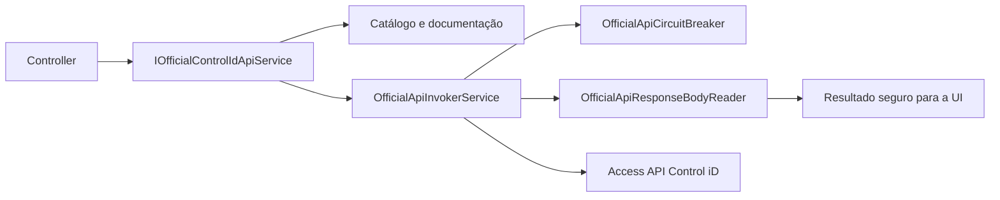
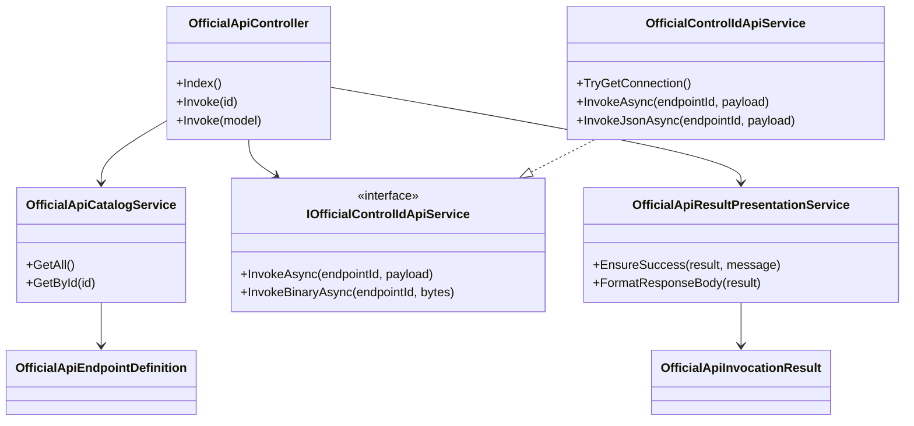
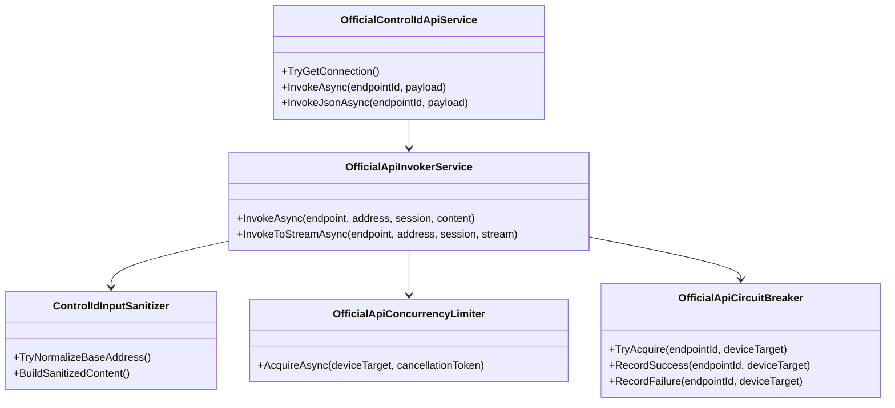
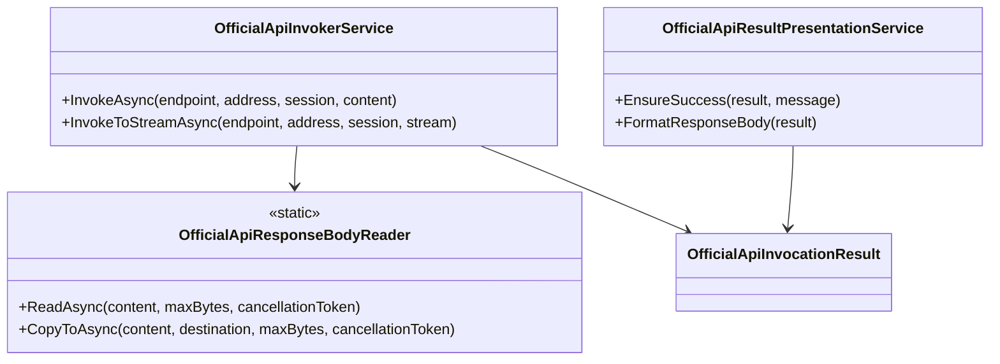
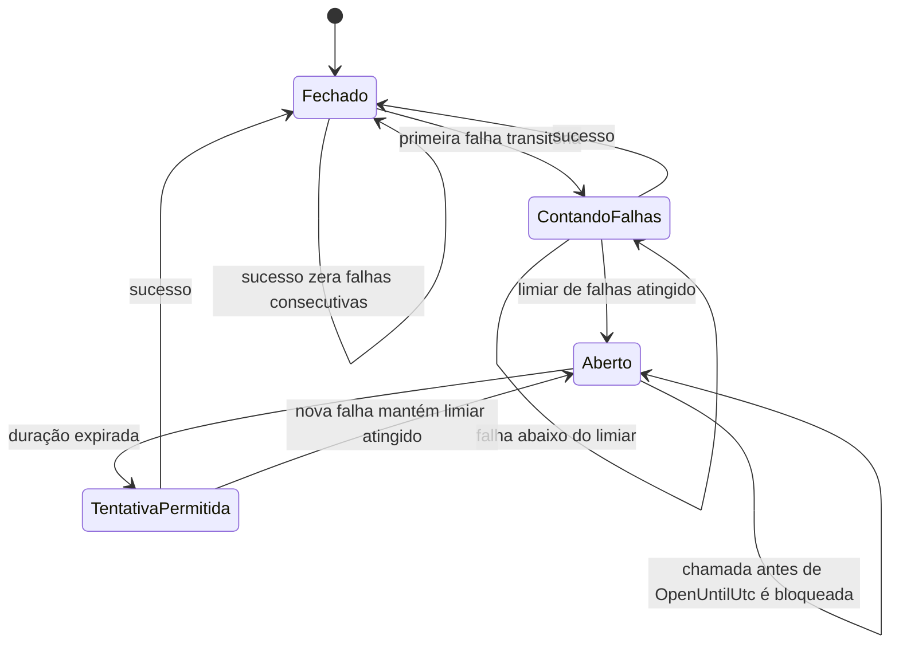

# Services/ControlIDApi

> **Guia** · Público: desenvolvimento backend · Responsável: Engenharia · Última validação: 2026-08-12.

Camada oficial de integração da PoC com a Access API da Control iD.

Serviços principais:

- `OfficialApiCatalogService`: catálogo local dos endpoints oficiais usados pela PoC.
- `OfficialApiInvokerService`: invocação HTTP oficial com sanitização, timeout configurável e logs estruturados.
- `OfficialControlIdApiService`: orquestração de chamadas usando o contexto atual da sessão da PoC.
- `OfficialApiContractDocumentationService`: composição da documentação visual de contrato exibida no módulo `OfficialApi`.

Pontos operacionais importantes:

- o timeout das chamadas oficiais usa `ControlIDApi__ConnectionTimeoutSeconds`;
- erros de validação, timeout e falhas inesperadas são registrados em log;
- resolução de endpoint inexistente e falha de parse JSON também geram log estruturado;
- a camada visual de `OfficialApi` usa esses serviços para documentar endpoint, query, body e exemplos.

## Fluxo de uma chamada



1. O controller resolve um endpoint conhecido no catálogo.
2. Estratégias de consulta/corpo montam apenas parâmetros documentados.
3. O invocador valida destino, allowlist, sessão, timeout e cancelamento.
4. O circuit breaker evita cascata após falhas transitórias repetidas.
5. A resposta é lida em streaming com limite e charset explícito.
6. O resultado de apresentação remove detalhes internos antes da tela.

## Relações entre as classes principais

Os três diagramas mostram dependências de construção ou chamada, não herança
entre controllers e serviços. A separação entre fachada, controles de envio e
tratamento da resposta mantém os nomes legíveis no GitHub. Métodos foram
limitados aos que definem o contrato do pipeline.

### Fachada de aplicação e catálogo



### Transporte e controles anteriores ao envio



### Leitura e apresentação da resposta



## Responsabilidades dos componentes

| Componente | Responsabilidade | Não deve fazer |
| --- | --- | --- |
| `OfficialApiCatalogService` | Expor metadados de endpoints oficiais | Executar HTTP |
| `OfficialApiInvokerService` | Transporte seguro e observável | Renderizar HTML |
| `OfficialControlIdApiService` | Orquestrar sessão e chamadas comuns | Duplicar políticas HTTP |
| Estratégias de parâmetros | Construir consulta/corpo conforme contrato | Aceitar campos arbitrários |
| `OfficialApiResponseBodyReader` | Aplicar limite e decodificação | Interpretar regra de negócio |
| Serviços de documentação | Gerar exemplos e descrições | Tornar exemplo em contrato implícito |

## Erros e extensibilidade

- Validação local deve falhar antes de abrir conexão.
- Timeout, cancelamento e circuito aberto são estados diferentes e devem
  permanecer distinguíveis em logs e métricas, mas seguros para o usuário.
- Não existe nova tentativa automática genérica: endpoints físicos podem não ser
  idempotentes.
- Novo endpoint exige catálogo, documentação de parâmetros, autorização adequada
  e testes de sucesso, entrada inválida, tempo limite e resposta inesperada.
- Mudança de payload público exige versão ou compatibilidade documentada em
  [docs/integracao-controlid/integration-contracts.md](../../docs/integracao-controlid/integration-contracts.md).

## Estados do circuit breaker

O implementado não possui estado meio aberto exclusivo. Quando o período aberto
termina, a próxima chamada é permitida; sucesso zera a contagem e nova falha pode
reabrir o circuito conforme o limiar configurado.



O estado é isolado pela combinação de destino e endpoint. O diagrama não implica
persistência: a memória do disjuntor é perdida quando o processo reinicia.

## Testes relacionados

Execute os testes de `tests/Integracao.ControlID.PoC.Tests/Services/ControlIDApi/`
e os contratos de controllers afetados. O contrato simulado fica em
`tools/contract-controlid-stub.ps1`; equipamento físico é opt-in e nunca usa
credenciais versionadas.

## Roteiro para estender o módulo

1. Confirmar endpoint, método, parâmetros e compatibilidade na documentação do fabricante.
2. Registrar o contrato no catálogo sem duplicar regra de URL ou autenticação.
3. Reutilizar o invocador, timeout, limite de resposta e circuit breaker existentes.
4. Manter JSON como `JsonElement` independente e resposta binária como bytes, sem documento descartável ou conversão Base64 intermediária.
5. Aplicar paginação com lookahead às listagens `load_objects` servidas por GET; operações técnicas POST preservam o payload explícito do operador.
6. Criar testes de sucesso, sessão ausente, entrada inválida, timeout e resposta inesperada.
7. Atualizar [docs/integracao-controlid/integration-contracts.md](../../docs/integracao-controlid/integration-contracts.md) e a rastreabilidade do requisito.

Comando direcionado:

```powershell
dotnet test .\Integracao.ControlID.PoC.sln --no-build --filter FullyQualifiedName~Services.ControlIDApi
```

## Navegação documental

- [Integração Control iD](../../docs/integracao-controlid/README.md).
- [Central de documentação](../../docs/README.md).
