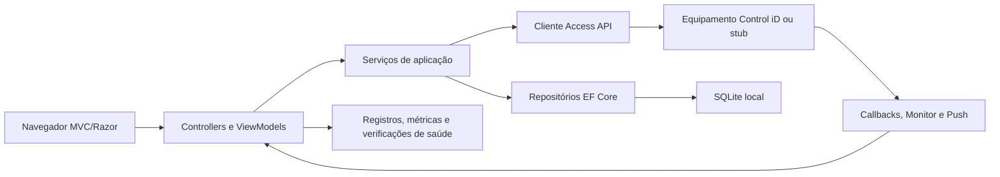
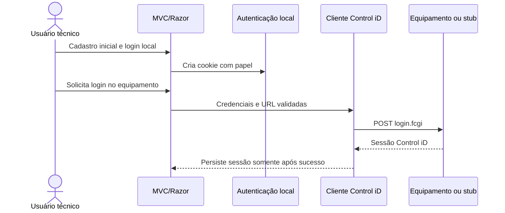
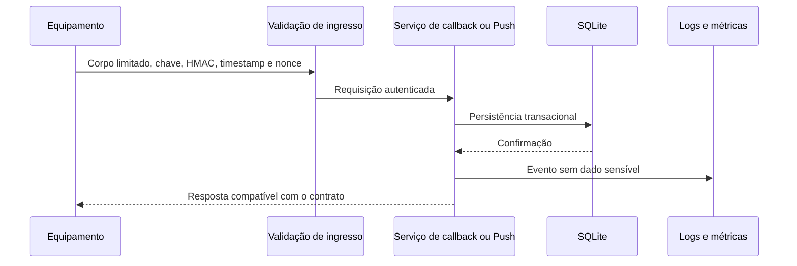
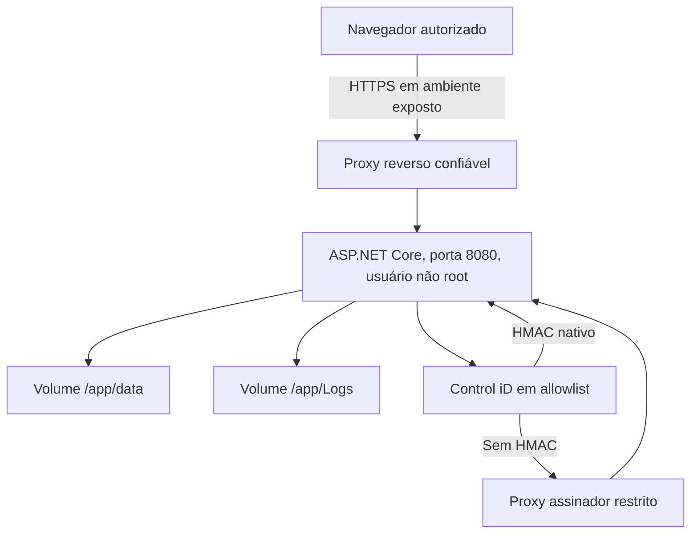

# Visão de arquitetura

> **Documento vivo** · Público: desenvolvimento e arquitetura · Responsável: liderança técnica · Última validação: 2026-08-03.

Este documento resume a arquitetura atual da PoC e aponta onde cada tipo de
mudança deve acontecer. Ele não substitui os documentos de domínio; serve como
mapa de alto nível.

## Estilo arquitetural

A aplicação é um monólito web ASP.NET Core MVC/Razor com:

- apresentação em controllers, views e ViewModels;
- services para integração, regras reutilizáveis, observabilidade e segurança;
- repositórios EF Core/SQLite para estado local;
- scripts PowerShell para diagnóstico, teste integrado, prontidão e operação;
- Docker/Compose para execução reproduzível sem definir provedor de nuvem.

As dependências apontam da apresentação para serviços e adaptadores. Regras
reutilizáveis não devem depender de Razor, `HttpContext` ou detalhes de transporte
quando puderem ser expressas como serviços testáveis.

## Camadas

| Camada | Responsabilidade | Exemplos |
| --- | --- | --- |
| Apresentação | Rotas MVC, entrada da interface e renderização Razor | `Controllers/`, `Views/`, `ViewModels/` |
| Aplicação/serviços | Orquestração de fluxos, validações reutilizáveis e composição | `Services/ControlIDApi/`, `Services/Callbacks/`, `Services/Push/` |
| Domínio de integração | Contratos e modelos da Access API Control iD | `Models/ControlIDApi/`, catálogo oficial |
| Persistência local | Estado de execução, históricos, Push, callbacks e usuários locais | `Data/`, `Models/Database/`, `Services/Database/` |
| Transversal | Segurança, registros, métricas, cabeçalhos, identificador de correlação e desempenho | `Middlewares/`, `Services/Observability/`, `Services/Security/` |
| Operação | Teste integrado, cópias de segurança, analisadores, prontidão, FinOps e recuperação de desastres | `tools/`, `docs/*runbook*.md` |

## Fluxos críticos

| Fluxo | Entrada | Orquestração | Persistência/saída |
| --- | --- | --- | --- |
| Login local | `AuthController.LocalLogin` | Autenticação local, cookie, limitação de taxa | Cookie e métricas de autenticação |
| Login Control iD | `AuthController.Login` | `OfficialControlIdApiService`/invocador | Sessão ASP.NET e registros seguros |
| Catálogo oficial | `OfficialApiController` | `OfficialApiCatalogService` e docs de contrato | ViewModels e resposta visual |
| Invocação oficial | `OfficialApiController.Invoke` | `OfficialApiInvokerService`, tempo limite, disjuntor | Resultado sanitizado, registros e métricas |
| Callback/monitor | callbacks `.fcgi` e `/api/notifications/*` | `CallbackIngressService`, leitor do corpo e avaliador de segurança | `MonitorEvents`, registros e métricas |
| Push | `GET /push`, `POST /result`, `PushCenter` | `PushCommandWorkflowService` | `PushCommands`, estados e métricas |
| Banco/cópia de segurança | inicialização, repositórios e scripts | Migrações EF Core e teste de cópia/restauração | SQLite local e artefatos fora do Git |
| Observabilidade | middlewares e `/metrics` | `OperationalMetrics`, `PrometheusMetricsWriter` | Texto Prometheus, painéis e alertas |

### Sequência de autenticação e integração

### Sequência de entrada assíncrona

## Dependências externas

| Dependência | Tipo | Controle |
| --- | --- | --- |
| Equipamento Control iD | API HTTP local/externa | Tempo limite, lista de permissões, HMAC em callbacks, contrato simulado e contrato físico opcional |
| SQLite | Arquivo local/volume | Verificação de saúde, migrações, índices e teste de cópia/restauração |
| GitHub Actions/NuGet | CI/dependências | Arquivos de bloqueio, auditoria e revisão da cadeia de suprimentos |
| Analisadores externos | Ferramentas opcionais | `tools/external-security-scans.ps1` e critério de liberação |

Não há provedor de nuvem, armazenamento externo, cache distribuído,
intermediador, e-mail/SMS ou análise externa versionada.

## Fronteiras de confiança

- Navegador do operador -> aplicação MVC.
- Aplicação -> equipamento Control iD.
- Equipamento -> callbacks/Push expostos pela PoC.
- Aplicação -> SQLite local.
- Operador/CI -> scripts PowerShell e artefatos locais.
- Host/provedor futuro -> registros, volumes, métricas e cópias de segurança.

Fora de `Development`, a aplicação deve falhar na inicialização se configurações
críticas estiverem inseguras: `AllowedHosts=*`, métricas anônimas, chave compartilhada
ausente, assinatura HMAC ausente, OpenAPI habilitado sem decisão e cabeçalhos
encaminhados sem proxy conhecido.

## Contratos a preservar

- Rotas MVC usadas pela UI.
- Endpoints oficiais auxiliares, callbacks `.fcgi`, `/push`, `/result` e
  `Push/Receive`.
- Cargas úteis e nomes de campos esperados pela Access API Control iD.
- ViewModels publicamente consumidos pelas views.
- Métricas e rótulos já documentados em `docs/observability-runbook.md`.
- Scripts oficiais citados em README, AGENTS e CI.

## Decisões arquiteturais

ADRs atuais:

- `docs/adrs/0001-local-sqlite-runtime-state.md`
- `docs/adrs/0002-secure-controlid-ingress-and-egress.md`
- `docs/adrs/0003-in-process-observability-and-readiness-gates.md`
- `docs/adrs/0004-release-governance-with-local-scripts.md`

Crie novo ADR quando uma decisão alterar padrão de arquitetura, provedor,
persistência, segurança, observabilidade, liberação ou contrato público.

## Limites conhecidos

- SQLite simplifica a PoC, mas não substitui um desenho de banco multi-instancia.
- Contrato com equipamento real depende de hardware, rede, firmware e credenciais
  fora do Git; a liberação estrita bloqueia sem contrato físico validado.
- Faturamento, DNS, TLS real e dimensionamento de produção dependem de provedor escolhido;
  `ops.example.json` e `operational-readiness-check.ps1 -RequireConfig` exigem
  responsáveis, estado e evidências antes da liberação.
- Bases legais, DPA, RIPD e titulares reais dependem de DPO/jurídico; os campos
  `privacy.*` agora são obrigatórios em configuração operacional real.
- Scanners externos dependem de instalação local ou ambiente CI preparado; o gate
  `-ReleaseGate` exige as ferramentas e os relatórios.
- O fechamento detalhado desses riscos externos fica em
  `docs/residual-risk-closure.md`.

## Visão de implantação

## Como evoluir a arquitetura

Uma mudança estrutural deve declarar problema, contratos afetados, direção de
dependência, estratégia de migração, testes e reversão. Crie novo ADR ao alterar
persistência, fronteira de confiança, autenticação, topologia, observabilidade ou
governança de liberação; não reescreva uma decisão aceita como se sempre tivesse
sido diferente.

## Responsabilidade e direção de mudança

| Componente | Responsabilidade principal | Mudança exige revisar |
| --- | --- | --- |
| MVC/Razor | Jornada, autorização e apresentação | Critérios de aceite, acessibilidade e testes de controlador |
| Serviços Control iD | Contrato de saída, limites e falhas | Contratos de integração, stub e segurança de saída |
| Ingressos externos | Callbacks, Monitor e Push | Assinatura, lista de IPs, idempotência e privacidade |
| EF Core/SQLite | Estado local, integridade e consultas | Migrações, recuperação, retenção e capacidade |
| Middlewares | Controles transversais HTTP | Cabeçalhos, correlação, erros, cache e métricas |
| Scripts e CI | Evidência reproduzível | Gate local, documentação operacional e reversão |

Uma dependência nova deve apontar da apresentação para aplicação ou domínio e
destes para adaptadores explicitamente injetados. Controllers não devem depender
entre si, e código de domínio não deve conhecer detalhes de Razor, Serilog ou SQLite.
