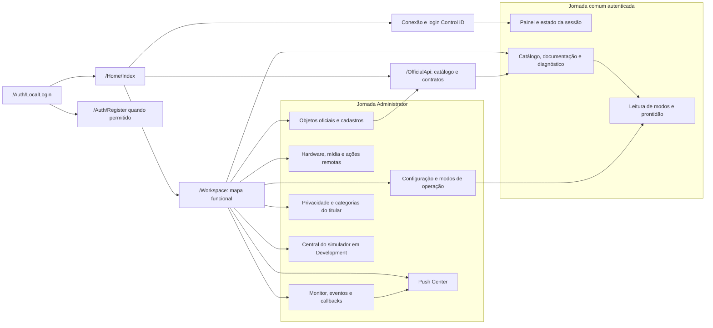

# Responsabilidades dos módulos da solução

> **Referência** · Público: desenvolvimento e manutenção · Responsável: Engenharia · Última validação: 2026-08-13.

Este mapa descreve módulos, pontos de entrada e direção de mudança. Ele não
repete cada arquivo versionado: o inventário completo é mecânico e pode ser
gerado com:

```powershell
powershell -ExecutionPolicy Bypass -File .\tools\generate-source-inventory.ps1
```

O resultado fica em `artifacts/documentation/source-inventory.md`, fora do Git.
Para comportamento detalhado, use o código, os testes e a fonte canônica do
[domínio documental](../README.md#domínios).

## Composição e configuração

| Caminho | Responsabilidade | Mude quando |
| --- | --- | --- |
| `Program.cs` | Compõe DI, middlewares, rotas, banco e health checks | Serviço global, pipeline HTTP ou composição de runtime mudar |
| `Services/Security/RuntimeSecurityValidator.cs` | Reúne invariantes obrigatórias de segurança para ambientes fora de desenvolvimento | Requisito de HTTPS, hosts, chaveiro, callbacks, métricas, proxy ou saída para equipamento mudar |
| `Integracao.ControlID.PoC.csproj` | Define framework, dependências e propriedades do projeto web | Pacote ou configuração de compilação mudar |
| `Integracao.ControlID.PoC.sln` | Agrupa aplicação e projetos de testes | Projeto versionado for adicionado ou removido |
| `Directory.Build.props` | Centraliza qualidade e propriedades comuns do MSBuild | Regra comum de compilação mudar |
| `global.json` | Fixa a família do SDK | Runtime coordenado mudar por ADR |
| `appsettings*.json` | Defaults seguros por ambiente, sem segredos | Opção tipada ou default ambiental mudar |
| `Properties/launchSettings.json` | Perfis e URLs apenas de desenvolvimento | Experiência local mudar |
| `.env.example` e `ops.example.json` | Exemplos sanitizados de ambiente e operação | Contrato de configuração mudar |

## Apresentação web

| Caminho | Responsabilidade | Dependências permitidas |
| --- | --- | --- |
| `Controllers/` | Recebe entrada MVC, autoriza, coordena casos de uso e escolhe resposta | Services, ViewModels, helpers e opções |
| `Views/` | Renderiza Razor, formulários e feedback ao usuário | ViewModels, componentes compartilhados e assets |
| `ViewModels/` | Modela entrada e saída específica das telas | Tipos simples e modelos públicos quando necessário |
| `wwwroot/css/` | Tokens, layout, componentes e responsividade | Assets locais |
| `wwwroot/js/` | Interações progressivas da interface | DOM e contratos explícitos da view |
| `wwwroot/img/` | Marca e capturas sanitizadas | Nenhum dado pessoal real |

Controllers devem permanecer finos. Regra reutilizável, acesso a dados e
integração HTTP pertencem aos módulos abaixo.

## Mapa de navegação funcional

O mapa agrupa telas por jornada e papel, sem tentar substituir a tabela de rotas
do ASP.NET Core. Links administrativos podem aparecer na navegação, mas o
controller continua sendo a fronteira confiável de autorização.



O percurso inicial recomendado é login local, conexão, login no equipamento,
painel e consulta segura. Escritas, ações físicas, limpeza e expurgo exigem
`Administrator`, antiforgery e, quando aplicável, confirmação textual.

## Aplicação e integração

| Caminho | Responsabilidade | Fonte complementar |
| --- | --- | --- |
| `Services/ControlIDApi/` | Client HTTP, sessão, catálogo, políticas de resiliência e transporte da Access API | [Guia do módulo](../../Services/ControlIDApi/README.md) |
| `Services/Callbacks/` | Valida, limita, normaliza e persiste callbacks recebidos | [Monitor](../integracao-controlid/monitor-implementation.md) |
| `Services/Push/` | Coordena fila, consulta e resultado de comandos Push | [Push](../integracao-controlid/push-implementation.md) |
| `Services/Database/` | Encapsula consultas e alterações EF/SQLite | [Dados](../dados/README.md) |
| `Services/Security/` | Regras de autenticação, autorização, assinatura e proteção de estado | [Hardening](../seguranca-privacidade/security-hardening.md) |
| `Services/Privacy/` | Minimização, exportação e descarte ligado a titulares | [Privacidade](../seguranca-privacidade/privacy-and-data-retention.md) |
| `Services/Analytics/` | Agregação de eventos sem rastreamento pessoal | [Analytics](../produto/product-analytics.md) |
| `Services/Observability/` | Métricas e contexto operacional seguro | [Observabilidade](../operacao/observability-runbook.md) |
| `Services/Files/` | Leitura e codificação limitada de uploads | [Hardening](../seguranca-privacidade/security-hardening.md) |
| `Services/OperationModes/` | Casos de uso de Standalone, Pro e Enterprise | [Modos](../integracao-controlid/operation-modes-implementation.md) |

## Domínio, contratos e persistência

| Caminho | Responsabilidade | Regra |
| --- | --- | --- |
| `Models/ControlIDApi/` | DTOs e tipos do contrato externo Control iD | Preserve nomes e formatos oficiais |
| `Models/Database/` | Entidades do estado local | Evolua por migration e teste de compatibilidade |
| `Models/Security/` | Tipos internos de identidade e proteção | Não exponha secrets ou hashes |
| `Options/` | Configuração tipada e validável | Documente a variável correspondente |
| `Data/IntegracaoControlIDContext.cs` | Modelo EF e configuração de persistência | Repositórios dependem do contexto, não controllers |
| `Data/Migrations/` | Histórico versionado do esquema SQLite | Mudança destrutiva exige backup e confirmação |
| `Mappings/` | Conversões explícitas entre camadas | Não esconda regra de negócio em mapping |

## Preocupações transversais

| Caminho | Responsabilidade |
| --- | --- |
| `Middlewares/` | Correlação, erros, headers, cache e logging HTTP |
| `Helpers/` | Utilitários pequenos e determinísticos, sem acesso difuso à infraestrutura |
| `Logging/` | Políticas e enriquecimento seguro de logs |
| `Monitor/` | Tipos e coordenação legada/específica de eventos monitorados |

Ordem esperada do fluxo HTTP:

```text
requisição → middleware → controller → service/caso de uso
          → client externo ou repositório → resposta/view model
```

## Testes

| Caminho | Responsabilidade |
| --- | --- |
| `tests/Integracao.ControlID.PoC.Tests/` | Unidade, integração SQLite, contratos HTTP, segurança e governança |
| `tests/Integracao.ControlID.PoC.E2E/` | Jornadas Playwright, axe, responsividade e regressão visual |
| `tests/.../TestSupport/` | Fixtures, handlers e bancos temporários compartilhados |
| `tests/.../Snapshots/` | Baselines visuais sanitizadas e revisadas |

Espelhe o domínio do código no diretório do teste. Prefira comportamento
observável a detalhes privados de implementação.

## Ferramentas e executáveis auxiliares

| Caminho | Responsabilidade |
| --- | --- |
| `tools/ControlIdDeviceStub/` | Simulador determinístico e massas sintéticas |
| `tools/ControlIdCallbackSigningProxy/` | Proxy que valida origem e assina callbacks para a PoC |
| `tools/smoke-localhost.ps1` | Smoke integrado de aplicação e simulador |
| `tools/test-readiness-gates.ps1` | Orquestra gates progressivos e release estrito |
| `tools/contract-controlid-*.ps1` | Valida contrato simulado ou físico |
| `tools/audit-github-security.ps1` | Audita CodeQL, Dependabot, proteção de segredos e integridade de `main` no GitHub |
| `tools/protect-sensitive-sqlite-data.ps1` | Protege dados legados somente após backup, ensaio e confirmação explícita |
| `tools/*-check.ps1` e `tools/audit-*.ps1` | Verificações de documentação, segurança, operação, capacidade e dependências |
| `tools/generate-source-inventory.ps1` | Gera inventário completo de arquivos para diagnóstico |

Scripts devem ser não destrutivos por padrão, ter saída acionável e documentar
pré-condições quando dependem de ferramenta externa ou hardware.

## Documentação e governança

| Caminho | Responsabilidade |
| --- | --- |
| [README.md](../../README.md) | Visão executiva e início rápido |
| [docs/README.md](../README.md) | Portal canônico de conhecimento |
| [docs/arquitetura/diagramas.md](diagramas.md) | Inventário, notação e manutenção das visões técnicas |
| `docs/<domínio>/README.md` | Índice e fonte canônica do domínio |
| `docs/adrs/` | Decisões arquiteturais imutáveis por substituição explícita |
| `docs/historico/` | Changelogs, auditorias e relatórios datados |
| [AGENTS.md](../../AGENTS.md) | Regras permanentes para agentes de código |
| [CONTRIBUTING.md](../../CONTRIBUTING.md) | Fluxo de contribuição humana e automatizada |
| [SECURITY.md](../../SECURITY.md) | Relato responsável de vulnerabilidades |
| [SUPPORT.md](../../SUPPORT.md) | Evidências e percurso para suporte |
| `.github/CODEOWNERS` | Ownership técnico mínimo no GitHub |

## Onde implementar uma mudança

| Mudança | Comece por | Valide com |
| --- | --- | --- |
| Nova tela ou ajuste de UX | `Views/`, `ViewModels/`, `wwwroot/` | Testes frontend e E2E |
| Novo endpoint Control iD | catálogo/client/DTO em `Services/ControlIDApi/` e `Models/ControlIDApi/` | Contrato com stub e documentação de integração |
| Callback | `Controllers/OfficialCallbacksController.cs` e `Services/Callbacks/` | Assinatura, replay, limite e persistência |
| Push | `Controllers/PushController.cs` e `Services/Push/` | Estados, idempotência e polling |
| Persistência | `Models/Database/`, `Data/`, `Services/Database/` | Migration, SQLite temporário e restore smoke |
| Segurança | middleware ou `Services/Security/` | Teste negativo, scan de secrets e hardening |
| Operação | opções, health, métricas ou scripts | Readiness, observabilidade e runbook |

## Política de revisão

Revise este mapa quando um módulo, camada ou ponto de entrada for criado,
removido ou ganhar nova responsabilidade. Não o atualize por cada arquivo novo:
o inventário gerado cobre essa necessidade sem transformar documentação manual
em uma lista obsoleta.

## Navegação documental

- [Voltar ao índice deste domínio](README.md).
- [Abrir a central de documentação](../README.md).
