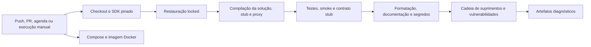

# CI/CD e critérios de qualidade

> **Documento vivo** · Público: desenvolvimento, plataforma e release · Responsável: DevOps/Platform · Última validação: 2026-08-03.

Este documento descreve a automação versionada para impedir regressão antes de
merge ou publicação. Ele complementa `AGENTS.md`, `docs/testing-strategy.md`,
`docs/deployment-runbook.md` e `docs/residual-risk-closure.md`.

## Provedor detectado

| Item | Estado |
| --- | --- |
| Provedor de repositório | GitHub (`origin` aponta para GitHub). |
| CI | GitHub Actions em `.github/workflows/ci.yml`. |
| CD/implantação automática | Não existe e não deve ser criado sem autorização humana. |
| Container | `Dockerfile` e `docker-compose.yml`, validados pela CI. |
| Scripts internos | `tools/*.ps1`, especialmente `test-readiness-gates.ps1`. |
| Makefile/Jenkins/GitLab/Azure/Bitbucket | Não detectados. |

## Fluxos de trabalho

### `CI`

Arquivo: `.github/workflows/ci.yml`

Disparos:

- `push` em `main`;
- `pull_request`;
- agenda semanal, segunda-feira;
- disparo manual por `workflow_dispatch`.

O Dependabot em `.github/dependabot.yml` abre no máximo dois PRs semanais por
ecossistema para NuGet e GitHub Actions. Atualizações patch/minor compatíveis são
agrupadas; atualizações major são ignoradas pela automação e exigem uma tarefa de
migração coordenada, com análise de contratos e regressão completa.

Permissões:

- `contents: read` apenas.

Jobs:

| Job | Runner | Objetivo |
| --- | --- | --- |
| `build-test-audit` | `windows-latest` | Restauração bloqueada, compilação, testes, verificação integrada, formatação, documentação, espaços em branco, segredos, prontidão, auditorias e artefatos. |
| `container-build` | `ubuntu-latest` | Validar `docker compose config` com valores de exemplo seguros e compilar o Dockerfile. |

Não há tarefa de implantação, liberação, publicação, marcação ou envio de imagem.

## Critérios de qualidade obrigatórios em PR e `main`

| Gate | Comando/step | Falha quando |
| --- | --- | --- |
| Checkout reprodutível | `actions/checkout@v7` | Repositório não pode ser lido. |
| SDK pinado | `actions/setup-dotnet@v6` com `global.json` | SDK .NET correto não resolve. |
| Cache seguro | `cache: true` usando `packages.lock.json` | Lockfiles mudam sem restore consistente. |
| Restauração bloqueada | `dotnet restore ... --locked-mode` | O arquivo de bloqueio está ausente ou desatualizado. |
| Ferramentas locais | `dotnet tool restore` | O `dotnet-ef` pinado não pode ser restaurado. |
| Compilação/verificação de tipos | `dotnet build ... --no-restore` | Erro de compilação ou aviso tratado como erro. |
| Testes | `dotnet test ... --no-build` | Qualquer teste xUnit falha. |
| Verificação integrada local | `tools/smoke-localhost.ps1` | Aplicação, simulador ou fluxos locais não respondem. |
| Contrato simulado Control iD | `tools/contract-controlid-stub.ps1` | O simulador não cumpre autenticação, sessão ou consulta de informações do sistema. |
| Formatação/análise estática | `dotnet format --verify-no-changes` | Código fora do padrão. |
| Espaços em branco | `git diff --check` | Espaço em branco inválido ou conflito de formatação. |
| Documentação | `tools/validate-documentation.ps1` | Inventário, UTF-8, metadados, links, caminhos, blocos, licença ou mapa de testes ficam inconsistentes. |
| Segredos | `tools/scan-secrets.ps1` | Segredo de alta confiança encontrado. |
| Observabilidade | `tools/observability-check.ps1 -OfflineValidateOnly` | Alertas, painéis ou métricas documentadas ficam inconsistentes. |
| Operabilidade | `tools/operational-readiness-check.ps1` | Procedimentos ou `ops.example.json` ficam inconsistentes. |
| FinOps/capacidade | `tools/finops-capacity-check.ps1` | Documentos, alertas ou limites locais quebram. |
| Cadeia de suprimentos/SBOM | `tools/audit-supply-chain.ps1` | Vulnerabilidade, pacote obsoleto, correção pendente, dependência vendorizada inconsistente ou SBOM inválido. |
| Inventário SAST/DAST/a11y | `tools/external-security-scans.ps1 -InventoryOnly` | Estado das ferramentas externas não fica rastreável em artefato. |
| Vulnerabilidades NuGet | `dotnet list package --vulnerable --include-transitive` | Pacote vulnerável aparece. |
| Compose | `docker compose config` com placeholders seguros | Compose não interpola ou fica inconsistente. |
| Docker build | `docker build --pull` | Imagem não compila. |

## Artefatos

A CI publica artefatos diagnósticos não sensíveis por 14 dias:

- `artifacts/smoke/**/*.md`;
- `artifacts/observability/**/*.md`;
- `artifacts/operational-readiness/**/*.md`;
- `artifacts/finops-capacity/**/*.md`;
- `artifacts/reports/**/*.md`;
- `artifacts/sbom/**/*.json`.

Não publicar logs completos, bancos SQLite, backups, payloads pessoais, fotos,
biometria, cartões, QR Codes, headers de auth ou secrets.

## Reprodução local

Use os comandos abaixo a partir da raiz:

```powershell
dotnet restore .\Integracao.ControlID.PoC.sln --locked-mode
dotnet restore .\tools\ControlIdDeviceStub\ControlIdDeviceStub.csproj --locked-mode
dotnet restore .\tools\ControlIdCallbackSigningProxy\ControlIdCallbackSigningProxy.csproj --locked-mode
dotnet tool restore
dotnet build .\Integracao.ControlID.PoC.sln --no-restore -v:minimal
dotnet build .\tools\ControlIdDeviceStub\ControlIdDeviceStub.csproj --no-restore -v:minimal
dotnet build .\tools\ControlIdCallbackSigningProxy\ControlIdCallbackSigningProxy.csproj --no-restore -v:minimal
dotnet test .\Integracao.ControlID.PoC.sln --no-build -v:minimal
powershell -ExecutionPolicy Bypass -File .\tools\smoke-localhost.ps1
powershell -ExecutionPolicy Bypass -File .\tools\contract-controlid-stub.ps1
dotnet format .\Integracao.ControlID.PoC.sln --verify-no-changes --no-restore -v:minimal
dotnet format .\tools\ControlIdCallbackSigningProxy\ControlIdCallbackSigningProxy.csproj --verify-no-changes --no-restore -v:minimal
git diff --check
powershell -ExecutionPolicy Bypass -File .\tools\validate-documentation.ps1
powershell -ExecutionPolicy Bypass -File .\tools\scan-secrets.ps1
powershell -ExecutionPolicy Bypass -File .\tools\observability-check.ps1 -OfflineValidateOnly
powershell -ExecutionPolicy Bypass -File .\tools\operational-readiness-check.ps1
powershell -ExecutionPolicy Bypass -File .\tools\finops-capacity-check.ps1
powershell -ExecutionPolicy Bypass -File .\tools\audit-supply-chain.ps1
powershell -ExecutionPolicy Bypass -File .\tools\external-security-scans.ps1 -InventoryOnly
```

A validação documental da CI é off-line e determinística. Para uma auditoria
manual conectada, execute também:

```powershell
powershell -ExecutionPolicy Bypass -File .\tools\validate-documentation.ps1 -CheckExternalUrls
```

Falhas de disponibilidade externa devem registrar URL, data e condição de rede;
elas não autorizam remover silenciosamente uma referência técnica ainda válida.

Para Compose local sem segredos reais, use valores de exemplo apenas para validar
interpolação:

```powershell
$env:AllowedHosts = "poc.example.internal"
$env:ControlIDApi__AllowedDeviceHosts__0 = "controlid-device.local"
$env:CallbackSecurity__SharedKey = "placeholder-shared-key-32-characters-minimum"
docker compose config
```

## Critério manual de liberação

Para release operacional real, use:

```powershell
powershell -ExecutionPolicy Bypass -File .\tools\test-readiness-gates.ps1 -ReleaseGate
```

Esse gate é intencionalmente mais estrito que a CI de PR. Ele exige ambiente
preparado, `ops.local.json` fora do Git, observabilidade on-line, contrato físico
Control iD, analisadores externos e FinOps/capacidade sem avisos.

## Proteção recomendada da ramificação

Configurar no GitHub, fora do repositório:

- exigir PR antes da mesclagem em `main`;
- exigir pelo menos uma revisão humana;
- exigir ramificação atualizada antes da mesclagem;
- exigir as verificações de estado `build-test-audit` e `container-build`;
- bloquear bypass por administradores, salvo emergência documentada;
- exigir resolução de conversas;
- bloquear envio forçado e exclusão da ramificação `main`;
- exigir assinatura de commit se a organização já usar essa política.

## Diagnóstico de falhas

| Falha | Primeiro arquivo/comando |
| --- | --- |
| Restauração bloqueada | Conferir `packages.lock.json` do projeto afetado. |
| Compilação/teste | Executar localmente o mesmo comando da etapa. |
| Verificação integrada | Abrir o artefato `artifacts/smoke/localhost-smoke-ci.md`. |
| Documentação | Executar `tools/validate-documentation.ps1` e corrigir a ocorrência indicada. |
| Análise de segredos | Verificar o achado sem colar segredo em issue/PR. |
| Cadeia de suprimentos | Conferir `docs/supply-chain-review.md` e SBOM em `artifacts/sbom/`. |
| Observabilidade/FinOps/prontidão | Ler artefatos em `artifacts/*/*latest.md`. |
| Docker | Rodar `docker compose config` e `docker build --pull ...` localmente. |

## Limites

- A CI não executa implantação.
- A CI não usa credenciais reais nem equipamento físico.
- Scanners externos completos ficam no `-ReleaseGate` ou em ambiente preparado.
- Branch protection precisa ser aplicada nas configurações do GitHub.
- Cobertura numérica por percentual ainda depende de ferramenta adicional
  versionada; hoje a suíte bloqueia falha de teste e o gate de cobertura bloqueia
  ausência de artefato quando solicitado.

## Fluxo da automação



| Evento | Objetivo | Cancelamento concorrente | Implantação |
| --- | --- | --- | --- |
| Pull request | Bloquear regressão antes da revisão | Execução anterior do mesmo ref é cancelada | Nunca |
| Push em `main` | Validar estado integrado | Execução anterior do mesmo ref é cancelada | Nunca |
| Agenda semanal | Detectar deriva de dependências | Uma execução por ref | Nunca |
| Manual | Diagnóstico controlado | Conforme ref | Nunca |

O limite atual é 30 minutos para `build-test-audit` e 20 minutos para
`container-build`. Reexecução é aceitável somente para falha comprovadamente
externa; falha determinística deve ser reproduzida localmente e corrigida. Não
marque um check como opcional para contornar indisponibilidade recorrente.

## Evidência de falha intermitente

Registre job, etapa, run ID, commit, horário, duração, primeira mensagem de erro e
artefato sanitizado. Após duas recorrências equivalentes, abra ação corretiva com
responsável e prazo; não adote repetição automática ilimitada.

## Contratos de estado no GitHub

| Contexto esperado | Origem | Recomendação de proteção |
| --- | --- | --- |
| `CI / build-test-audit` | Job `build-test-audit` | Obrigatório para PR e `main` |
| `CI / container-build` | Job `container-build` | Obrigatório quando a execução Docker estiver disponível |

A configuração de proteção da ramificação não está versionada neste repositório.
O mantenedor deve conferir os nomes na interface ou API do GitHub após renomear
workflow ou job; um contexto antigo não protege a ramificação. Ações de terceiros
devem permanecer fixadas por versão ou SHA revisado. A CI usa
`actions/checkout@v7`, `actions/setup-dotnet@v6` e
`actions/upload-artifact@v7`; qualquer mudança de versão major deve atualizar o
teste contratual e este documento na mesma entrega.
