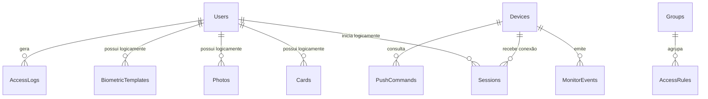

# Modelo de dados, integridade e recuperação

> **Referência** · Público: dados, backend e SRE · Responsável: Engenharia · Última validação: 2026-08-12.

Esta é a fonte canônica para o modelo local: entidades, integridade, índices,
evolução de esquema, retenção, backup e restauração. Para arquivos criados em
runtime, WAL, inicialização e comandos de diagnóstico, consulte
[Banco de dados e estado de execução](database-and-runtime-state.md).

Revise este documento antes de mudanças em `Models/Database/`,
`Data/Migrations/`, `Services/Database/`, callbacks, Push ou retenção de
payloads.

## Inventário de persistências

| Persistência | Evidência | Uso | Observação |
| --- | --- | --- | --- |
| SQLite local | `ConnectionStrings:DefaultConnection`, `IntegracaoControlIDContext`, `Data/Migrations/` | Estado runtime da PoC, eventos, push, cadastros e auditoria local | Arquivos `integracao_controlid.db*` não devem ser versionados. |
| Arquivos de log | Serilog, `Logs/app_log.txt` | Diagnóstico operacional | Pode conter metadados sensíveis; manter retenção curta. |
| Artefatos locais | `artifacts/`, `docs/historico/relatorios/` | Relatórios de smoke, QA e backups locais | `artifacts/` fica fora do Git; evidências históricas versionadas devem usar dados fictícios e sanitizados. |
| Fila persistente local | Tabela `PushCommands` | Comandos e resultados Push | Não há broker externo; consistência e idempotência são locais. |
| Cache distribuído | Não encontrado | N/A | Não aplicável no estado atual. |
| NoSQL/search/storage externo | Não encontrado | N/A | Não aplicável no estado atual. |

## Tabelas e dados

| Tabela | Chave | Campos principais | Dados sensíveis | Retenção |
| --- | --- | --- | --- | --- |
| `AccessLogs` | `Id` | `Time`, `Event`, `DeviceId`, `UserId`, `PortalId`, `Info` | Eventos de acesso, usuário/dispositivo | Mínimo necessário para QA. |
| `AccessRules` | `Id` | `Name`, `Type`, `Priority`, `BeginTime`, `EndTime`, `Status` | Regras de acesso | Enquanto necessária para homologação. |
| `BiometricTemplates` | `Id` | `UserId`, `Template`, `Type`, `FingerPosition`, `FingerType` | Biometria/template | Alto cuidado; evitar dados reais. |
| `Cards` | `Id` | `UserId`, `Value`, `Type`, `BeginTime`, `EndTime`, `Status` | Cartões/tags | Mínimo necessário. |
| `ChangeLogs` | `Id` | `OperationType`, `TableName`, `TableId`, `Timestamp`, `PerformedBy`, `Description` | Auditoria operacional | Curto prazo local. |
| `Configs` | `Id` | `Group`, `Key`, `Value`, `Description` | Pode conter configuração sensível | Não armazenar secrets reais. |
| `Devices` | `Id` | `Name`, `Ip`, `IpAddress`, `SerialNumber`, `Firmware`, `Status`, `LastSeenAt` | IP/serial/rede | Enquanto ambiente existir. |
| `Groups` | `Id` | `Name`, `Description`, `Status` | Baixo a moderado | Conforme homologação. |
| `Logos` | `Id` | `Base64Image`, `Timestamp`, `FileName`, `Format`, `Description` | Imagem/base64 | Evitar imagens reais. |
| `Logs` | `Id` | `Level`, `Message`, `Timestamp`, `StackTrace`, `User`, `EventCode`, `Source`, `AdditionalData` | Logs podem conter metadados sensíveis | Curto prazo local. |
| `MonitorEvents` | `EventId` | `ReceivedAt`, `RawJson`, `EventType`, `DeviceId`, `UserId`, `Payload`, `Status` | Payload de callback | `Payload` guarda o conteúdo efetivo; `RawJson` fica vazio quando seria duplicado. |
| `Photos` | `Id` | `UserId`, `Base64Image`, `Timestamp`, `FileName`, `Format` | Foto/base64 | Alto cuidado; evitar dados reais. |
| `PushCommands` | `CommandId` | `ReceivedAt`, `CommandType`, `RawJson`, `Status`, `Payload`, `DeviceId`, `UserId` | Comando/resultado/payload bruto | `RawJson` só preserva envelope distinto do `Payload`; limpar após análise. |
| `QRCodes` | `Id` | `UserId`, `Value`, `BeginTime`, `EndTime`, `Status` | QR code/token | Mínimo necessário. |
| `Sessions` | `Id` | `DeviceAddress`, `SessionString`, `DeviceName`, `DeviceSerial`, `Username`, `ExpiresAt`, `IsActive` | Sessão e usuário | Curto prazo; não compartilhar DB. |
| `Syncs` | `Id` | `SyncType`, `Status`, `Message`, `StartedAt`, `FinishedAt`, `ErrorCode`, `AdditionalData` | Diagnóstico operacional | Curto prazo local. |
| `Users` | `Id` | `Name`, `Registration`, `Username`, `NormalizedUsername`, `PasswordHash`, `Salt`, `Email`, `NormalizedEmail`, `Phone`, `Status` | Dados pessoais e credenciais derivadas | Evitar dados reais; mínimo necessário. |

## Integridade e evolução

- O esquema usa chaves primárias locais, mas não declara chaves estrangeiras entre entidades. Isso evita quebrar dados importados ou simulados da Access API quando IDs remotos ainda não possuem contrato relacional fechado no projeto.
- `Users.NormalizedUsername` e `Users.NormalizedEmail` possuem índices únicos;
  a migration falha sem excluir dados caso encontre duplicidades preexistentes.
- Outros índices operacionais continuam não únicos. Novas constraints exigem
  análise de duplicidade e plano de reversão.
- `DeviceLocal` ainda possui `Ip` e `IpAddress`. O campo duplicado deve ser preservado até existir plano de migração e confirmação de compatibilidade.
- `Program.cs` só aplica `Database.Migrate()` quando configurado; fora de
  `Development`, o default e não alterar schema no startup.
- Não há mais criação ad hoc de tabelas no startup. Toda evolução deve entrar
  por migration versionada.

## Índices operacionais

A migration `AddOperationalIndexes` adiciona índices para filtros e ordenações já usados pelos repositórios e telas operacionais:

- `AccessLogs`: data, usuário, dispositivo e evento.
- `MonitorEvents`: data de recebimento, tipo, status e dispositivo.
- `PushCommands`: status/dispositivo/data, tipo, usuário e recebimento.
- `Sessions`: sessões ativas por data, dispositivo e usuário.
- `ChangeLogs`, `Logs`, `Syncs`: filtros por status/tipo/nível e ordenação temporal.
- `Users`, `Devices`, `Cards`, `QRCodes`, `BiometricTemplates`, `Photos`, `Configs`: lookup por identificadores funcionais frequentes. Em `Devices`, `Ip` e `IpAddress` ficam indexados para compatibilidade, mas novas consultas locais devem preferir `Ip`.

Justificativa: reduzir full scans prováveis em telas de histórico, callbacks, push, logs e sessões sem introduzir constraints novas.

## Limites de consulta e expurgo

Repositórios locais aplicam `LocalDataQueryLimits.DefaultListLimit` em listagens e buscas para evitar full scans e renderização de volumes excessivos por acidente. Consultas somente leitura usam `AsNoTracking()`; fluxos de edição continuam carregando entidades rastreadas. Fluxos de limpeza confirmados usam operações específicas de delete em banco, sem carregar toda a tabela em memória.

Listagens remotas baseadas em `load_objects.fcgi` e abertas por GET usam páginas de 100 registros com um item adicional de lookahead. A exploração técnica por POST preserva o payload informado e não recebe paginação implícita.

Fluxos com expurgo guiado:

- `OfficialEvents/Purge`: remove `MonitorEvents` mais antigos que a janela de retenção informada, com frase `EXPURGAR EVENTOS`.
- `PushCenter/Purge`: remove `PushCommands` mais antigos que a janela de retenção informada, com frase `EXPURGAR PUSH`.

Os limites aceitos para retenção ficam entre 1 e 3650 dias.

## Migrações

Ferramenta: EF Core migrations.

Histórico atual:

- `InitialLocalSchema`: cria tabelas com `CREATE TABLE IF NOT EXISTS` para preservar bancos locais existentes.
- `AddOperationalIndexes`: cria índices com `CREATE INDEX IF NOT EXISTS` e remove com `DROP INDEX IF EXISTS`.
- `HardenLocalIdentity`: adiciona identificadores normalizados e unicidade de
  username/e-mail para eliminar corrida no bootstrap do primeiro administrador.

Regras de segurança:

- Não executar migration destrutiva sem backup e confirmação humana.
- Não remover coluna/tabela enquanto houver dados locais sem plano de migração, reversão e retenção.
- Para mudanças de alta volumetria, preferir estratégia em etapas: adicionar campo nullable, preencher de forma controlada, validar, depois tornar obrigatório se necessário.
- Scripts de reversão devem ser revisáveis e não apagar dados por padrão.

## Dados iniciais

Não há seeds versionados com dados reais ou fictícios permanentes. Os testes usam dados criados em memória e o smoke local usa stub/fakes controlados. Mantenha essa regra: dados reais de usuários, fotos, biometria, cartões, QR codes, IPs de clientes ou secrets não devem entrar no Git.

## Cópia de segurança local segura

Use o script abaixo antes de validar mudanças de schema em um SQLite local com dados importantes:

```powershell
powershell -ExecutionPolicy Bypass -File .\tools\backup-sqlite.ps1
```

O script copia o arquivo `.db` e, se existirem, os arquivos `-wal` e `-shm` para `artifacts/backups/sqlite-<timestamp>/`, junto com um manifesto. Ele não altera o banco de origem.

Para operação real, prefira o wrapper operacional, que pode espelhar o backup
para destino fora do host, executar restore-smoke e aplicar retenção somente com
confirmação textual:

```powershell
$env:CONTROLID_BACKUP_MIRROR_DIRECTORY = "\\servidor-seguro\backups\controlid-poc"
powershell -ExecutionPolicy Bypass -File .\tools\backup-sqlite-operational.ps1 -RunRestoreSmoke
```

Backups novos são protegidos por DPAPI por padrão e recebem extensão `.protected`. Use `-Unprotected` apenas para interoperabilidade local temporária e registre a justificativa. O manifesto informa `Protected`, `Protection` e `ProtectionScope`.

Recomendações:

- Pare a aplicação antes do backup quando possível, para reduzir risco de cópia parcial.
- Se o banco estiver em WAL mode, preserve sempre `.db`, `-wal` e `-shm` juntos.
- Proteja backups como dados sensíveis; eles podem conter usuários, sessões, fotos, biometria, logs e payloads brutos.
- Restrinja permissões locais de SQLite, logs e backups com `powershell -ExecutionPolicy Bypass -File .\tools\harden-local-state.ps1`.
- Não versionar backups.
- Para revisar capacidade e custo local sem apagar dados, rode `powershell -ExecutionPolicy Bypass -File .\tools\finops-capacity-check.ps1`.

## Restauração

Restore sobrescreve estado local e exige confirmação humana. Procedimento recomendado:

1. Parar a aplicação e qualquer processo que esteja usando o SQLite.
2. Fazer backup do estado atual com `tools/backup-sqlite.ps1`.
3. Validar o backup escolhido com `tools/restore-smoke-sqlite.ps1`.
4. Com confirmação humana, copiar a cópia restaurada validada para o caminho configurado em `ConnectionStrings:DefaultConnection`, preservando também `-wal` e `-shm` quando existirem.
5. Rodar `dotnet build .\Integracao.ControlID.PoC.sln --no-restore -v:minimal`.
6. Subir a aplicação em ambiente local controlado e validar os fluxos afetados.

RTO/RPO não estão garantidos para produção até existir validação no ambiente-alvo. Para a release operacional, `ops.local.json` deve registrar os valores aprovados, e `tools/operational-readiness-check.ps1 -RequireConfig` bloqueia status pendente. O fechamento completo está em [docs/operacao/residual-risk-closure.md](../operacao/residual-risk-closure.md).

## Teste de restauração em cópia temporária

Para validar que um backup pode ser aberto e receber migrations sem sobrescrever o banco real:

```powershell
powershell -ExecutionPolicy Bypass -File .\tools\restore-smoke-sqlite.ps1
```

Sem parâmetro, o script usa a cópia de segurança mais recente em `artifacts/backups/`. Ele copia ou descriptografa o arquivo para `artifacts/restore-smoke/`, executa `dotnet ef database update --no-build --connection ...` sobre essa cópia e grava um manifesto do teste.

## Riscos controlados e acompanhamento

| Severidade | Item | Controle implementado | Acompanhamento |
| --- | --- | --- | --- |
| Média | Dados sensíveis podem existir no SQLite, nos logs e nas cópias de segurança locais | `.gitignore`, cópias protegidas por DPAPI por padrão, fortalecimento de permissões locais, documentação de privacidade e expurgo confirmado de Monitor e Push | Executar `tools/harden-local-state.ps1` no host-alvo e revisar o mascaramento nos logs a cada novo fluxo. |
| Baixa | Restore precisa ser exercitado de forma recorrente | Procedimento documentado e smoke de restore em cópia temporária, incluindo backups `.protected` | Executar smoke regularmente antes de mudanças de schema e em preparações de release. |
| Média | Ausência de chaves estrangeiras entre tabelas locais | Preserva compatibilidade com IDs remotos | Definir o contrato relacional antes de criar restrições. |
| Baixa | Listagens remotas podem mudar entre páginas durante alterações concorrentes no equipamento | Paginação por `limit`/`offset`, lookahead de um registro, limite local e `AsNoTracking()` em leituras SQLite | Homologar ordenação estável e volume máximo por firmware no equipamento físico. |
| Média | `Ip` e `IpAddress` duplicam a finalidade em `Devices` | Campo preservado para compatibilidade; consultas novas usam `Ip`, e ambos ficam indexados | Planejar consolidação versionada sem remoção destrutiva. |
| Baixa | Sem dados iniciais formais | Testes criam dados em memória | Criar fixtures fictícias se surgirem testes de integração mais amplos. |

## Diagrama conceitual

As ligações abaixo representam associações funcionais; o schema atual não impõe
chaves estrangeiras entre todas elas porque vários identificadores vêm do
equipamento remoto.



## Histórico de migrações

| Migração | Finalidade | Reversão e atenção |
| --- | --- | --- |
| `20260430144509_InitialLocalSchema` | Cria o schema local inicial | Reversão remove tabelas; nunca executar sobre dados reais sem aprovação |
| `20260430224746_AddOperationalIndexes` | Adiciona índices de consultas operacionais | Remoção degrada desempenho, mas não altera payload |
| `20260430233000_AddLocalUserRoles` | Introduz papéis de usuário local | Rollback afeta autorização e exige plano explícito |
| `20260803192319_HardenLocalIdentity` | Normaliza identidade e unicidade | Exige validar duplicidades antes de ambiente existente |

Toda nova migração deve ter teste sobre banco vazio e legado, impacto de lock e
volume estimado, estratégia de backup, compatibilidade com a versão anterior e
procedimento de reversão. O comando de produção permanece uma decisão humana.

## Atualização verificável do modelo

As fontes de verdade são `IntegracaoControlIDContext`, as entidades em
`Models/Database/` e as migrações versionadas. Antes de atualizar o inventário ou
o diagrama, execute somente comandos de leitura ou geração fora do banco real:

```powershell
dotnet ef dbcontext info --project .\Integracao.ControlID.PoC.csproj --no-build
dotnet ef migrations list --project .\Integracao.ControlID.PoC.csproj --no-build
```

Toda entidade nova deve aparecer no inventário, no diagrama conceitual, na
política de retenção e no mapa de arquivos. Tipo, nulabilidade e índice devem ser
confirmados no snapshot da migração; associação lógica não deve ser descrita
como chave estrangeira quando o SQLite não a impõe.

## Navegação documental

- [Voltar ao índice deste domínio](README.md).
- [Abrir a central de documentação](../README.md).
