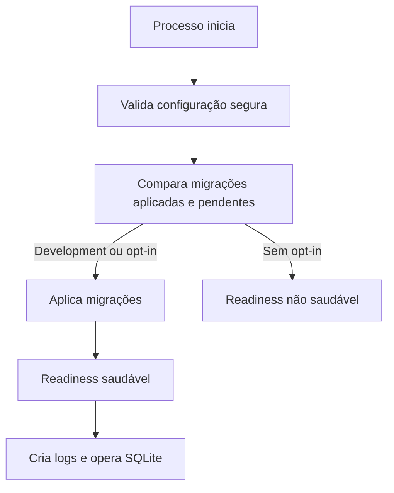

# Banco de dados e estado de execução

> **Documento vivo** · Público: desenvolvimento e operação · Responsável: engenharia de dados · Última validação: 2026-08-03.

Este projeto usa SQLite local por padrão. A cadeia de conexão `DefaultConnection` fica em `appsettings.json` e aponta para `integracao_controlid.db`.

## Estado criado durante a execução

Os arquivos abaixo são estado local e não devem ser versionados:

- `integracao_controlid.db`
- `integracao_controlid.db-shm`
- `integracao_controlid.db-wal`
- `Logs/`
- `artifacts/`
- `bin/`
- `obj/`

Esses caminhos já estão cobertos por `.gitignore`.

## Aplicação do esquema

O esquema local está versionado em `Data/Migrations/` pelo EF Core. O `Program.cs` executa `Database.Migrate()` somente quando `Database:ApplyMigrationsOnStartup=true`; quando a opção não é informada, o padrão é habilita-la apenas em `Development`.

A migração inicial usa `CREATE TABLE IF NOT EXISTS` para preservar bancos SQLite locais já existentes desta PoC. As tabelas `MonitorEvents` e `PushCommands` fazem parte das migrações versionadas e não são criadas manualmente pelo `Program.cs`.

Iniciar a aplicação com migrações automáticas habilitadas pode criar ou atualizar o banco local, mesmo sem alterar arquivos rastreados pelo Git. Antes de validar alterações de esquema em um banco com dados importantes, faça backup do arquivo SQLite local.

Regra de evolução:

- alterações de esquema devem ser feitas por migrações versionadas do EF Core ou scripts `.sql` revisáveis;
- não introduza criação manual de tabelas no `Program.cs`; o mecanismo de evolução é o histórico de migrações;
- não remova colunas/tabelas locais sem plano de migração e backup do SQLite local;
- `MonitorEvents` e `PushCommands` podem conter payloads pessoais/sensíveis e devem seguir a política de retenção em `docs/privacy-and-data-retention.md`.

## Comandos seguros

Use estes comandos para validação sem tocar em dados de produção:

```powershell
dotnet restore .\Integracao.ControlID.PoC.sln --locked-mode
dotnet build .\Integracao.ControlID.PoC.sln --no-restore -v:minimal
dotnet test .\Integracao.ControlID.PoC.sln --no-build -v:minimal
dotnet format .\Integracao.ControlID.PoC.sln --verify-no-changes --no-restore -v:minimal
dotnet list .\Integracao.ControlID.PoC.sln package --vulnerable --include-transitive
```

## Comandos que alteram estado local

Estes comandos são esperados para criar arquivos locais, processos ou relatórios:

```powershell
dotnet run --project .\Integracao.ControlID.PoC.csproj
powershell -ExecutionPolicy Bypass -File .\tools\smoke-localhost.ps1
```

O teste smoke inicia o stub local, executa fluxos HTTP e grava relatórios em `docs/reports/` e `artifacts/`.

## Cópia de segurança local

Antes de validar mudanças de schema em um banco local com dados importantes, gere uma cópia segura:

```powershell
powershell -ExecutionPolicy Bypass -File .\tools\backup-sqlite.ps1
powershell -ExecutionPolicy Bypass -File .\tools\restore-smoke-sqlite.ps1
```

O script copia `integracao_controlid.db` e, quando existirem, `integracao_controlid.db-wal` e `integracao_controlid.db-shm` para `artifacts/backups/`. Os backups podem conter dados pessoais, sessões, logs e payloads brutos; não versione nem compartilhe esses arquivos.

Backups novos são protegidos por DPAPI por padrão e recebem extensão `.protected`. O smoke de restore descriptografa uma cópia temporária, aplica migrations apenas nessa cópia e não sobrescreve o banco real.

Restrinja permissões locais de SQLite, logs e backups no host com:

```powershell
powershell -ExecutionPolicy Bypass -File .\tools\harden-local-state.ps1
```

O mapa completo de tabelas, índices, riscos de integridade e procedimento de restauração está em `docs/data-model-and-recovery.md`.

## Requisitos para ambientes não Development

Ambientes fora de `Development` devem configurar:

- `AllowedHosts` sem wildcard `*`.
- `CallbackSecurity:RequireSharedKey=true`.
- `CallbackSecurity:SharedKey` com valor secreto via User Secrets, variável de ambiente ou cofre externo.
- `CallbackSecurity:RequireSignedRequests=true`.
- `ControlIDApi:RequireAllowedDeviceHosts=true`, com os hosts permitidos configurados.
- `OpenApi:Enabled=false`.

Sem esses valores, a aplicação falha na inicialização para evitar exposição acidental dos callbacks e endpoints push.

## Primeiro início e arquivos gerados



| Caminho | Quando surge | Tratamento |
| --- | --- | --- |
| `integracao_controlid.db` | Primeiro acesso ao contexto após migração | Estado local; nunca versionar |
| `integracao_controlid.db-wal`/`-shm` | SQLite em modo WAL | Copiar junto no backup consistente |
| `Logs/` | Inicialização do Serilog | Aplicar retenção e mascaramento |
| `artifacts/` | Smoke, backup e gates | Evidência local, fora do Git |

Inspeção segura e somente leitura:

```powershell
Get-Item .\integracao_controlid.db* -ErrorAction SilentlyContinue
dotnet ef migrations list --project .\Integracao.ControlID.PoC.csproj --no-build
powershell -ExecutionPolicy Bypass -File .\tools\restore-smoke-sqlite.ps1
```

Não abra o banco ativo com ferramenta que altere journal, schema ou pragmas. Para
investigação, trabalhe sobre uma cópia protegida e registre a origem.

## Compatibilidade do host

| Ambiente | Comportamento esperado | Atenção |
| --- | --- | --- |
| Windows local | SQLite, DPAPI e fortalecimento de ACL disponíveis | OneDrive e antivírus podem aumentar latência ou bloquear arquivos |
| Linux local ou contêiner | SQLite funciona; permissões seguem usuário e volume Linux | DPAPI e ACL do Windows não se aplicam |
| Volume persistente | Banco e logs sobrevivem à troca do contêiner | Validar proprietário, espaço, backup e restauração |
| Compartilhamento de rede | Não homologado para o arquivo SQLite ativo | Bloqueio e semântica de arquivo podem ser incompatíveis |

Registre caminho absoluto, sistema de arquivos, usuário do processo e estratégia
de cópia antes de tratar um host como candidato operacional.
