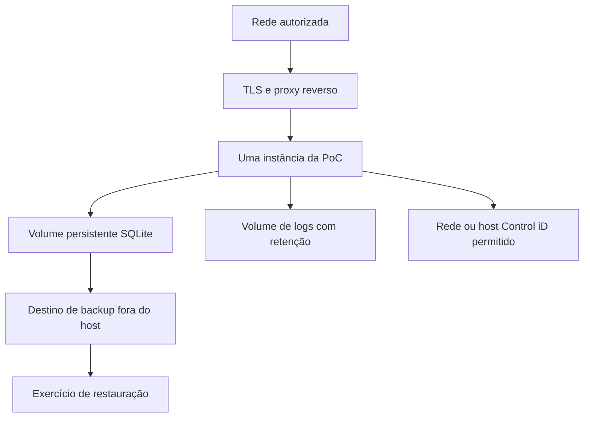

# Implantação, ambientes e resiliência

> **Guia operacional vivo** · Público: plataforma, SRE e release · Responsável: Platform/SRE · Última validação: 2026-08-03.

Escopo: PoC ASP.NET Core 8 MVC/Razor com SQLite local e integração com equipamento
Control iD. Este documento descreve execução reproduzível fora do ambiente local
sem criar implantação automática, DNS real ou credenciais versionadas.

## Ambientes mapeados

| Ambiente | Estado | Evidência | Observação |
| --- | --- | --- | --- |
| Local | Existente | `launchSettings.json`, `README.md`, `tools/smoke-localhost.ps1` | Usa `Development`, SQLite local e User Secrets/env vars. |
| Development | Existente | `appsettings.Development.json` | Habilita OpenAPI somente neste ambiente. |
| Homologação (`Staging`) | Configurado | `appsettings.Staging.json`, `.env.example`, Docker/Compose | Requer segredos e hosts configurados pelo ambiente. |
| Produção (`Production`) | Configurado | `appsettings.Production.json`, `.env.example`, Docker/Compose | A inicialização falha se hosts, chave compartilhada, assinatura e lista de permissões de saída não forem configurados. |
| Pré-visualização (`Preview`) | Ausente | Sem provedor ou manifesto dedicado | Use ramificação ou serviço efêmero com as mesmas variáveis de homologação. |

Não há provedor cloud versionado. Qualquer Render, Azure, AWS, GCP, Fly.io, VPS ou
Kubernetes deve ser configurado por decisão humana e sem credenciais no Git.

## Configuração obrigatória fora de Development

Use variáveis no formato nativo do ASP.NET Core. `.env.example` contém placeholders
seguros para Compose; copie para `.env` e substitua todos os valores antes de uso.

Variáveis mínimas:

- `ASPNETCORE_ENVIRONMENT=Staging` ou `Production`.
- `ASPNETCORE_URLS=http://+:8080` no container.
- `AllowedHosts` com host real, sem `*`, `localhost` ou placeholders.
- `ConnectionStrings__DefaultConnection=Data Source=/app/data/integracao_controlid.db`
  ou caminho de volume persistente equivalente.
- `Database__ApplyMigrationsOnStartup=false` na instancia que atende tráfego.
- `Database__ExitAfterMigrations=false` na execução normal.
- `CallbackSecurity__RequireSharedKey=true`.
- `CallbackSecurity__SharedKey` com valor real, não placeholder, mínimo de 32 caracteres.
- `CallbackSecurity__RequireSignedRequests=true`.
- `CallbackSecurity__AllowLoopback=false` em ambiente exposto.
- `ControlIDApi__RequireAllowedDeviceHosts=true`.
- `ControlIDApi__AllowedDeviceHosts__0` com o host/IP permitido do equipamento.
- `OpenApi__Enabled=false`.
- `Observability__Metrics__AllowAnonymous=false`.
- `Serilog__WriteTo__1__Args__retainedFileCountLimit=14` ou valor aprovado.
- `Serilog__WriteTo__1__Args__fileSizeLimitBytes=10000000` ou limite aprovado.

Reverse proxy:

- `ForwardedHeaders__Enabled=false` por padrão.
- Habilite apenas atrás de proxy confiável.
- Quando habilitar fora de Development, configure `ForwardedHeaders__KnownProxies__0`
  com IP real do proxy ou load balancer.

## Infraestrutura de contêiner

Artefatos versionados:

- `Dockerfile`: multi-stage build, imagem runtime Alpine, usuário não root, porta
  `8080`, volume esperado para `/app/data` e `/app/Logs`, healthcheck em
  `/health/ready`.
- `.dockerignore`: remove Git, bin/obj, logs, artefatos, `.env` e SQLite local do
  contexto de build.
- `docker-compose.yml`: execução local/container com volumes nomeados, portas,
  healthcheck e variáveis obrigatórias.

Comandos:

```powershell
docker build -t integracao-controlid-poc:local .
docker compose config
docker compose up --build
```

Health checks:

- Liveness: `GET /health/live`.
- Readiness: `GET /health/ready`.
- Métricas: `GET /metrics` com usuário administrador.

## Procedimento de implantação

1. Criar ou atualizar `.env` fora do Git com base em `.env.example`.
2. Garantir volume persistente para `/app/data` e `/app/Logs`.
3. Validar a configuração sem iniciar:

```powershell
docker compose config
```

4. Construir a imagem:

```powershell
docker build --pull -t integracao-controlid-poc:<versao> .
```

5. Depois do backup, aplicar migrations em um processo único que encerra ao
   concluir. Não execute este comando em paralelo:

```powershell
docker compose run --rm -e Database__ApplyMigrationsOnStartup=true -e Database__ExitAfterMigrations=true integracao-controlid-poc
```

6. Subir em Staging com `Database__ApplyMigrationsOnStartup=false`:

```powershell
docker compose up --build
```

7. Validar:

```powershell
powershell -ExecutionPolicy Bypass -File .\tools\observability-check.ps1 -OfflineValidateOnly
powershell -ExecutionPolicy Bypass -File .\tools\test-readiness-gates.ps1 -RunContainerBuild
```

8. Contra ambiente rodando, validar health/readiness e métricas com credencial local:

```powershell
$env:OBSERVABILITY_BASE_URL = "http://localhost:8080"
powershell -ExecutionPolicy Bypass -File .\tools\observability-check.ps1
```

9. Para release sem exceções, rode o gate estrito em ambiente preparado:

```powershell
powershell -ExecutionPolicy Bypass -File .\tools\test-readiness-gates.ps1 -ReleaseGate
```

O `-ReleaseGate` exige também `ops.local.json` preenchido fora do Git, baseado em
`ops.example.json`, para bloquear release sem ownership, on-call, RTO/RPO,
backup externo, provedor/DNS/TLS/sizing, DPO/jurídico quando aplicável,
scanners externos, FinOps/capacidade e contingência física validados.

O fechamento das lacunas externas fica em `docs/residual-risk-closure.md`.

## Reversão técnica

Para incidentes ativos, use também `docs/incident-response-and-dr.md`, que define
severidade, comunicação, escalonamento, preservação de evidências e validação
pós-reversão.

1. Preservar volume `/app/data` antes de trocar versão.
2. Manter a imagem anterior tagueada, por exemplo `integracao-controlid-poc:<versao-anterior>`.
3. Se o novo container falhar em `/health/ready`, parar somente o serviço novo.
4. Subir a tag anterior com o mesmo `.env` e os mesmos volumes.
5. Validar `/health/live`, `/health/ready`, login local e logs.
6. Se a falha envolver schema SQLite, restaurar cópia apenas em ambiente controlado
   usando `tools/restore-smoke-sqlite.ps1`; não sobrescreva dados reais sem
   confirmação humana.

Para preparação operacional, gere backup com restore-smoke e espelhamento:

```powershell
$env:CONTROLID_BACKUP_MIRROR_DIRECTORY = "\\servidor-seguro\backups\controlid-poc"
powershell -ExecutionPolicy Bypass -File .\tools\backup-sqlite-operational.ps1 -RunRestoreSmoke
```

## Riscos de ambiente

| Risco | Severidade | Controle atual |
| --- | --- | --- |
| Provedor de nuvem ausente | Média | Docker, Compose e guia operacional; a escolha do provedor requer decisão humana. |
| TLS/DNS fora do repo | Alta | Deve ser terminado no proxy/provedor; app bloqueia configs inseguras fora de Development. |
| Equipamento físico não disponível na CI | Alta | `-RequireHardwareContract` e `-ReleaseGate` bloqueiam release quando exigido. |
| Secrets reais fora do Git | Alta | `.env.example`, User Secrets, secret scan e validação contra placeholders. |
| SQLite local em container sem volume | Alta | Compose usa volume nomeado para `/app/data`; docs exigem volume persistente. |
| Forwarded headers com proxy não confiável | Alta | Desabilitado por padrão; exige `KnownProxies` fora de Development. |

## Topologia de referência independente de provedor



Essa referência não promete alta disponibilidade. SQLite pressupõe uma instância
gravadora e volume persistente. Um provedor real deve documentar CPU, memória,
armazenamento, TLS, DNS, backup, retenção, região, custo e responsável em
`ops.local.json`.

## Lista de verificação pós-implantação

1. Confirmar imagem/tag e configuração sem exibir segredos.
2. Validar `/health/live` e `/health/ready` antes de liberar tráfego.
3. Fazer login local com conta de teste autorizada e papel esperado.
4. Consultar endpoint de leitura no stub ou equipamento homologado.
5. Confirmar logs correlacionados, métricas e ausência de 5xx novos.
6. Validar volumes, espaço livre, backup e alerta de retenção.
7. Registrar horário, executor, versão, evidências e decisão de seguir ou reverter.

A reversão só termina quando a versão anterior está saudável, dados permanecem
consistentes e sinais operacionais voltaram à linha de base. Migração de schema
exige plano próprio; restaurar código não reverte dados automaticamente.

## Pacote mínimo de evidência

| Item | Conteúdo permitido | Local |
| --- | --- | --- |
| Versão | Commit, imagem e horário | Registro da liberação |
| Configuração | Nomes das variáveis e estados, nunca valores secretos | Repositório operacional restrito |
| Banco | Migração aplicada, backup e resultado de restauração | Evidência de dados restrita |
| Saúde | Estado de `live`, `ready`, métricas e erro 5xx | Painel ou relatório sanitizado |
| Integração | Modelo, firmware, licença e contrato aprovado | Evidência de bancada restrita |
| Decisão | Executor, aprovador, seguir ou reverter | Registro da liberação |

Sem provedor escolhido, este pacote é um contrato de conteúdo. Região, serviço,
TLS, cofre de segredos, limites e URL reais só devem ser preenchidos após decisão
humana registrada em `ops.local.json`.
