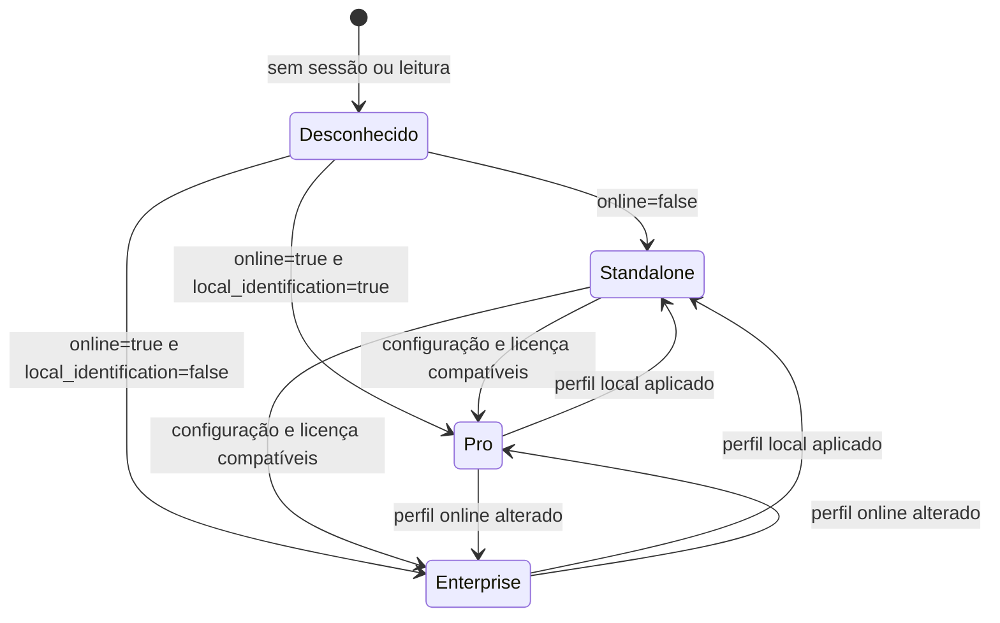

# Modos de operação: Standalone, Pro e Enterprise

> **Referência** · Público: produto, integração e QA · Responsável: Engenharia · Última validação: 2026-08-12.

Este documento explica como a PoC representa, detecta e aplica os modos de operação Standalone, Pro e Enterprise da API de controle de acesso da Control iD.

Ele complementa os relatórios de validação existentes em [docs/historico/relatorios/operation-modes-e2e-runbook-2026-04-14.md](../historico/relatorios/operation-modes-e2e-runbook-2026-04-14.md) e [docs/historico/relatorios/operation-modes-homologation-matrix-2026-04-14.md](../historico/relatorios/operation-modes-homologation-matrix-2026-04-14.md). A diferença aqui é o foco: esta documentação descreve a implementação dentro da aplicação.

## Visão geral

Na PoC, os modos de operação são tratados como perfis de configuração aplicados ao equipamento por meio da API oficial.

O ponto central é a combinação das configurações `general.online` e `general.local_identification`:

| Modo | `online` | `local_identification` | Ideia operacional |
| --- | --- | --- | --- |
| Standalone | `0` | `1` | O equipamento opera localmente, sem depender do servidor online para identificar ou autorizar. |
| Pro | `1` | `1` | O equipamento fica online, mas continua fazendo identificação local e enviando callbacks/eventos para a aplicação. |
| Enterprise | `1` | `0` | O equipamento fica online e a decisão passa a ser centralizada/orientada ao servidor. |

Essa regra de classificação está implementada em `Services/OperationModes/OperationModesProfileResolver.cs`.

## Arquivos envolvidos

| Arquivo | Papel na funcionalidade |
| --- | --- |
| `Controllers/OperationModesController.cs` | Orquestra leitura do estado atual, aplicação dos perfis, validação de sessão, upgrades de licença e montagem da tela. |
| `Services/OperationModes/OperationModesPayloadFactory.cs` | Cria os payloads enviados para `set-configuration` e `create-objects`. |
| `Services/OperationModes/OperationModesProfileResolver.cs` | Traduz `online` e `local_identification` em Standalone, Pro ou Enterprise. |
| `ViewModels/OperationModes/OperationModesViewModel.cs` | Carrega todos os dados exibidos na tela: estado atual, cartões, callbacks, `server_id`, licenças e resposta bruta. |
| `Views/OperationModes/Index.cshtml` | Interface do hub de modos de operação. |
| `Services/ControlIDApi/OfficialApiCatalogService.cs` | Cataloga os endpoints oficiais usados indiretamente pela funcionalidade. |
| `Services/ControlIDApi/OfficialControlIdApiService.cs` | Executa as chamadas HTTP reais para a API do equipamento. |
| `Services/Database/MonitorEventRepository.cs` | Fornece eventos recentes usados para mostrar prontidão de callbacks e sinais de modo. |

## Como o estado atual é detectado

Quando a tela `OperationModes/Index` é aberta, o controller chama `PrepareViewModelAsync`.

O fluxo é:

1. Aplicar defaults de runtime para `ServerUrl` e `CallbackBaseUrl` com base em `Request.Scheme` e `Request.Host`.
2. Verificar se existe uma conexão ativa com o equipamento por `_apiService.TryGetConnection`.
3. Se não houver conexão, a tela fica em modo aguardando equipamento.
4. Se houver conexão, a PoC chama `get-configuration` solicitando `general.online`, `general.local_identification`, `online_client.server_id`, `online_client.extract_template` e `online_client.max_request_attempts`.
5. A PoC chama `session-is-valid` para indicar se a sessão oficial ainda está válida.
6. A PoC chama `system-information` para tentar exibir modelo e número de série do equipamento.
7. O par `online` + `local_identification` é entregue ao `OperationModesProfileResolver`, que resolve o modo atual.

O resultado visual aparece na tela como `CurrentModeLabel`, `CurrentModeDescription`, `CurrentModeEvidence` e badge de tom visual.

## Como cada modo é aplicado

As transições são acionadas manualmente por POSTs da tela. Não existe um job automático mudando modo em segundo plano.

### Standalone

O botão "Aplicar Standalone" chama `ApplyStandalone`.

Antes de aplicar, o controller valida se existe conexão com equipamento. Depois ele chama:

```csharp
_apiService.InvokeJsonAsync("set-configuration", _payloadFactory.BuildStandaloneSettings())
```

O payload gerado é:

```json
{
  "general": {
    "online": "0",
    "local_identification": "1"
  }
}
```

Na prática, a PoC desliga o modo online e preserva a identificação local.

### Pro

O botão "Aplicar Pro" chama `ApplyPro`.

Antes de enviar `set-configuration`, a PoC precisa resolver um `server_id`. Isso é feito por `ResolveServerIdAsync`.

Há dois caminhos:

| Caminho | Comportamento |
| --- | --- |
| Reutilizar device existente | Usa o valor informado em `ExistingDeviceId`. |
| Criar servidor online | Chama `create-objects` criando um objeto `devices` com `name`, `ip` e `public_key`, depois lê o primeiro ID retornado em `ids`. |

Depois de resolver o `server_id`, a PoC chama:

```csharp
_apiService.InvokeJsonAsync(
    "set-configuration",
    _payloadFactory.BuildProSettings(serverId, model.ExtractTemplate, model.MaxRequestAttempts))
```

O payload final segue esta forma:

```json
{
  "general": {
    "online": "1",
    "local_identification": "1"
  },
  "online_client": {
    "server_id": "<server_id>",
    "extract_template": "0 ou 1",
    "max_request_attempts": "<tentativas>"
  }
}
```

O Pro liga o modo online, mas mantém a identificação local ativa.

### Enterprise

O botão "Aplicar Enterprise" chama `ApplyEnterprise`.

O fluxo de `server_id` é o mesmo do Pro: a PoC pode reutilizar um device existente ou criar o servidor online por `create-objects`.

Depois disso, a PoC chama:

```csharp
_apiService.InvokeJsonAsync(
    "set-configuration",
    _payloadFactory.BuildEnterpriseSettings(serverId, model.ExtractTemplate, model.MaxRequestAttempts))
```

O payload final segue esta forma:

```json
{
  "general": {
    "online": "1",
    "local_identification": "0"
  },
  "online_client": {
    "server_id": "<server_id>",
    "extract_template": "0 ou 1",
    "max_request_attempts": "<tentativas>"
  }
}
```

O Enterprise liga o modo online e desliga a identificação local, deixando a operação orientada ao servidor.

## Como a transição entre modos funciona

A transição é uma chamada oficial de configuração aplicada ao equipamento.

O ciclo é:

1. O usuário acessa `OperationModes/Index`.
2. A PoC identifica o modo atual via `get-configuration`.
3. O usuário escolhe Standalone, Pro ou Enterprise.
4. O controller valida conexão e sessão operacional.
5. Para Pro/Enterprise, a PoC resolve ou cria o `server_id`.
6. A PoC envia `set-configuration` com o payload do modo escolhido.
7. A resposta oficial é formatada por `OfficialApiResultPresentationService`.
8. A tela recarrega o estado remoto para mostrar o modo detectado após a alteração.

Importante: a PoC não guarda uma tabela própria de "modo atual". A fonte de verdade é o equipamento, lido por `get-configuration`. O banco local entra apenas como apoio para eventos/callbacks recentes usados na observabilidade da tela.

## Licenças e upgrades

A tela também inclui ações de licenciamento, mas elas são separadas da aplicação de perfil.

| Ação | Método no controller | Endpoint catalogado |
| --- | --- | --- |
| Upgrade Pro do iDFace | `UpgradeProLicense` | `upgrade-idface-pro`, caminho oficial `/upgrade_ten_thousand_face_templates.fcgi` |
| Upgrade Enterprise | `UpgradeEnterpriseLicense` | `upgrade-idflex-enterprise`, caminho oficial `/idflex_upgrade_enterprise.fcgi` |

Essas ações enviam um payload simples:

```json
{
  "password": "<licenca-control-id>"
}
```

Na PoC, essas chamadas apenas solicitam o upgrade ao equipamento e exibem a resposta. A disponibilidade real depende de produto, firmware e licença fornecida pela Control iD.

## Relação com callbacks e monitoramento

Os modos online dependem de endpoints que recebem eventos do equipamento. Por isso, a tela também mostra uma grade de prontidão com rotas relevantes:

| Rota | Uso na PoC |
| --- | --- |
| `/new_user_identified.fcgi` | Evento de usuário identificado localmente em modo Pro. |
| `/new_card.fcgi` | Evento online por cartão. |
| `/new_biometric_image.fcgi` | Evento de imagem biométrica. |
| `/device_is_alive.fcgi` | Heartbeat/keep-alive do equipamento. |
| `/api/notifications/operation_mode` | Notificação de mudança de modo via Monitor. |

Esses sinais são lidos do `MonitorEventRepository`. A tela usa `BuildReadiness` para mostrar se cada rota já recebeu algum evento, e `BuildRecentSignals` para exibir os últimos sinais relacionados aos modos.

## Tratamento de erro e observabilidade

| Situação | Comportamento |
| --- | --- |
| Sem equipamento conectado | A tela informa que é necessário conectar e autenticar antes de aplicar modo. |
| Falha ao ler configuração | O erro é registrado como warning e a tela continua renderizando o que for possível. |
| Falha ao aplicar modo | A mensagem para o usuário é sanitizada por `SecurityTextHelper.BuildSafeUserMessage`. |
| Resposta oficial bem-sucedida | A resposta bruta é exibida no painel `_RawResponsePanel`. |
| Erros técnicos | Serilog registra o contexto no logger do controller. |

## Cobertura de testes

| Teste | Cobre |
| --- | --- |
| `OperationModesPayloadFactoryTests.cs` | Payloads de Standalone, Pro, Enterprise e criação de servidor online. |
| `OperationModesProfileResolverTests.cs` | Resolução do modo a partir de `online` e `local_identification`. |

Também existem roteiros e relatórios de smoke/homologação no
[histórico de relatórios](../historico/relatorios/README.md), usados apenas como
evidência datada.

## Limitações atuais

| Ponto | Observação |
| --- | --- |
| Homologação física | A validação completa depende de um equipamento real Control iD. |
| Histórico de mudança de modo | A PoC não persiste uma tabela de transições; ela consulta o estado atual no equipamento. |
| Licença | A PoC dispara os endpoints de upgrade, mas não consegue simular a liberação real sem produto/licença compatível. |
| Callbacks | A prontidão dos callbacks depende de a URL pública da PoC estar acessível pelo equipamento. |

## Estados e transições



A PoC infere o modo pela configuração lida; não mantém uma máquina de estados
persistida. Uma resposta de sucesso da API não substitui releitura do estado nem
homologação física.

## Matriz de compatibilidade viva

| Linha | Standalone | Pro | Enterprise | Estado da evidência |
| --- | --- | --- | --- | --- |
| iDFace/iDFace Max | Implementado | Implementado quando suportado | Não é fluxo principal documentado | Pendente de homologação por firmware/licença |
| iDFlex/iDAccess Nano | Implementado | Não é fluxo principal documentado | Implementado quando suportado | Pendente de homologação por firmware/licença |
| Demais terminais | Implementado quando houver configuração compatível | Depende do produto | Depende do produto | Validar por modelo |

Toda homologação deve registrar modelo, firmware, licença, modo anterior, modo
solicitado, configuração relida, callbacks observados, data e evidência. A matriz
histórica detalhada está em
[docs/historico/relatorios/operation-modes-homologation-matrix-2026-04-14.md](../historico/relatorios/operation-modes-homologation-matrix-2026-04-14.md).

## Cobertura a completar

O comportamento de payload e resolução de perfil está automatizado em
`OperationModesPayloadFactoryTests` e `OperationModesProfileResolverTests`. A
orquestração de `OperationModesController` ainda deve ganhar teste com o stub
para cada modo, incluindo sessão ausente, licença incompatível, resposta parcial
e releitura da configuração. Essa lacuna não invalida a PoC, mas impede declarar
homologação integral sem o roteiro físico.

## Protocolo vivo de validação

1. Registre modelo, firmware, licença e configuração atual antes da mudança.
2. Execute os testes de payload e resolução de perfil.
3. Valide a orquestração com o stub, sem credenciais nem dados pessoais reais.
4. Aplique o modo em bancada somente com autorização e plano de retorno.
5. Releia `online` e `local_identification`; não aceite apenas a resposta de escrita.
6. Confirme callbacks, conectividade e fluxo de acesso esperados para o perfil.
7. Atualize a matriz de homologação com data, resultado, evidência sanitizada e responsável.

Qualquer divergência entre a releitura, os callbacks e a interface mantém o
modelo/firmware como não homologado até diagnóstico conclusivo.

## Navegação documental

- [Voltar ao índice deste domínio](README.md).
- [Abrir a central de documentação](../README.md).
