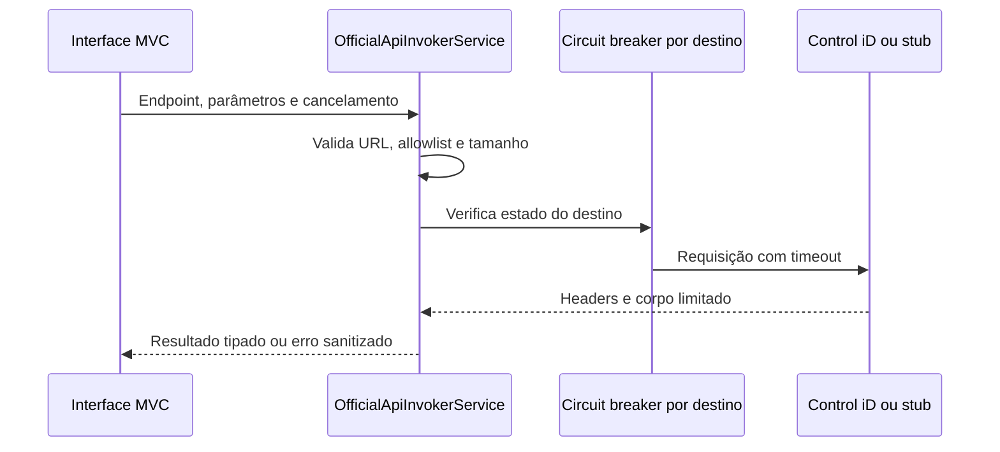
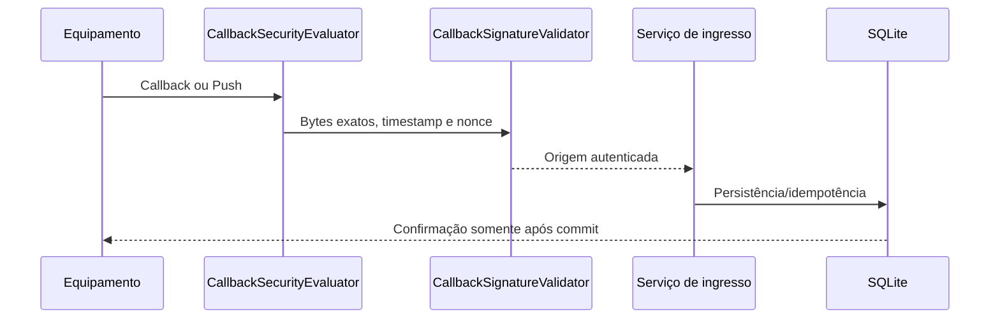

# Inventário de integrações e contratos

> **Documento vivo** · Público: backend, frontend, QA e integrações · Responsável: engenharia de integração · Última validação: 2026-08-03.

Este documento registra os contratos de integração da PoC sem criar endpoints novos ou alterar contratos públicos. Quando um esquema provém de um payload livre da Control iD ou da interface técnica, ele é marcado como inferido.

## Sumário executivo

| Integração | Tipo | Direção | Ambiente | Status |
| --- | --- | --- | --- | --- |
| Access API Control iD | API externa HTTP | PoC -> equipamento | Local/laboratório/equipamento real | Implementada |
| Catálogo oficial da PoC | API interna/UI técnica | Browser -> PoC | Local/laboratório | Implementada |
| Callbacks oficiais | Webhook HTTP | equipamento -> PoC | URL acessível ao equipamento | Implementada |
| Monitor | Webhook HTTP | equipamento -> PoC | URL acessível ao equipamento | Implementada |
| Push oficial | Fila/polling HTTP | equipamento <-> PoC | URL acessível ao equipamento | Implementada |
| Push legado | Webhook HTTP legado | equipamento/simulador -> PoC | Local/laboratório | Implementada |
| SQLite local | Banco de dados | PoC -> arquivo local | Workspace/local | Implementada |
| Sessão ASP.NET + sessão Control iD | Autenticação/estado | Browser/PoC/equipamento | Local/laboratório | Implementada |
| Serilog | Observabilidade | PoC -> console/arquivo | Local/laboratório | Implementada |
| Smoke/stub local | Teste/terceiro simulado | PoC <-> stub | Local | Implementada |
| Swagger/OpenAPI | Documentação automática | Browser/cliente -> PoC | Development/configurado | Implementada |
| Cache | Cache de aplicação | N/A | N/A | Não aplicável |
| Mensageria externa | Queue/broker | N/A | N/A | Não aplicável |
| Pagamentos | Terceiro | N/A | N/A | Não aplicável |
| E-mail/SMS/analytics | Terceiro | N/A | N/A | Não aplicável |

## Configuração e variáveis

Não há loader `.env` configurado. Use `appsettings.json`, User Secrets ou variáveis de ambiente ASP.NET Core no formato `Secao__Chave`.

| Chave | Finalidade | Sensível | Observação |
| --- | --- | --- | --- |
| `ConnectionStrings__DefaultConnection` | Caminho SQLite local | Não, salvo caminho sensível | Default: `integracao_controlid.db` |
| `ControlIDApi__DefaultDeviceUrl` | URL padrão do equipamento | Sim em rede privada | Não versionar valores reais |
| `ControlIDApi__DefaultUsername` | Usuário sugerido | Sim | Não versionar |
| `ControlIDApi__DefaultPassword` | Senha sugerida | Sim | Não versionar |
| `ControlIDApi__ConnectionTimeoutSeconds` | Timeout outbound para Access API | Não | Normalizado entre 5 e 300 segundos |
| `ControlIDApi__MaxResponseBodyBytes` | Limite de resposta outbound | Não | Default 16 MiB; normalizado entre 64 KiB e 64 MiB |
| `ControlIDApi__CircuitBreaker__Enabled` | Proteção contra falhas transitórias repetidas | Não | Default: true |
| `ControlIDApi__CircuitBreaker__FailureThreshold` | Falhas consecutivas para abrir circuito | Não | Default: 5 |
| `ControlIDApi__CircuitBreaker__BreakDurationSeconds` | Duração do circuito aberto | Não | Default: 30 |
| `OpenApi__Enabled` | Habilita Swagger fora de Development | Não | Padrão: `false`; Development habilita automaticamente |
| `CallbackSecurity__MaxBodyBytes` | Limite de body em callbacks/push | Não | Default: 1048576 |
| `CallbackSecurity__RequireSharedKey` | Exige shared key nos ingressos | Não | Obrigatório fora de Development |
| `CallbackSecurity__SharedKeyHeaderName` | Header da chave compartilhada | Não | Default: `X-ControlID-Callback-Key` |
| `CallbackSecurity__SharedKey` | Segredo do ingresso | Sim | Obrigatório fora de Development |
| `CallbackSecurity__AllowedRemoteIps__N` | IPs autorizados | Pode ser sensível | Opcional; vazio aceita qualquer IP |
| `CallbackSecurity__AllowLoopback` | Permite loopback com lista de IP | Não | Facilita stub/smoke local |
| `CallbackSecurity__RateLimit__PermitLimit` | Limite por janela para ingressos callback/push | Não | Default: 120 |
| `CallbackSecurity__RateLimit__WindowSeconds` | Janela do rate limit de ingressos | Não | Default: 60 |
| `Session__IdleTimeout` | Timeout de sessão ASP.NET | Não | Default: 30 minutos |
| `Session__CookieName` | Nome do cookie de sessão | Não | Default: `.IntegracaoControlID.Session` |
| `AllowedHosts` | Hosts aceitos pelo ASP.NET Core | Não | Não pode ser `*` fora de Development |

## Contratos mapeados

### INT-001 - Access API Control iD

- Tipo: API externa HTTP.
- Finalidade: conectar, autenticar, consultar e alterar estado/configuração/objetos do equipamento.
- Ponto de chamada: `OfficialApiInvokerService` via `OfficialControlIdApiService`.
- Endpoints: catalogados em `OfficialApiCatalogService` como paths `.fcgi`, por exemplo `/login.fcgi`, `/load_objects.fcgi`, `/set_configuration.fcgi`, `/reboot.fcgi`.
- Método: definido por endpoint (`GET` ou `POST`).
- Headers: `Content-Type` conforme `OfficialApiEndpointDefinition.ContentType`; session vai na query real `session=...` quando requerida, mas URLs exibidas em tela/logs devem mascarar esse valor.
- Autenticação: login oficial retorna `session`; endpoints com `RequiresSession=true` exigem sessão ativa.
- Request: JSON, multipart, binário/base64 ou vazio, conforme `BodyKind`.
- Response: texto/JSON ou bytes binários mantidos fora de `ResponseBody`; a leitura é limitada, cancelável e rejeitada com `502` acima do limite configurado. Base64 só é produzido nas telas que precisam montar uma URL de dados, nunca no transporte interno de downloads.
- DTO/schema: `OfficialApiEndpointDefinition`, `OfficialApiInvocationResult`; schemas de payload são inferidos do catálogo e docs oficiais.
- Status codes: propagados do equipamento em `OfficialApiInvocationResult.StatusCode`.
- Erros esperados: endpoint ausente no catálogo, device address inválido, sessão ausente, timeout, HTTP não 2xx, JSON inesperado.
- Timeout: `ControlIDApi:ConnectionTimeoutSeconds`, normalizado entre 5 e 300 segundos.
- Retry/backoff: não existe; seguro porque muitas operações oficiais não são idempotentes.
- Idempotência: depende do endpoint externo; `load/get` tendem a ser seguros, `create/modify/destroy/reboot/reset` não devem ser repetidos automaticamente.
- Rate limit: não implementado.
- Circuit breaker/fallback: `OfficialApiCircuitBreaker` abre circuito por endpoint/equipamento após falhas transitórias repetidas (`408`, `429`, `5xx`, timeout ou falha inesperada).
- Logs: endpoint id, método, path, target sem query/session, status e duração.
- Dados sensíveis: credenciais, session, fotos, biometria, cartões, QR, payloads de usuários.

### INT-002 - Catálogo oficial da PoC

- Tipo: API interna/UI técnica MVC.
- Finalidade: expor catálogo de endpoints oficiais, exemplos e invocação assistida.
- Ponto de chamada: `OfficialApiController`, `OfficialApiCatalogService`, `OfficialApiContractDocumentationService`.
- Método: MVC `GET` para catálogo/detalhe e `POST` para invocação.
- Headers: cookie de sessão ASP.NET e antiforgery em formulários.
- Autenticação/autorização: sessão da PoC e RBAC por papel; invocação assistida exige perfil autorizado conforme controller.
- Request: ViewModels de `ViewModels/OfficialApi/*`.
- Response: views Razor com resposta oficial formatada.
- Status codes: MVC padrão; erros aparecem em tela.
- Erros esperados: endpoint não invocável, JSON inválido, sessão ausente e falha oficial.
- Timeout/retry: delegados ao INT-001; sem retry automático.
- Idempotência: não garantida para endpoints oficiais.
- Logs: via invoker e controllers relacionados.
- Dados sensíveis: payloads e respostas oficiais podem conter dados pessoais; não usar exemplos reais.

### INT-003 - Callbacks oficiais

- Tipo: Webhook HTTP.
- Finalidade: receber eventos oficiais de identificação online e cadastros remotos.
- Ponto de chamada: `OfficialCallbacksController`.
- Endpoints: `/new_biometric_image.fcgi`, `/new_biometric_template.fcgi`, `/new_card.fcgi`, `/new_qrcode.fcgi`, `/new_uhf_tag.fcgi`, `/new_user_id_and_password.fcgi`, `/new_user_identified.fcgi`, `/new_rex_log.fcgi`, `/device_is_alive.fcgi`, `/card_create.fcgi`, `/fingerprint_create.fcgi`, `/template_create.fcgi`, `/face_create.fcgi`, `/pin_create.fcgi`, `/password_create.fcgi`.
- Método: `POST`.
- Headers: `X-ControlID-Callback-Key` quando `RequireSharedKey=true`.
- Autenticação/autorização: `CallbackSecurityEvaluator` por shared key, IP permitido e limite de body.
- Request: body textual, JSON, form, imagem ou octet-stream; schema oficial/inferido por endpoint.
- Response: eventos de identificação retornam `{ "result": { "event": 14 } }`; eventos reconhecidos retornam `200 OK` sem payload.
- DTO/schema: persistência em `MonitorEventLocal`; leitura por `CallbackRequestBodyReader`.
- Status codes: `200`, `401`, `403`, `409`, `413`, `500`, `503`.
- Erros esperados: shared key ausente/inválida, IP bloqueado, replay de nonce, capacidade anti-replay atingida, payload acima do limite, falha SQLite.
- Timeout: não há timeout próprio; leitura aceita cancellation token do ASP.NET Core.
- Retry/backoff: não implementado na PoC; retry deve ser decidido pelo equipamento/origem.
- Idempotência: não há chave idempotente; cada callback aceito gera novo `EventId`.
- Rate limit: policy `CallbackIngress`, particionada por IP remoto.
- Circuit breaker/fallback: não implementado.
- Logs: aceite/rejeição com path, event id, família e device id quando seguro.
- Dados sensíveis: imagens, templates, identificadores de usuário, eventos de acesso.

### INT-004 - Monitor

- Tipo: Webhook HTTP.
- Finalidade: receber notificações de tópicos Monitor.
- Ponto de chamada: `OfficialCallbacksController.ReceiveMonitorNotification`.
- Endpoint: `POST /api/notifications/{topic}`.
- Headers/autenticação: iguais aos callbacks oficiais.
- Request: JSON ou payload bruto de monitor; schema inferido por tópico.
- Response: `200 OK` sem payload em sucesso.
- DTO/schema: `MonitorEventLocal`, `WebhookEventViewModel`.
- Status codes/erros/timeout/retry/idempotência/logs/dados: iguais ao INT-003.
- Tópicos documentados: `user_image`, `template`, `card`, `operation_mode`, `pin`, `password`, `catra_event`, `usb_drive`.

### INT-005 - Push oficial

- Tipo: fila persistida com polling HTTP.
- Finalidade: equipamento busca comandos pendentes e devolve resultado.
- Pontos de chamada: `PushCenterController.Poll`, `PushCenterController.Result`, `PushCommandWorkflowService`, `PushCommandRepository`.
- Endpoints:
  - `GET /push?device_id=<id>` ou `GET /push?deviceid=<id>`.
  - `POST /result?command_id=<guid>&status=<status>&device_id=<id>&user_id=<id>`.
- Headers: `X-ControlID-Callback-Key` quando `RequireSharedKey=true`; `Content-Type: application/json` recomendado no resultado.
- Autenticação/autorização: `CallbackSecurityEvaluator`.
- Request:
  - `/push`: query opcional de dispositivo.
  - `/result`: body bruto do resultado; query opcional `command_id`, `status`, `device_id`, `user_id`.
- Response:
  - `/push` com comando: payload JSON enfileirado.
  - `/push` sem comando: `{}`.
  - `/result`: `200 OK` sem payload.
- DTO/esquema: `PushCommandLocal`, `PushQueueCommandViewModel`, `PushEventViewModel`; os payloads do comando e do resultado são inferidos e livres.
- Status codes: `200`, `401`, `403`, `413`, `500`.
- Erros esperados: shared key ausente/inválida, IP bloqueado, payload acima do limite, falha de persistência.
- Timeout: leitura de body limitada por request/cancellation token; limite por `CallbackSecurity:MaxBodyBytes`.
- Retry/backoff: não implementado; retry de `/result` pode criar ou atualizar registro conforme `command_id`.
- Idempotência:
  - `/push` não é idempotente: altera `pending` para `delivered`.
- `/result` com `command_id` é idempotente pela sobrescrita do mesmo registro.
  - `/result` sem `command_id` aceita `Idempotency-Key` ou `idempotency_key` e atualiza o mesmo registro derivado da chave.
  - `/result` sem `command_id` e sem chave idempotente cria registro novo.
- Rate limit: policy `CallbackIngress`, particionada por IP remoto.
- Circuit breaker: não aplicável a polling ingress.
- Logs: command id, device id, status e bytes; payload bruto não deve ser logado.
- Dados sensíveis: payloads podem conter dados pessoais/operacionais.

### INT-006 - Push legado

- Tipo: webhook HTTP legado.
- Finalidade: manter compatibilidade com `POST /Push/Receive`.
- Endpoint: `POST /Push/Receive`.
- Headers/autenticação: iguais ao Push oficial.
- Request: body bruto; se JSON, campos inferidos `command_type`, `type`, `event`, `status`, `device_id`, `deviceid`, `user_id`, `userid`, `payload`, `data`.
- Response: `{ "status": "received", "eventId": "<guid>" }`.
- DTO/schema: `PushCommandLocal`.
- Status codes: `200`, `401`, `403`, `413`, `500`.
- Timeout/retry/backoff/idempotência: sem retry; aceita `Idempotency-Key` ou `idempotency_key` para atualizar o mesmo evento legado, mas cada aceite sem chave cria registro.
- Logs: registram apenas metadados operacionais, como tamanho do corpo e identificador do evento; não registram o payload bruto.
- Dados sensíveis: payload bruto.

### INT-007 - SQLite local

- Tipo: banco de dados local.
- Finalidade: persistir estado da PoC, eventos, push, usuários locais e artefatos.
- Ponto de chamada: `IntegracaoControlIDContext`, com repositórios em `Services/Database`.
- Esquema: migrações do EF Core em `Data/Migrations`; a aplicação ocorre quando `Database:ApplyMigrationsOnStartup=true` ou no modo exclusivo de migração.
- Autenticação: arquivo local; sem usuário/senha.
- Timeout/retry/backoff: defaults do SQLite/EF Core; sem retry customizado.
- Idempotência: depende do repository; inserts geram novos ids, updates por chave.
- Logs: repositories registram falhas.
- Dados sensíveis: usuários, fotos, biometria, cartões, QR, callbacks e push.
- Ambiente: local/área de trabalho; arquivos `integracao_controlid.db*` não devem ser versionados.

### INT-008 - Sessão ASP.NET e sessão Control iD

- Tipo: autenticação/estado.
- Finalidade: guardar device address e session string oficial para chamadas autenticadas.
- Chaves: `ControlID_DeviceAddress`, `ControlID_SessionString`.
- Cookie: `Session:CookieName`, HttpOnly, SameSite Strict, Secure Always fora de Development.
- Request/response: MVC com antiforgery nos POSTs.
- Timeout: `Session:IdleTimeout`.
- Retry/backoff: não aplicável.
- Idempotência: logout/clear são tolerantes a ausência de sessão.
- Dados sensíveis: session string oficial; não logar.
- Controle: auth local global com RBAC por papel; session string oficial deve aparecer apenas mascarada em URLs de diagnóstico.
- Permissões: qualquer usuário local autenticado pode conectar e executar
  login/logout oficial pelo `AuthController`; ações do `SessionController`,
  invocações por POST e operações administrativas exigem `Administrator`.

### INT-009 - Observabilidade Serilog

- Tipo: logs, correlation ID, health checks e métricas in-process.
- Destino: console e `Logs/app_log.txt`.
- Payload: mensagens estruturadas com endpoint, device id pseudonimizado, command id, status, duração, correlation id e exceções.
- Correlação: `X-Correlation-ID` inbound/outbound, retornado em toda resposta HTTP.
- Health: `GET /health/live` e `GET /health/ready`.
- Métricas: meter `Integracao.ControlID.PoC.Operations` via `System.Diagnostics.Metrics` e `GET /metrics` em formato Prometheus text.
- Autorização: `/metrics` exige `AdministratorOnly` por padrão; `AllowAnonymous` é bloqueado fora de `Development`.
- Artefatos: alertas em `docs/observability/alert-rules.json`, painéis em `docs/observability/dashboard.json`, monitor local em `tools/observability-check.ps1`.
- Dados sensíveis: não logar credenciais, shared key, biometria bruta ou payload integral.
- Retenção: configurada por `Logging__File__RetainedFileCountLimit`/Serilog.

### INT-010 - OpenAPI/Swagger local

- Tipo: documentação automática HTTP.
- Finalidade: expor especificação e UI técnica dos contratos HTTP locais da PoC.
- Endpoint: `/swagger/v1/swagger.json` e `/swagger`.
- Ambiente: habilitado automaticamente em `Development`; fora de Development exige `OpenApi:Enabled=true`.
- Autenticação/autorização: não adiciona autenticação própria; não habilite fora de rede controlada sem proteção externa.
- DTO/schema: gerado pelo Swashbuckle a partir das ações com método HTTP
  explícito e metadados ASP.NET Core. Rotas MVC convencionais sem verbo declarado
  são omitidas porque não formam contrato OpenAPI inequívoco.
- Dados sensíveis: exemplos reais não devem ser colocados em atributos, docs ou responses.

### INT-011 - Check opt-in de contrato com equipamento real

- Tipo: script de validação externa.
- Ponto de chamada: `tools/contract-controlid-device.ps1`.
- Finalidade: validar `login.fcgi`, `session_is_valid.fcgi` e `system_information.fcgi` contra equipamento real sem versionar credenciais.
- Ambiente: local/laboratório; exige `CONTROLID_DEVICE_URL`, `CONTROLID_USERNAME` e `CONTROLID_PASSWORD`.
- Persistência: gera relatório em `artifacts/reports/controlid-device-contract-latest.md` por padrão, fora do Git, omitindo host real, credenciais e session.
- Restrição: não roda na CI porque depende de equipamento físico e credenciais reais.

## Exemplos de payloads

### Access API - login válido

Request:

```http
POST /login.fcgi HTTP/1.1
Content-Type: application/json

{
  "login": "<usuario>",
  "password": "<senha>"
}
```

Response de sucesso inferido:

```json
{
  "session": "<session>"
}
```

Erro esperado: credencial inválida ou resposta sem `session`; a PoC não cria sessão local.

### Callback com shared key ausente

Request inválido:

```http
POST /device_is_alive.fcgi HTTP/1.1
Content-Type: application/json

{}
```

Response quando `RequireSharedKey=true`:

```http
401 Unauthorized
Callback shared key is missing.
```

### Monitor válido

Request válido:

```http
POST /api/notifications/operation_mode?device_id=123 HTTP/1.1
X-ControlID-Callback-Key: <segredo>
Content-Type: application/json

{
  "online": 1,
  "local_identification": 0
}
```

Response:

```http
200 OK
```

Persistência esperada: `EventType = "monitor:operation_mode:/api/notifications/operation_mode"`, `Status = "received"`.

### Push - comando disponível

Request:

```http
GET /push?device_id=device-1 HTTP/1.1
X-ControlID-Callback-Key: <segredo>
```

Response:

```json
{
  "actions": []
}
```

Efeito: comando muda de `pending` para `delivered`.

### Push - fila vazia

```http
HTTP/1.1 200 OK
Content-Type: application/json

{}
```

### Push - resultado válido

Request:

```http
POST /result?command_id=00000000-0000-0000-0000-000000000001&status=completed&device_id=device-1 HTTP/1.1
X-ControlID-Callback-Key: <segredo>
Content-Type: application/json

{
  "ok": true
}
```

Response:

```http
200 OK
```

### Payload excessivo

Quando o body ultrapassa `CallbackSecurity:MaxBodyBytes`, mesmo sem `Content-Length`, callbacks e Push retornam:

```http
413 Payload Too Large
```

### Falha de rede/timeout outbound

Quando o equipamento não responde dentro de `ControlIDApi:ConnectionTimeoutSeconds`, a PoC retorna mensagem funcional segura:

```text
Tempo limite excedido ao comunicar com o equipamento.
```

### Resposta inesperada

Quando um fluxo espera JSON estruturado e o equipamento retorna corpo não parseável, a PoC mantém o resultado bruto e registra warning; o fluxo consumidor deve tratar `JsonDocument` nulo.

## Riscos mitigados nesta revisão

| Risco | Mitigação |
| --- | --- |
| Contratos de integração espalhados | Documento único de inventário e exemplos |
| Payload Push sem `Content-Length` podendo exceder limite antes da persistência | `CallbackRequestBodyReader` agora limita leitura de `/result` e `/Push/Receive` |
| DTO/status Push implícitos | `PushCommandWorkflowService` e `PushCommandStatuses` centralizam estados e workflow |
| OpenAPI presumido | Swagger/OpenAPI habilitado em Development ou via `OpenApi:Enabled=true` |
| Sem circuit breaker outbound | `OfficialApiCircuitBreaker` protege endpoint/equipamento após falhas transitórias repetidas |
| Sem idempotency key para Push sem `command_id` e legado | `Idempotency-Key`/`idempotency_key` geram chave determinística e atualizam o mesmo registro |
| Sem secret scanner dedicado | `tools/scan-secrets.ps1` roda localmente e na CI |
| Sem check contra equipamento real | `tools/contract-controlid-device.ps1` valida contrato real de forma opt-in, sem credenciais versionadas |
| Sem rate limit para ingressos | Policy `CallbackIngress` limita callbacks e push por IP remoto |
| Ingressos sem autenticidade criptográfica | `CallbackSignatureValidator` exige HMAC/timestamp/nonce quando configurado e `ControlIdCallbackSigningProxy` assina equipamentos sem HMAC nativo |
| UI sem autorização por perfil | Cookie auth global e RBAC por papel protegem operações administrativas e dados sensíveis |

## Riscos controlados e limites externos

| Item | Prioridade | Controle |
| --- | --- | --- |
| `/push` altera estado por natureza do contrato de polling | Alta | Mantido sem retry automático para evitar replay de operações físicas; resultados usam idempotency key quando o equipamento envia ou quando a PoC deriva chave segura |
| Operações oficiais de saída podem não ser idempotentes | Média | Sem nova tentativa automática genérica; tempo limite e circuit breaker reduzem repetição perigosa e falhas em cascata |
| Contratos oficiais dependem de firmware/modelo/licença | Alta | Check opt-in real existe em `tools/contract-controlid-device.ps1`; validação final exige equipamento físico e credenciais fora do Git |

## Sequências de referência





## Compatibilidade e propriedade

| Integração | Dono técnico | Compatibilidade conhecida | Evidência exigida |
| --- | --- | --- | --- |
| Access API | Engenharia de integração | Stub cobre o contrato usado; hardware varia por firmware e licença | Relatório de `contract-controlid-device.ps1` |
| Callbacks/Monitor | Integração e AppSec | HMAC nativo ou proxy assinador | Callback real, correlação e persistência |
| Push | Integração e operação | Polling e resultado simulados no stub | Ciclo físico sem duplicidade |
| SQLite | Backend/dados | Uma instância gravadora da PoC | Migrações e teste de cópia/restauração |
| OpenAPI/métricas | Plataforma | Exposição condicionada ao ambiente e à autorização | Gate de observabilidade |

Registre modelo, firmware, licença, data e relatório fora de payloads públicos.
Uma diferença física não autoriza alterar silenciosamente rota ou DTO; documente
a variante, cubra-a por teste e preserve o contrato existente.

## Detecção de divergência contratual

| Fonte | Verificação | Divergência bloqueante |
| --- | --- | --- |
| Rotas MVC | Testes de controlador e catálogo de navegação | Rota pública removida ou autorização enfraquecida |
| Access API | Stub, catálogo oficial e teste com equipamento opt-in | Método, `.fcgi`, campo ou semântica incompatível |
| DTOs e schemas | Compilação, testes de serialização e exemplos | Campo obrigatório sem validação ou resposta sensível |
| OpenAPI | Documento gerado em Development | Operação pública ausente ou erro não documentado |
| Firmware real | Relatório de contrato físico | Variação não versionada por modelo, firmware ou licença |

O OpenAPI descreve a superfície HTTP da PoC, mas não substitui o contrato externo
do equipamento. Exemplos deste documento devem usar placeholders e permanecer
compatíveis com testes executáveis.
