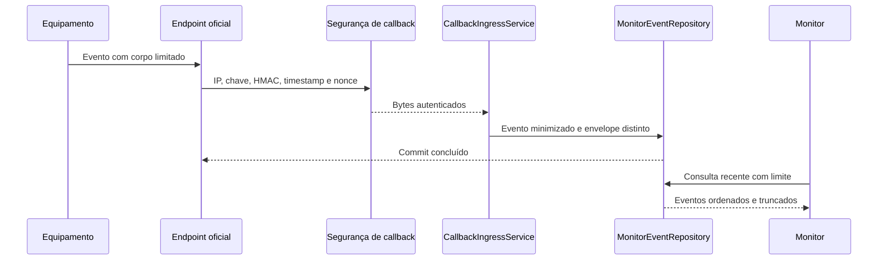

# Monitor: implementação na PoC

> **Documento vivo** · Público: desenvolvimento, QA e operação · Responsável: engenharia de integração · Última validação: 2026-08-03.

Este documento explica como a funcionalidade Monitor foi implementada dentro da PoC de integração com a API de controle de acesso da Control iD.

Na PoC, "Monitor" representa a trilha de recebimento, persistência e visualização de callbacks/notificações enviados pelo equipamento para a aplicação. Ele é diferente do Push: no Monitor, o equipamento envia eventos para a PoC; no Push, o equipamento consulta a PoC para buscar comandos pendentes.

## Visão geral

O Monitor foi implementado como um pipeline de entrada HTTP:

```text
Equipamento Control iD
  -> endpoint da PoC
  -> validação de segurança
  -> leitura do corpo da requisição
  -> persistência em SQLite
  -> tela de eventos oficiais
  -> uso por outras telas, como Modos de operação
```

A tela operacional principal é `OfficialEvents`. As rotas legadas de `MonitorWebhook` redirecionam para essa tela consolidada.

## Arquivos envolvidos

| Arquivo | Papel na funcionalidade |
| --- | --- |
| `Controllers/OfficialCallbacksController.cs` | Expõe endpoints oficiais de callback e monitor recebidos pelo equipamento. |
| `Controllers/OfficialEventsController.cs` | Lista, detalha e limpa eventos oficiais persistidos. |
| `Controllers/MonitorWebhookController.cs` | Mantém uma entrada legada para webhook e redireciona consultas para `OfficialEvents`. |
| `Services/Callbacks/CallbackIngressService.cs` | Orquestra validação, leitura e persistência dos callbacks recebidos. |
| `Services/Callbacks/CallbackSecurityEvaluator.cs` | Aplica regras de segurança para callbacks: tamanho, IP permitido e chave compartilhada. |
| `Services/Callbacks/CallbackRequestBodyReader.cs` | Lê o corpo da requisição e converte payload binário/imagem para Base64. |
| `Options/CallbackSecurityOptions.cs` | Define as configurações de segurança usadas pelo pipeline de callback. |
| `Models/Database/MonitorEventLocal.cs` | Entidade local persistida na tabela `MonitorEvents`. |
| `Services/Database/MonitorEventRepository.cs` | Repositório de persistência e consulta dos eventos monitorados. |
| `ViewModels/Monitor/*` | Modelos usados para listagem e detalhe dos eventos. |
| `Views/OfficialEvents/*` | Interface principal para consultar eventos oficiais. |
| `Monitor/MonitorEventHandler.cs` | Handler auxiliar para processar `MonitorEvent` e salvar como evento local. |
| `Monitor/MonitorEventMapper.cs` | Conversores entre modelo de API e entidade local. |
| `Monitor/MonitorEventQueue.cs` | Fila em memória para expansões futuras de processamento assíncrono. |

## Endpoints recebidos pela PoC

O controller `OfficialCallbacksController` cobre três famílias de entrada.

### Eventos de identificação online

Rotas:

```text
POST /new_biometric_image.fcgi
POST /new_biometric_template.fcgi
POST /new_card.fcgi
POST /new_qrcode.fcgi
POST /new_uhf_tag.fcgi
POST /new_user_id_and_password.fcgi
POST /new_user_identified.fcgi
```

Essas rotas chamam:

```csharp
_callbackIngressService.PersistAsync(HttpContext, "identification", cancellationToken)
```

Quando o evento é aceito, a PoC responde:

```json
{
  "result": {
    "event": 14
  }
}
```

### Eventos reconhecidos

Rotas:

```text
POST /new_rex_log.fcgi
POST /device_is_alive.fcgi
POST /card_create.fcgi
POST /fingerprint_create.fcgi
POST /template_create.fcgi
POST /face_create.fcgi
POST /pin_create.fcgi
POST /password_create.fcgi
```

Essas rotas chamam:

```csharp
_callbackIngressService.PersistAsync(HttpContext, "callback", cancellationToken)
```

Quando aceitas, retornam `200 OK` sem payload adicional.

### Notificações de Monitor

Rota genérica:

```text
POST /api/notifications/{topic}
```

Essa rota chama:

```csharp
_callbackIngressService.PersistAsync(HttpContext, $"monitor:{topic}", cancellationToken)
```

Exemplos catalogados:

| Rota | Finalidade |
| --- | --- |
| `/api/notifications/user_image` | Receber imagem de usuário pelo Monitor. |
| `/api/notifications/template` | Receber template pelo Monitor. |
| `/api/notifications/card` | Receber cartão pelo Monitor. |
| `/api/notifications/operation_mode` | Receber mudança de modo de operação. |
| `/api/notifications/pin` | Receber PIN de cadastro remoto. |
| `/api/notifications/password` | Receber senha de cadastro remoto. |
| `/api/notifications/catra_event` | Receber evento de catraca. |
| `/api/notifications/usb_drive` | Receber evento relacionado a USB. |

## Fluxo de entrada

A lógica principal fica em `CallbackIngressService.PersistAsync`.

O fluxo é:

1. `CallbackSecurityEvaluator.Evaluate` valida origem, chave compartilhada e tamanho declarado.
2. `CallbackRequestBodyReader.ReadAsync` lê o corpo da requisição dentro do limite configurado.
3. `CallbackSignatureValidator.Validate` valida assinatura HMAC, carimbo de data e hora e nonce quando a assinatura é obrigatória.
4. A PoC monta um `MonitorEventLocal`.
5. O evento é persistido por `MonitorEventRepository.AddMonitorEventAsync`.
6. A resposta informa sucesso ou rejeição.

O `EventType` é montado assim:

```text
<família>:<path>
```

Exemplos:

```text
identification:/new_user_identified.fcgi
callback:/device_is_alive.fcgi
monitor:operation_mode:/api/notifications/operation_mode
legacy-webhook:/MonitorWebhook/Receive
```

## Segurança dos callbacks

A segurança do Monitor é configurada por `CallbackSecurityOptions`, carregada da seção `CallbackSecurity` do `appsettings`.

| Opção | Comportamento |
| --- | --- |
| `MaxBodyBytes` | Limita o tamanho máximo do payload. O padrão é 1 MB. |
| `AllowedRemoteIps` | Quando preenchido, restringe os IPs que podem enviar callbacks. |
| `AllowLoopback` | Permite loopback mesmo quando há filtro de IP. |
| `RequireSharedKey` | Exige uma chave compartilhada no cabeçalho configurado. |
| `SharedKeyHeaderName` | Nome do cabeçalho usado para a chave. Padrão: `X-ControlID-Callback-Key`. |
| `SharedKey` | Valor esperado da chave compartilhada. |
| `RequireSignedRequests` | Exige assinatura HMAC do corpo e dos metadados canônicos da requisição. |
| `SignatureHeaderName`, `TimestampHeaderName`, `NonceHeaderName` | Definem os cabeçalhos da assinatura, do carimbo de data e hora e do nonce. |
| `MaxClockSkewSeconds`, `NonceTtlSeconds`, `MaxTrackedNonces` | Limitam desvio de relógio, vida útil e quantidade de nonces para proteção contra repetição. |

A comparação da chave usa `CryptographicOperations.FixedTimeEquals`, evitando comparação simples de strings para o segredo.

O `Program.cs` também valida a segurança durante a inicialização:

| Condição | Resultado |
| --- | --- |
| `RequireSharedKey=true` e `SharedKey` vazio em `Development` | Registra erro de segurança para diagnóstico local. |
| Ambiente fora de `Development` sem chave compartilhada válida ou sem assinatura obrigatória | Interrompe a inicialização. |
| Ambiente fora de `Development` com `AllowedHosts`, OpenAPI ou lista de hosts do equipamento inseguros | Interrompe a inicialização. |

## Leitura do corpo da requisição

`CallbackRequestBodyReader` trata dois cenários:

| Tipo de corpo | Tratamento |
| --- | --- |
| Texto/JSON/form | Lido como UTF-8 e salvo como string. |
| `application/octet-stream` ou `image/*` | Convertido para Base64 antes de persistir. |

Isso permite que eventos com imagem, template ou binário sejam inspecionados posteriormente sem quebrar a persistência textual no SQLite.

## Persistência local

Os eventos são salvos na tabela `MonitorEvents`.

As migrações versionadas do EF Core criam e evoluem a tabela quando são aplicadas, seja na inicialização configurada, seja no modo exclusivo de migração:

```text
MonitorEvents(
  EventId,
  ReceivedAt,
  RawJson,
  EventType,
  DeviceId,
  UserId,
  Payload,
  Status,
  CreatedAt,
  UpdatedAt
)
```

Campos principais:

| Campo | Origem |
| --- | --- |
| `EventId` | GUID gerado pela PoC. |
| `ReceivedAt` | Data/hora UTC de recebimento. |
| `RawJson` | Reservado para um envelope bruto distinto; permanece vazio no pipeline principal para não duplicar `Payload`. |
| `EventType` | Família + path do callback. |
| `DeviceId` | Query string `device_id`, quando enviada. |
| `UserId` | Query string `user_id`, quando enviada. |
| `Payload` | Conteúdo textual ou Base64 lido do corpo. |
| `Status` | Atualmente definido como `received` no pipeline principal. |

## Interface de consulta

A interface principal está em:

```text
GET /OfficialEvents
GET /OfficialEvents/Details/{id}
POST /OfficialEvents/Clear
```

`OfficialEventsController.Index` consulta os eventos recentes por `MonitorEventRepository.GetAllMonitorEventsAsync`, alias limitado de `GetRecentMonitorEventsAsync`, ordenados do mais recente para o mais antigo.

`Details` abre um evento específico.

`Clear` remove todos os eventos persistidos somente depois de confirmação textual na UI, porque esses registros podem conter payloads pessoais/sensíveis e servem como histórico operacional local.

`MonitorWebhookController` mantém compatibilidade com a rota legada:

| Rota | Comportamento |
| --- | --- |
| `GET /MonitorWebhook` | Redireciona para `OfficialEvents/Index`. |
| `GET /MonitorWebhook/Details/{id}` | Redireciona para `OfficialEvents/Details/{id}`. |
| `POST /MonitorWebhook/Receive` | Recebe webhook legado e persiste como `legacy-webhook`. |
| `POST /MonitorWebhook/Clear` | Limpa eventos e redireciona para `OfficialEvents`. |

## Relação com Modos de operação

A tela de modos usa eventos do Monitor para mostrar prontidão e sinais recentes.

`OperationModesController` consulta `MonitorEventRepository.GetAllMonitorEventsAsync` e verifica eventos cujo `EventType` termina com:

```text
/new_user_identified.fcgi
/new_card.fcgi
/new_biometric_image.fcgi
/device_is_alive.fcgi
/api/notifications/operation_mode
```

Isso permite que a PoC mostre se os endpoints que sustentam Pro e Enterprise já receberam eventos reais.

## Componentes auxiliares de Monitor

A pasta `Monitor/` possui estruturas auxiliares:

| Arquivo | Situação na implementação atual |
| --- | --- |
| `MonitorEventHandler.cs` | Converte um `MonitorEvent` de API em `MonitorEventLocal` e persiste. Serve como ponto de extensão para processamento programático. |
| `MonitorEventMapper.cs` | Faz conversão entre `MonitorEvent` e `MonitorEventLocal`. |
| `MonitorEventQueue.cs` | Implementa fila em memória com `ConcurrentQueue` e `SemaphoreSlim`. |

O pipeline HTTP principal de callbacks usa `CallbackIngressService` diretamente. A fila em memória existe como base para evolução futura, por exemplo processamento assíncrono, SignalR ou notificação em tempo real.

## Cobertura de testes

| Teste | Cobre |
| --- | --- |
| `CallbackSecurityEvaluatorTests.cs` | Validação de IP, tamanho, loopback e chave compartilhada. |
| `CallbackSignatureValidatorTests.cs` | Assinatura HMAC, carimbo de data e hora, nonce e proteção contra repetição. |
| `CallbackRequestBodyReaderTests.cs` | Leitura de payload textual, vazio, binário e limite de tamanho. |
| `CallbackIngressServiceTests.cs` | Fluxo de persistência/rejeição dos callbacks recebidos. |

## Limitações atuais

| Ponto | Observação |
| --- | --- |
| Equipamento real | A validação completa depende de um dispositivo Control iD enviando callbacks reais. |
| Tempo real | A PoC persiste e lista eventos, mas ainda não publica eventos via SignalR/websocket. |
| Processamento assíncrono | A fila em memória existe, mas o pipeline principal persiste diretamente no banco. |
| Exposição pública | Para receber callbacks reais, a URL da PoC precisa estar acessível pelo equipamento. |

## Fluxo ponta a ponta



## Ciclo de dados e diagnóstico

| Etapa | Dado mantido | Controle | Sintoma de falha |
| --- | --- | --- | --- |
| Recepção | Bytes somente durante a requisição | Limite antes do parse | HTTP 413 ou rejeição de segurança |
| Validação | Metadados criptográficos temporários | HMAC e proteção contra replay | HTTP 401/403 |
| Persistência | Payload necessário e metadados do evento | `RawJson` apenas quando distinto | Evento ausente ou erro SQLite |
| Consulta | Janela recente | Limite de listagem | Aviso de resultado truncado |
| Expurgo | Registros confirmados pelo operador | Ação explícita e auditável | Crescimento de volume |

Para diagnosticar, use o correlation ID e confirme, nesta ordem, conectividade,
política `CallbackIngress`, assinatura, commit SQLite e consulta da UI. Não copie
payload completo para tickets ou logs; use identificadores pseudonimizados.

## Exemplo local sanitizado

```json
{
  "eventType": "access_event_example",
  "deviceId": "device-ref-example",
  "userId": "subject-ref-example",
  "status": "received",
  "receivedAt": "2026-01-01T00:00:00Z"
}
```

Este exemplo ilustra os metadados locais, não define o payload oficial de um
firmware. Campos reais devem ser validados no contrato do equipamento, e
`RawJson` ou `Payload` não devem ser copiados para documentação pública.
