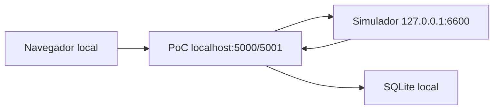
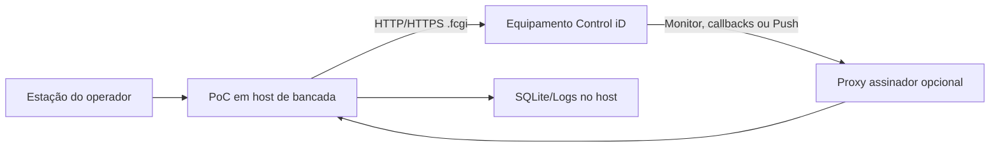
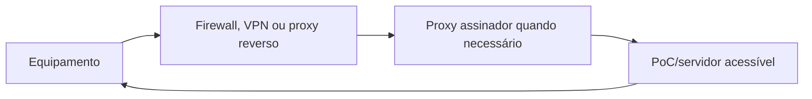

# Topologias de rede e comunicação

> **Documento vivo** · Público: integração, infraestrutura, segurança e suporte · Responsável: plataforma e engenharia de integração · Última validação: 2026-08-03.

Este documento mostra quem inicia cada conexão, quais endereços precisam ser
alcançáveis e como separar um laboratório local de um ambiente exposto. Ele não
autoriza abertura de firewall, publicação em internet, alteração de DNS ou uso de
certificado real sem aprovação humana.

## Fluxos de comunicação

| Fluxo | Iniciador | Destino | Direção | Sessão/controle |
| --- | --- | --- | --- | --- |
| Interface web | Navegador | PoC | Entrada | Cookie local, antiforgery e RBAC. |
| Access API | PoC | Equipamento | Saída | `session` oficial na query quando exigida. |
| Modo Pro/Enterprise | Equipamento | Servidor configurado | Entrada | Resposta do servidor define autorização/continuidade. |
| Monitor | Equipamento | PoC/proxy | Entrada | IP, chave compartilhada, HMAC, timestamp, nonce e limite de corpo conforme ambiente. |
| Push | Equipamento | PoC/proxy | Entrada e resposta | `GET /push` e `POST /result`; controles de ingresso. |
| Observabilidade | Operador/coletor | PoC | Entrada | `/health/*` anônimo; `/metrics` administrativo por padrão. |

## Topologia 1: demonstração somente local



Use esta topologia para integração inicial, testes e demonstração sem hardware.
O simulador (stub)
reproduz apenas os contratos usados pelos testes; ele não comprova relés,
biometria, câmera, licença, latência ou firmware reais.

## Topologia 2: equipamento em rede de laboratório



Para chamadas da PoC ao equipamento, o host da aplicação precisa alcançar o
endereço e a porta configurados no terminal. Para eventos do equipamento, o
terminal precisa alcançar a URL da PoC ou do proxy. Estar na mesma LAN não é um
requisito lógico, mas reduz complexidade de roteamento; redes distintas exigem
rotas, firewall, DNS e TLS aprovados.

## Topologia 3: modo on-line ou Monitor fora da LAN



Não exponha diretamente a PoC à internet apenas para “fazer o callback
funcionar”. Prefira VPN, rede privada, túnel corporativo ou proxy reverso
controlado. Se houver NAT, a URL configurada no equipamento deve apontar para um
endereço roteável até o servidor; `localhost` sempre significa o próprio
equipamento quando usado nele.

## Endereços e portas do repositório

| Componente | Padrão/documentação local | Observação |
| --- | --- | --- |
| PoC via perfil local | `http://localhost:5000` e `https://localhost:5001` | Confirmar `Properties/launchSettings.json`. |
| Contêiner | Porta interna `8080` | Publicação externa definida por `APP_PORT`/Compose. |
| Simulador (stub) | `http://127.0.0.1:6600` | Somente laboratório. |
| Proxy assinador | `http://localhost:6700` | Deve receber apenas origens e caminhos permitidos. |
| Equipamento | URL informada pelo operador/configuração | A documentação oficial lista HTTP 80 e HTTPS 443 como padrões de rede, mas o equipamento pode estar configurado em outra porta. |

A página oficial de fortalecimento lista também serviços como SSH, NTP, RTSP,
ONVIF, SIP, DNS, DHCP e SNMP. Não abra portas que não sejam necessárias para o
caso de uso e confirme os valores padrão no modelo/firmware real:
[fortalecimento de segurança](https://www.controlid.com.br/docs/access-api-en/system/security-hardening/).

## Composição das URLs de ingresso

### Monitor

A configuração combina `hostname`, `port` e `path`. Com o caminho padrão, os
eventos chegam sob `/api/notifications/{topic}`. O hostname pode ser IP ou domínio
alcançável pelo equipamento. Consulte a
[introdução oficial ao Monitor](https://www.controlid.com.br/docs/access-api-pt/monitor/introducao-ao-monitor/).

### Modos Pro e Enterprise

O objeto `devices` representa o servidor no banco do equipamento. Seu `id` passa
a ser o `online_client.server_id`; o endereço precisa alcançar os endpoints de
identificação, inclusive `/device_is_alive.fcgi`. Consulte
[configurar modo on-line](https://www.controlid.com.br/docs/access-api-pt/modos-de-operacao/configurar-modo-online/).

### Push

O equipamento consulta periodicamente `/push` e envia o resultado para `/result`.
A PoC aceita `device_id` ou `deviceid` na consulta periódica e persiste o ciclo. Consulte a
[introdução oficial ao Push](https://www.controlid.com.br/docs/access-api-pt/modo-push/introducao-ao-push/)
e `push-implementation.md`.

## TLS, certificados e proxies

- Fora de `Development`, a PoC exige cookie seguro e deve ser publicada por
  HTTPS.
- O equipamento deve confiar no certificado e no nome usados na URL; valide a
  cadeia com o firmware real.
- Cabeçalhos encaminhados permanecem desabilitados até existir proxy conhecido e
  `ForwardedHeaders:KnownProxies` configurado.
- HTTPS entre PoC e equipamento depende da configuração/certificado do terminal;
  não desative validação de certificado para contornar erro.
- CORS não substitui autenticação nem costuma participar de chamadas servidor a
  servidor. A interface MVC usa mesma origem e antiforgery.

## Controles mínimos por ambiente

| Controle | Local com simulador | Laboratório físico | Ambiente exposto |
| --- | --- | --- | --- |
| `AllowedHosts` restrito | Opcional em Development | Recomendado | Obrigatório; nunca `*`. |
| Lista de permissões de equipamentos | Opcional com loopback | Recomendada | Obrigatória. |
| IP permitido em callbacks | Loopback | IP do equipamento/proxy | Obrigatório e revisado. |
| Chave compartilhada | Pode ser usada no teste integrado | Obrigatória se houver ingresso real | Obrigatória. |
| HMAC/timestamp/nonce | Proxy opcional | Obrigatório para homologação segura | Obrigatório. |
| TLS | Pode usar certificado local | Recomendado | Obrigatório. |
| OpenAPI | Permitido em Development | Desabilitar salvo necessidade | Desabilitado. |
| Métricas anônimas | Permitidas apenas em Development controlado | Não | Não. |

Se o equipamento não assina HMAC nativamente, use
`tools/ControlIdCallbackSigningProxy` com segredo fora do Git, lista de permissões de IP,
limite de corpo e destino permitido. O proxy não torna segura uma rede pública
mal configurada.

## Diagnóstico de conectividade

```powershell
Test-NetConnection <host-do-equipamento> -Port <porta>
Resolve-DnsName <host-do-equipamento>
powershell -ExecutionPolicy Bypass -File .\tools\contract-controlid-device.ps1
```

O contrato físico exige `CONTROLID_DEVICE_URL`, `CONTROLID_USERNAME` e
`CONTROLID_PASSWORD` no ambiente e executa apenas sessão e leitura. Não coloque os
valores na linha de comando compartilhada, no Git ou em relatório público.

## Lista de verificação para implantação de rede

1. Registrar origem, destino, protocolo, porta e responsável de cada fluxo.
2. Confirmar resolução DNS e rota nos dois sentidos necessários.
3. Aplicar princípio do menor privilégio no firewall.
4. Configurar TLS, certificado e proxy conhecido.
5. Definir listas de permissões de host e IP.
6. Validar `device_is_alive`, Monitor e Push conforme o modo usado.
7. Simular tempo limite, perda de rota e retorno à normalidade.
8. Guardar evidência sanitizada, sem credenciais, sessão, IP de cliente ou
   carga útil com dados pessoais.

Para incidentes, siga `troubleshooting-controlid.md`,
`equipment-contingency-runbook.md` e `incident-response-and-dr.md`.
