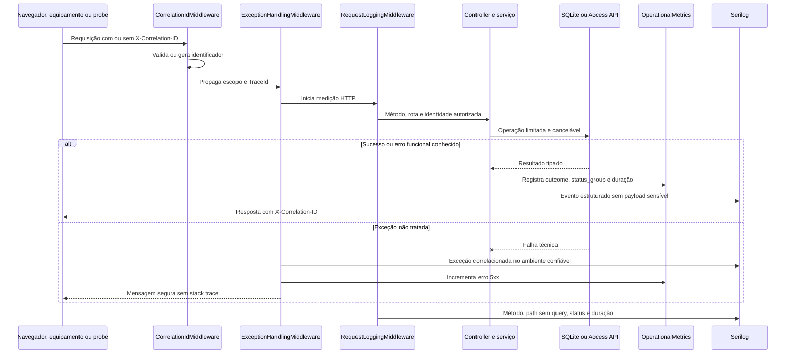

# Guia operacional de observabilidade e operabilidade

> **Runbook** · Público: desenvolvimento e SRE · Responsável: Plataforma/SRE · Última validação: 2026-08-13.

Escopo: PoC ASP.NET Core MVC/Razor para integração com a Access API Control iD.
Este guia operacional define sinais, eventos críticos, métricas, alertas e
painéis sem expor dados pessoais, credenciais, cargas úteis completas ou detalhes
internos ao usuário final.

## Endpoints operacionais

| Endpoint | Finalidade | Dependência | Exposição recomendada |
| --- | --- | --- | --- |
| `GET /health/live` | Verifica se o processo ASP.NET Core responde | Estado agregado apenas | Pode ser usado anonimamente por supervisor ou balanceador |
| `GET /health/ready` | Verifica SQLite, migrações e proteção de dados sensíveis | Estado agregado apenas | Usar anonimamente para readiness antes de enviar tráfego |
| `GET /health/details` | Expõe nomes, estados, durações e tags das verificações | Diagnóstico interno | Exige administrador; nunca publicar no balanceador |
| `GET /metrics` | Exporta snapshot Prometheus text das métricas locais | Auth local/RBAC | Protegido por administrador por padrão |

As respostas de verificação de saúde são JSON minimizado com `status`, duração e nomes dos
checks. Exceções, paths locais, connection string e stack trace não são serializados.

O endpoint `/metrics` fica habilitado por `Observability:Metrics:Enabled=true` e
exige `AdministratorOnly` por padrão. `Observability:Metrics:AllowAnonymous=true`
só deve ser usado em `Development`; fora de `Development` a aplicação bloqueia o
startup se essa opção estiver ativa.

As métricas que consultam memória, disco e diretórios locais são atualizadas pelo
`RuntimeCapacityMetricsBackgroundService`. O intervalo padrão é 30 segundos e
pode ser configurado por `Observability:CapacitySnapshotIntervalSeconds` entre
10 e 300 segundos. Assim, cada leitura de `/metrics` não repete varreduras do
sistema de arquivos.

## Correlação e rastreamento

- Header inbound/outbound: `X-Correlation-ID`.
- Valores aceitos: até 128 caracteres, somente letras, números, `-`, `_`, `.`, `:`
  e `/`.
- Valor inválido, vazio ou longo demais é substituído por um identificador gerado.
- Toda resposta HTTP recebe `X-Correlation-ID`.
- O middleware registra `CorrelationId` e `TraceId` no escopo de log.
- Chamadas outbound para a Access API recebem o mesmo `X-Correlation-ID` quando a
  request atual possui contexto HTTP.

## Eventos críticos

| Evento | Origem | Nível esperado | Dados permitidos |
| --- | --- | --- | --- |
| Login local concluído | `AuthController.LocalLogin` | Information | user ref pseudonimizado, role |
| Falha de login local | `AuthController.LocalLogin` | Warning | identificador pseudonimizado |
| Logout local | `AuthController.LocalLogout` | Information | correlation id |
| Login/logout no equipamento | `AuthController`, `OfficialApiInvokerService` | Information/Warning/Error | endpoint, status, device ref pseudonimizado |
| Chamada oficial Control iD | `OfficialApiInvokerService` | Information | endpoint id, método, path oficial, target pseudonimizado, status, duração |
| Timeout/falha oficial | `OfficialApiInvokerService` | Warning/Error | endpoint id, status group, duração, target pseudonimizado |
| Callback aceito | `CallbackIngressService` | Information | path, event id, event family, device ref pseudonimizado |
| Callback bloqueado | `CallbackIngressService`, `Push*Controller` | Warning | path, status, motivo funcional |
| Falha de persistência de callback/push | Services/controllers de callback/push | Error | path, event family, command id quando aplicável |
| Push enfileirado/entregue/resultado | `PushCommandWorkflowService`, `PushCenterController` | Information | command id, device ref pseudonimizado, status, bytes |
| Limpeza/expurgo manual | `PushCommandWorkflowService`, monitor repositories | Warning | quantidade removida e cutoff |
| Erro 5xx não tratado | `ExceptionHandlingMiddleware` | Error | correlation id, trace id; detalhes apenas no log |
| Request HTTP concluída | `RequestLoggingMiddleware` | Information/Warning | método, path sem query, status, duração, IP/user refs |

## Fluxo observável de uma requisição



Logs, métricas e resposta compartilham o identificador de correlação, mas não o
payload. Labels permanecem em lista de permissões para evitar cardinalidade alta
e exposição de usuário, IP, query, body ou segredo.

## Métricas instrumentadas

As métricas são publicadas via `System.Diagnostics.Metrics` no meter
`Integracao.ControlID.PoC.Operations` e também expostas em `/metrics` em formato
Prometheus text, sem dependência externa. Labels de rota substituem segmentos
numéricos/GUID por `{id}` para reduzir cardinalidade e evitar identificadores em
claro.

| Métrica | Tipo | Tags | Uso |
| --- | --- | --- | --- |
| `controlid.http.requests` | Counter | `method`, `path`, `status_group` | Taxa de requests e erros por rota |
| `controlid.http.request.duration` | Histogram | `method`, `path`, `status_group` | Latência HTTP local |
| `controlid.local_auth.attempts` | Counter | `outcome`, `role` | Falhas/sucessos de auth local e device auth |
| `controlid.official_api.invocations` | Counter | `endpoint_id`, `method`, `outcome`, `status_group` | Disponibilidade da Access API |
| `controlid.official_api.duration` | Histogram | `endpoint_id`, `method`, `outcome`, `status_group` | Latência de equipamento/firmware/rede |
| `controlid.callback.ingress` | Counter | `event_family`, `path`, `outcome`, `status_group` | Aceite/rejeição de callbacks, monitor e push ingress |
| `controlid.push.operations` | Counter | `operation`, `outcome` | Fila push, polling, resultado, clear e purge |
| `controlid.product.flow.events` | Counter | `flow`, `event`, `action`, `outcome`, `status_group` | Uso privacy-aware de fluxos de produto sem usuário, IP, query, body ou payload |
| `controlid.product.flow.duration` | Histogram | `flow`, `event`, `action`, `outcome`, `status_group` | Tempo percebido por fluxo de produto |
| `controlid.runtime.process.memory.bytes` | Gauge | `scope` | Memória de processo sem expor host/path |
| `controlid.runtime.managed_heap.bytes` | Gauge | `scope` | Heap gerenciado .NET |
| `controlid.runtime.storage.local.bytes` | Gauge | `scope` | Tamanho agregado de SQLite, logs, artifacts e reports, sem path real |
| `controlid.runtime.disk.total.bytes` | Gauge | `scope` | Capacidade total do disco/volume para dados e logs |
| `controlid.runtime.disk.free.bytes` | Gauge | `scope` | Espaço livre do disco/volume para dados e logs |
| `controlid.runtime.disk.free.percent` | Gauge | `scope` | Percentual livre para alertas de capacidade |

O catálogo de eventos, KPIs e propriedades permitidas fica versionado em
[docs/produto/product-analytics.md](../produto/product-analytics.md). Não adicione labels livres, identificadores reais
ou propriedades de analytics sem revisão de privacidade.

As métricas runtime/FinOps são calculadas no momento da coleta de `/metrics` e
usam apenas labels fixas como `sqlite`, `logs`, `artifacts`, `reports`, `data` e
`working_set`. Paths locais, connection string, nome de arquivo e host real não
são serializados.

## Alertas recomendados

Regras versionadas: `docs/observability/alert-rules.json`.

| Alerta | Sinal | Threshold inicial | Severidade | Ação esperada |
| --- | --- | --- | --- | --- |
| Aplicação indisponível | `/health/live` != Healthy por 2 checks | 2 min | Crítico | Reiniciar processo, verificar porta, logs de startup |
| Runtime state indisponível | `/health/ready` != Healthy por 2 checks | 2 min | Crítico | Verificar arquivo SQLite, lock, permissão e disco |
| Erros HTTP 5xx | `controlid.http.requests{status_group="5xx"}` | > 0 em 5 min | Alto | Buscar `CorrelationId`, verificar exceção e rota |
| Timeout Control iD | `official_api.invocations{outcome="timeout"}` | >= 3 em 10 min por endpoint | Alto | Conferir IP/porta/rede/firmware/sessão do equipamento |
| Circuit breaker aberto | `outcome="blocked_circuit_open"` | >= 1 em 5 min | Alto | Pausar operação, validar disponibilidade do equipamento |
| Falha de autenticação local | `local_auth.attempts{outcome="failed"}` | >= 10 em 5 min por origem | Médio | Conferir abuso, limite de requisições e usuário afetado |
| Callback rejeitado | `callback.ingress{outcome=~".*_rejected"}` | >= 5 em 5 min | Alto | Validar shared key, assinatura, IP permitido e payload |
| Falha de persistência | logs `CallbackPersistenceFailed` ou `Push result persist_failed` | qualquer ocorrência | Crítico | Verificar SQLite, migrations, disco e permissão |
| Resultado Push sem identificador do comando | logs de `/result` sem identificador ou chave | >= 1 em 10 min | Médio | Revisar firmware e configuração do equipamento |
| Expurgo ou limpeza manual | evento `PushQueueCleared` | qualquer ocorrência | Médio | Confirmar operador, janela e impacto esperado |
| Armazenamento ou logs acima do orçamento | `tools/finops-capacity-check.ps1` ou monitor do host | ver `FIN-*` | Médio/Alto | Revisar SQLite, logs, cópias de segurança e artefatos sem apagar dados sem confirmação |

## Painéis sugeridos

Especificação versionada: `docs/observability/dashboard.json`.

### Saúde do processo

- Status de `/health/live` e `/health/ready`.
- Requests por minuto por `status_group`.
- P95/P99 de `controlid.http.request.duration`.
- Top rotas 5xx por `path`.

### Integração Control iD

- Invocações por `endpoint_id` e `outcome`.
- P95/P99 de `controlid.official_api.duration`.
- Timeouts e circuit breaker aberto por endpoint.
- Status groups retornados pelo equipamento.

### Ingressos externos

- Callbacks aceitos/rejeitados por `event_family` e `path`.
- Rejeições por motivo logado: shared key, assinatura, IP, payload grande.
- Volume de monitor/push por janela.

### Push operacional

- Comandos enfileirados, entregues, vazios e resultados persistidos.
- Falhas de persistência.
- Clear/purge manuais.

### Segurança e privacidade

- Falhas de login local.
- Falhas de autorização/403 por rota.
- Requests 401/403/429.
- Eventos de startup de configuração insegura.
- Amostras de logs revisadas sem payload bruto, senha, token ou biometria.

## Dados proibidos em logs

Nunca registrar:

- Senhas, session string oficial, tokens, API keys, shared key, assinaturas HMAC.
- Headers `Authorization`, cookies, chaves de callback ou secrets.
- Documentos, cartões, QR Codes, fotos, biometria/template, payload bruto completo.
- IP real ou identificador de usuário em claro quando uma referência pseudonimizada
  for suficiente.
- Connection string, path local sensível, stack trace ou exceção completa em resposta
  ao usuário final.

## Procedimento de incidente

Runbooks detalhados por cenário, matriz SEV, continuidade, DR e template de
análise pós-incidente ficam em [docs/operacao/incident-response-and-dr.md](incident-response-and-dr.md). Use a sequência abaixo
como triagem inicial e escale para o guia dedicado quando houver alerta real.

1. Copiar o `X-Correlation-ID` da resposta, log ou tela de erro.
2. Buscar o correlation id em `Logs/app_log.txt` ou no coletor externo.
3. Identificar rota, status, duração, usuário/IP pseudonimizados e evento operacional.
4. Se envolver equipamento, correlacionar endpoint id, target pseudonimizado, status e
   timeout/circuit breaker.
5. Se envolver callback/push, validar shared key, assinatura, IP permitido, tamanho de
   payload e permissão de escrita SQLite.
6. Se envolver dado pessoal, acionar [docs/seguranca-privacidade/privacy-governance-runbook.md](../seguranca-privacidade/privacy-governance-runbook.md) e registrar
   evidências sem dados reais no ticket/incidente.
7. Depois da mitigação, rodar build, testes e smoke relevante antes de liberar nova
   versão.

## Monitor local versionado

Validação offline dos artefatos de observabilidade:

```powershell
powershell -ExecutionPolicy Bypass -File .\tools\observability-check.ps1 -OfflineValidateOnly
```

Validação contra uma aplicação local:

```powershell
$env:OBSERVABILITY_BASE_URL = "http://localhost:5000"
powershell -ExecutionPolicy Bypass -File .\tools\observability-check.ps1
```

Se `/metrics` estiver protegido por cookie local, informe apenas no ambiente:

```powershell
$env:OBSERVABILITY_METRICS_COOKIE = ".IntegracaoControlID.Auth=<cookie-local>"
powershell -ExecutionPolicy Bypass -File .\tools\observability-check.ps1 -RequireMetrics
```

Para bloquear release sem equipamento físico:

```powershell
$env:CONTROLID_DEVICE_URL = "http://<ip-ou-host-do-equipamento>:8080"
$env:CONTROLID_USERNAME = "<usuario>"
$env:CONTROLID_PASSWORD = "<senha>"
powershell -ExecutionPolicy Bypass -File .\tools\observability-check.ps1 -RequireHardwareContract
```

O relatório padrão fica em `artifacts/observability/`, fora do Git.

Na validação local de 2026-08-04, o modo on-line processou 25 séries de métricas,
15 regras de alerta e seis painéis sem violar limiares. O leitor aceita valores
numéricos e unidades `B`, `KB`, `MB` e `GB`, funciona no Windows PowerShell 5.1 e
não exige cabeçalhos quando `/metrics` está autorizado anonimamente no ambiente
controlado.

## Controles para dependências externas

- Exporter OTLP/Prometheus externo continua opcional, mas o repo agora possui
  `/metrics` Prometheus text sem dependência adicional.
- Dashboards e alertas existem como JSON versionado independente de fornecedor.
- Health checks de processo/SQLite continuam separados do contrato físico; o gate
  `-RequireHardwareContract` torna essa validação obrigatória quando houver
  decisão de release para equipamento real.
- O gate geral `tools/test-readiness-gates.ps1` executa a validação offline de
  observabilidade por padrão e pode bloquear a coleta online de `/metrics` com
  `-RunObservabilityOnline -RequireObservabilityMetrics`.
- O modo `tools/test-readiness-gates.ps1 -ReleaseGate` torna essa validação
  obrigatória junto com teste integrado, cobertura, cadeia de suprimentos, construção do contêiner, contrato
  físico, FinOps/capacidade e scanners externos.

## Indicadores, objetivos e orçamento de erro

Os valores abaixo são propostas iniciais para bancada estável; produção exige
linha de base e aprovação em `ops.local.json`.

| SLI | Cálculo | Objetivo inicial | Janela | Ação ao violar |
| --- | --- | --- | --- | --- |
| Disponibilidade HTTP | respostas não 5xx / total | 99% | 24 h | Investigar rotas e dependências dominantes |
| Prontidão | amostras saudáveis / total | 99% | 24 h | Bloquear tráfego e validar SQLite |
| Login do equipamento | sucessos / tentativas | 95% em bancada | 1 h | Verificar rede, sessão e circuit breaker |
| Callback aceito | persistidos / autenticados | 99% | 1 h | Verificar assinatura, limite e banco |
| Push concluído | concluídos / enfileirados válidos | 95% em bancada | 24 h | Conciliar fila e equipamento |

O orçamento de erro é `1 - objetivo`. Não agregue desenvolvimento a um SLO
operacional nem use labels com usuário, IP, device ID livre ou endpoint arbitrário.

Consultas de referência:

```promql
sum(rate(controlid_http_requests_total{status_group="5xx"}[5m]))
/
sum(rate(controlid_http_requests_total[5m]))
```

```promql
sum(rate(controlid_callback_ingress_total{outcome="persisted"}[15m]))
/
sum(rate(controlid_callback_ingress_total[15m]))
```

Para correlação ponta a ponta, comece pelo `X-Correlation-ID`, localize o evento
HTTP, siga somente identificadores operacionais pseudonimizados e compare
métricas da mesma janela. Nunca transforme correlation ID em identificador de
titular.

## Registro de linha de base e painel

| Sinal | Janela | Valor observado | Objetivo aprovado | Fonte |
| --- | --- | --- | --- | --- |
| Disponibilidade | 30 dias | A medir | A definir com o responsável | Health checks |
| Latência p95 | 15 min e 24 h | A medir | A definir por fluxo | Métricas HTTP/Control iD |
| Taxa de 5xx | 15 min | A medir | A definir por ambiente | `controlid_http_requests_total` |
| Falha de integração | 15 min | A medir | A definir por fornecedor | Métricas Control iD |

Um painel promovido para operação deve registrar versão, consultas, fonte,
responsável e revisão. Limiares propostos neste guia são pontos de partida; só
viram SLO após linha de base representativa e aprovação operacional.

## Navegação documental

- [Voltar ao índice deste domínio](README.md).
- [Abrir a central de documentação](../README.md).
