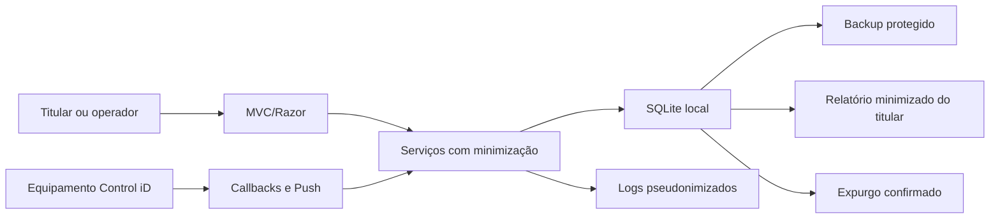

# Privacidade, LGPD e retenção local

> **Documento vivo** · Público: desenvolvimento, segurança e DPO · Responsável: Privacy/DPO · Última validação técnica: 2026-08-03.

Esta é uma revisão técnica de privacidade da PoC. O documento não constitui parecer jurídico nem declara conformidade total com a LGPD. Bases legais, papéis dos agentes de tratamento, contratos com terceiros e RIPD precisam de validação formal do DPO ou do departamento jurídico antes do uso real.

## Escopo funcional

Esta PoC ASP.NET Core MVC integra com equipamentos Control iD para autenticação, catálogo de endpoints oficiais, cadastros, callbacks, monitoramento, fila Push e persistência local em SQLite. A aplicação pode tratar dados pessoais comuns, dados técnicos identificáveis, credenciais e dados sensíveis como foto, biometria, cartões, QR codes e logs de acesso.

## Inventário e classificação de dados

| Dado | Origem | Classificação | Necessidade na PoC | Observações |
| --- | --- | --- | --- | --- |
| Nome, matrícula/`registration`, estado de usuário | UI/API Control iD | Pessoal comum | Necessário para cadastro e consulta operacional | Pode identificar titular. |
| E-mail e telefone | UI/API Control iD | Pessoal comum | Condicional | Deve ser coletado apenas quando o fluxo exigir. |
| Senha de usuário local, hash e salt | UI local/SQLite | Credencial/confidencial | Necessário para login local | Senha em claro não deve ser persistida nem logada. |
| Sessão oficial Control iD | API Control iD/sessão ASP.NET | Credencial/confidencial | Necessário para chamadas oficiais autenticadas | Exibida apenas mascarada; não logar. |
| Shared key/HMAC/certificados/VPN | Configuração local | Secret/confidencial | Necessário para segurança de callbacks/ambiente | Usar User Secrets, env vars ou cofre. |
| IP remoto, IP do equipamento, host, serial, device_id | HTTP/equipamento/API | Técnico identificável | Necessário para segurança, diagnóstico e roteamento | Logs devem usar referências pseudonimizadas. |
| Fotos, imagens faciais e logos com pessoas | Upload/API/SQLite | Sensível quando identifica pessoa | Condicional a fluxos de mídia | Evitar dados reais em PoC. |
| Templates biométricos, fingerprint, face template | API/SQLite/payloads | Sensível | Condicional a fluxos biométricos | Alto risco; requer base legal e RIPD. |
| Cartões, tags, QR codes, PINs | UI/API/SQLite | Pessoal/credencial de acesso | Condicional a controle de acesso | Tratar como credenciais de acesso físico. |
| Logs de acesso, monitoramento, callbacks e Push | Equipamento/API local | Pessoal, técnico e possivelmente sensível | Necessário para QA/diagnóstico | Payload bruto pode conter dados pessoais. |
| Cookies de autenticação, antiforgery e sessão | ASP.NET Core | Técnico identificável/segurança | Necessário para UI segura | Sem evidência de cookies de analytics. |
| Eventos agregados de produto | Middleware HTTP interno | Agregado não pessoal | Medir uso de fluxos e qualidade sem rastreamento individual | Rótulos em lista de permissões; sem usuário, IP, consulta, corpo, carga útil ou dispositivo real. |
| Dados financeiros, saúde, geolocalização, scores | Não encontrado | N/A | Não aplicável | Não introduzir sem requisito e avaliação. |
| Crianças e adolescentes | Não há campo explícito de idade | Necessita validação | Ambíguo | A base de usuários do equipamento pode incluir menores; o DPO deve validar o contexto. |
| Decisão automatizada/perfis | Não encontrado | N/A | Não aplicável | Não há score ou decisão automatizada própria da PoC. |

## Mapa de tratamento

| Tratamento | Finalidade | Origem | Destino | Tela/API/serviço/banco | Acesso/alteração/exclusão | Retenção | Base legal provável |
| --- | --- | --- | --- | --- | --- | --- | --- |
| Cadastro e edição de usuários | Gerir identidades no equipamento | UI administrativa | Access API Control iD | `UsersController`, `users` | Administrador altera ou exclui | Mínimo necessário | Necessita validação jurídica/DPO; possíveis execução de contrato, obrigação legal ou regulatória, ou legítimo interesse, conforme o contexto. |
| Login local | Proteger o acesso à PoC | UI local | Cookie/SQLite `Users` | `AuthController`, autenticação por cookie | Usuário ou administrador | Enquanto a conta existir | Necessita validação; segurança da aplicação e legítimo interesse podem ser aplicáveis. |
| Login no equipamento | Criar sessão oficial Control iD | UI autenticada | Equipamento/sessão ASP.NET | `AuthController`, `SessionController` | Usuário autenticado inicia/encerra pelo `AuthController`; administrador valida/limpa pelo `SessionController` | Curto prazo de sessão | Necessita validação; execução operacional/contratual. |
| Fotos e mídia de usuário | Sincronizar imagem facial | UI/API | Equipamento/SQLite `Photos` | `MediaController`, `OfficialCallbacksController` | Admin cria/remove | Mínimo necessário | Dados sensíveis quando biometria/facial: necessita base específica e RIPD. |
| Templates biométricos | Cadastro/consulta biométrica | UI/API | Equipamento/SQLite `BiometricTemplates` | `BiometricTemplatesController` | Admin cria/remove | Mínimo necessário | Dados sensíveis: necessita validação jurídica/DPO e provavelmente RIPD. |
| Cartões, QR codes e tags | Credenciais de acesso físico | UI/API | Equipamento/SQLite | `CardsController`, `QRCodesController`, callbacks | Admin cria/remove | Mínimo necessário | Necessita validação; controle de acesso/segurança. |
| Callbacks e monitoramento | Receber eventos do equipamento | Equipamento | SQLite `MonitorEvents` | `CallbackIngressService`, callbacks `.fcgi` | Sistema grava; admin expurga | Curto prazo para QA | Necessita validação; segurança, auditoria e operação. |
| Push e resultados | Enfileirar comandos e receber status | UI/equipamento | SQLite `PushCommands` | `PushCommandWorkflowService`, `/push`, `/result` | Admin cria/expurga; sistema atualiza | Curto prazo para QA | Necessita validação; operação técnica. |
| Logs técnicos | Diagnóstico, segurança e rastreabilidade | App/middleware | `Logs/`/Serilog | middlewares, controllers, services | Operador do host | Curto prazo | Necessita validação; segurança/prevenção. |
| Backups SQLite | Recuperação local | SQLite | `artifacts/backups/` | scripts `backup-sqlite`, `restore-smoke` | Operador do host | Apenas enquanto necessário | Necessita validação; recuperabilidade e continuidade. |

Todas as bases acima são hipóteses técnicas. A definição final depende do controlador real, finalidade concreta, titulares afetados, contratos, setor, legislação trabalhista/regulatória e política interna.

## Princípios LGPD avaliados

| Principio | Estado técnico | Lacunas |
| --- | --- | --- |
| Finalidade | Fluxos estão ligados a operação Control iD e QA local | Formalizar finalidade por ambiente/projeto real. |
| Adequação | Dados se relacionam a controle de acesso e integração | Confirmar adequação com política do controlador. |
| Necessidade | Logs foram reduzidos a referências pseudonimizadas; `RawJson` não duplica `Payload` e só preserva um envelope distinto no Push legado | Definir se cada payload remanescente é indispensável em produção. |
| Livre acesso | Não há portal DSAR/self-service | Criar procedimento manual ou automatizado. |
| Qualidade | Dados refletem equipamento/API | Sem processo de correção pelo titular. |
| Transparência | Documentação técnica existe | Aviso de privacidade e informativos ao titular não estão versionados. |
| Segurança | Autenticação local, RBAC, HMAC, limitação de taxa, cabeçalhos, cópias DPAPI e registros pseudonimizados | Validar configuração real, cofre de segredos e fortalecimento do host. |
| Prevenção | Limites de payload, expurgo guiado e mascaramento reduzem risco | Falta procedimento formal de incidente e exercício periódico. |
| Não discriminação | Não há score/decisão automatizada própria | Uso de biometria no contexto real precisa avaliação. |
| Responsabilização | Baselines, docs e checks existem | DPA/contratos, RIPD e evidências jurídicas ainda pendentes. |

## Direitos dos titulares

| Direito | Cobertura técnica atual | Lacuna |
| --- | --- | --- |
| Confirmação e acesso | Admin consegue gerar relatório minimizado em `Privacy/Index` e consultar usuários/eventos no equipamento/local | Canal formal e SLA dependem de DPO/jurídico. |
| Correção | Admin pode editar usuários/credenciais no equipamento | Necessita procedimento de solicitação e registro. |
| Anonimização, bloqueio e eliminação | Existem exclusoes por entidade e expurgo de MonitorEvents/PushCommands | Não há workflow consolidado por titular em todos os dados. |
| Portabilidade | `Privacy/Export` gera JSON minimizado, sem payload bruto | Definir formato final, escopo e segurança para exportação bruta. |
| Informação sobre compartilhamento | Documentação lista Control iD/equipamento e artefatos locais | DPA/contratos e terceiros reais precisam validação. |
| Revogação | Não há consentimento modelado no sistema | Se consentimento for usado, criar registro e revogação. |
| Revisão de decisão automatizada | Não há decisão automatizada própria | Validar uso real do equipamento. |
| Canal e prazo | Não implementado | DPO/jurídico devem definir canal, prazos e responsabilidades. |

## Terceiros e transferências

- Equipamento/firmware Control iD: recebe e retorna dados de usuários, credenciais de acesso, fotos, biometria, eventos e configurações. Papel do terceiro, contrato, DPA e transferência internacional: necessita validação jurídica/DPO.
- GitHub Actions/NuGet: evidenciados para código, CI e dependências; não devem receber dados reais da PoC. Não enviar logs, bancos ou artefatos com dados pessoais.
- Sem evidência de analytics externo, e-mail/SMS/push externo, gateway de pagamento, cache externo ou storage cloud de runtime. Analytics de produto existe apenas como métricas internas agregadas em `/metrics`, conforme `docs/product-analytics.md`.
- Callback signing proxy local e stub de equipamento são ferramentas técnicas; não devem receber dados reais fora de ambiente controlado.

## Retenção, descarte e anonimização

| Dado local | Retenção recomendada | Descarte/controle |
| --- | --- | --- |
| `MonitorEvents` | Mínimo necessário para QA/homologação | `OfficialEvents/Purge` com frase `EXPURGAR EVENTOS`; payload bruto pode conter dados pessoais/sensíveis. |
| `PushCommands` | Até concluir análise do ciclo Push | `PushCenter/Purge` com frase `EXPURGAR PUSH`; payload/resultados podem conter ids e comandos. |
| `Logs/` | Curto prazo local | Logs novos usam referências pseudonimizadas para IP, usuário, equipamento e ids sensíveis; manter fora do Git. |
| `integracao_controlid.db*` | Ambiente local controlado | Não versionar nem compartilhar; tratar como base com dados pessoais/sensíveis. |
| `artifacts/backups/` | Apenas enquanto necessário para reversão local | DPAPI por padrão; não versionar; restringir permissões com `tools/harden-local-state.ps1`. |
| Fotos/templates/cartões/QRs | Mínimo necessário | Preferir dados fictícios; exclusão real exige confirmação humana e base jurídica. |

Não apagar dados reais sem confirmação humana, registro da finalidade e decisão do controlador/DPO. Para dados em produção real, documentar política de retenção, descarte seguro e evidências.

## RIPD e incidentes

O RIPD é recomendado e pode ser necessário antes do uso real porque a PoC pode tratar biometria, fotos, credenciais de acesso físico, monitoramento de acesso e payloads brutos de eventos. A necessidade final depende da escala, da finalidade, dos titulares, do ambiente e do papel do controlador.

Procedimento mínimo recomendado para incidente:

1. Conter acesso ao host, equipamento, banco, logs e backups.
2. Preservar evidências sem copiar dados pessoais para canais inseguros.
3. Identificar titulares, categorias de dados, período e sistemas afetados.
4. Rotacionar secrets, shared keys, sessões e credenciais impactadas.
5. Acionar DPO/jurídico para avaliar notificação a ANPD e titulares.
6. Registrar causa raiz, mitigações, risco residual e decisão formal.

## Controles técnicos aplicados

- Logs HTTP agora registram `IPRef` e `UserRef`, sem IP remoto ou usuário bruto.
- Logs de autenticação local e login/logout de equipamento usam referências pseudonimizadas.
- Logs de sessão, callbacks, Push, usuários, fotos, biometria, cartões e QR codes usam `PrivacyLogHelper` para ids sensíveis.
- Alvo de observabilidade da Access API usa referência pseudonimizada de endpoint, sem host, caminho, query ou sessão.
- Mensagem de sucesso do teste de conectividade deixou de exibir o endpoint bruto informado.
- `Privacy/Index` gera relatório minimizado de atendimento a direitos do titular por ID, matrícula, usuário, e-mail ou telefone.
- `Privacy/Export` exporta JSON minimizado sem foto Base64, biometria bruta, hashes, sessões, payloads, cartões ou QR codes.
- Analytics de produto usa somente métricas agregadas por fluxo/evento allowlist, sem identificador pessoal, IP, session, query string, body ou payload bruto.
- Respostas dinâmicas usam `Cache-Control: no-store`; recursos estáticos versionados preservam cache próprio.
- Testes unitários cobrem estabilidade e não exposição de usuário, IP, endpoint e identificador pseudonimizados.
- `docs/privacy-governance-runbook.md` define RACI, DSAR, RIPD, DPA, retenção e incidente como artefatos verificáveis para decisão humana.

## Regras obrigatórias

- Não versionar dados reais, secrets, bancos SQLite locais, logs ou artefatos de runtime.
- Não copiar payload bruto para docs, issues ou commits quando houver dado pessoal/sensível.
- Mascarar segredos e identificadores em exemplos, screenshots e mensagens de erro.
- Usar User Secrets, variáveis de ambiente ou cofre externo para credenciais e `CallbackSecurity:SharedKey`.
- Validar `AllowedHosts`, shared key, assinatura HMAC e IPs permitidos antes de expor a PoC fora de localhost.
- Limpar `MonitorEvents` e `PushCommands` apenas por ação manual confirmada na UI.
- Preferir expurgo por retenção (`EXPURGAR EVENTOS` ou `EXPURGAR PUSH`) a limpeza total quando o objetivo for reduzir histórico.
- Tratar backups SQLite como dados sensíveis; backups novos são protegidos por DPAPI por padrão.
- Executar `tools/harden-local-state.ps1` no host local para restringir permissões do SQLite, dos logs, das cópias de segurança e das cópias temporárias de restauração.
- Não usar dados pessoais reais em testes, docs, smoke, fixtures ou screenshots.

## Critérios de aceite de privacidade

- Fluxo que grava payload bruto documenta tabela, finalidade e forma de limpeza local.
- Tela que apaga histórico local exige confirmação textual.
- Mensagem ao usuário não expõe stack trace, secret, sessão, IP interno sensível ou payload completo.
- Exemplo versionado usa valores fictícios e placeholders.
- Ambiente não `Development` falha no startup sem `AllowedHosts` explícito, `RequireSharedKey=true`, `SharedKey` configurado e assinatura HMAC quando exigida.
- Log novo que envolva titular, IP, host, device id, user id, biometria, cartão ou QR code usa mascaramento ou pseudonimização.

## Lacunas para DPO/jurídico

- Definir controlador, operador, encarregado e matriz RACI.
- Validar bases legais por tratamento e por ambiente.
- Validar necessidade de consentimento ou outra base específica para biometria/foto.
- Formalizar aviso de privacidade, canal de direitos e prazos.
- Validar contratos/DPA com Control iD, fornecedores de infraestrutura e qualquer terceiro real.
- Confirmar transferência internacional, se houver.
- Aprovar RIPD, política de retenção, descarte, backup e resposta a incidente.

## Fluxo de tratamento

## Verificação de retenção e eliminação

| Categoria | Fonte canônica | Evidência de retenção | Evidência de eliminação |
| --- | --- | --- | --- |
| Usuários locais | `Users` | Política aprovada em `ops.local.json` | Registro de direito/decisão e consulta posterior |
| Sessões | `Sessions` e cookie | Expiração configurada | Logout, invalidação e ausência de sessão ativa |
| Monitor | `MonitorEvents` | Limite e relatório de capacidade | Evento de expurgo e contagem posterior |
| Push | `PushCommands` | Estado e janela operacional | Confirmação administrativa e contagem posterior |
| Logs | `Logs/` e Serilog | Limites por arquivo/quantidade | Rotação observada sem remover evidência ativa |
| Backups | `artifacts/backups/` ou destino externo | Manifesto e política aprovada | Descarte autorizado após janela e restore validado |

A eliminação técnica não deve ser executada automaticamente para atender pedido
sem validação de identidade, escopo, obrigação de retenção e impacto no
equipamento. Toda decisão jurídica continua marcada como dependência do DPO.

## Decisões que exigem autoridade externa

| Decisão | Evidência técnica disponível | Autoridade necessária |
| --- | --- | --- |
| Base legal por finalidade | Inventário e mapa de tratamento | Controlador, DPO e jurídico |
| Prazo de retenção | Tabelas, expurgo e capacidade | Controlador e DPO |
| Uso de biometria ou menores | Fluxos e controles técnicos | DPO/jurídico e responsável pelo contexto |
| Transferência ou terceiro | Destinos e contratos técnicos | Jurídico, compras e DPO |
| Comunicação de incidente | Evidência e guia IR-13 | Incident Commander, DPO e jurídico |

Não preencha essas decisões por inferência técnica. O estado aprovado, a data e
a referência restrita devem ficar em `ops.local.json` ou no sistema de governança
da organização, sem incluir dados pessoais no Git.
