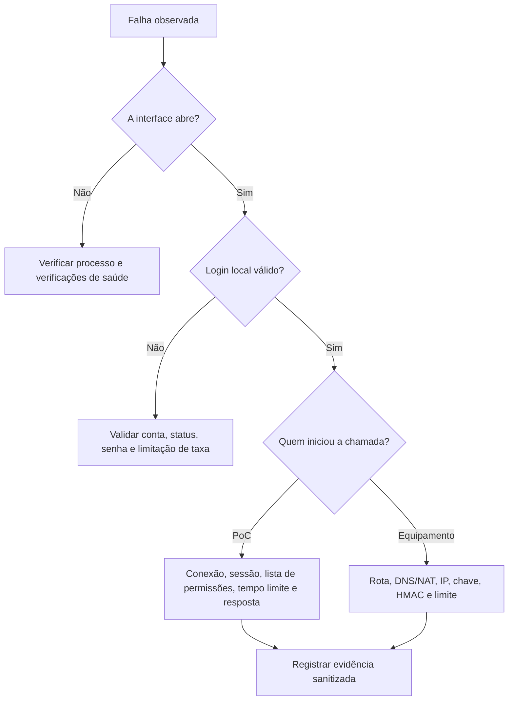

# Diagnóstico da integração Control iD

> **Guia operacional vivo** · Público: usuários, integração, suporte e SRE · Responsável: engenharia de integração · Última validação: 2026-08-03.

Este guia organiza o diagnóstico por sintoma e preserva evidências sem expor
credenciais, sessões, biometria, fotos ou endereços internos. Ele cobre a PoC e a
comunicação com a Access API; defeito físico, cabeamento, fonte, fechadura ou
firmware deve seguir também o procedimento do fornecedor.

## Triagem em cinco minutos

1. Confirme se a pessoa está autenticada localmente e qual papel possui.
2. Consulte `/health/live` e `/health/ready`.
3. Verifique se há equipamento no contexto e se a sessão oficial está válida.
4. Identifique a direção da falha: PoC para equipamento ou equipamento para PoC.
5. Registre horário, ambiente, endpoint, status HTTP, duração e
   `X-Correlation-ID`, sem copiar carga útil sensível.



## Sintomas da interface e da conta local

| Sintoma | Causa provável | Como confirmar | Ação segura |
| --- | --- | --- | --- |
| Redirecionamento contínuo para `/Auth/LocalLogin` | Cookie ausente, expirado ou HTTPS/cookie incompatível | Verificar ambiente, URL usada e horário | Entrar novamente pela mesma origem; corrigir TLS/configuração, não enfraquecer o cookie. |
| “Usuário local, e-mail ou senha inválidos” | Identificador incorreto, senha incorreta ou conta não ativa | Conferir apenas o identificador e o status em ambiente restrito | Usar credencial correta; não registrar a senha. |
| HTTP 429 no login | Limitação de taxa `LocalAuth` | Correlacionar horário/IP sem dado pessoal integral | Aguardar a janela; investigar automação ou abuso antes de aumentar limite. |
| Acesso negado | Conta `Operator` tentou ação administrativa | Conferir papel e atributo `Authorize` da rota | Usar administrador autorizado; não remover o controle. |
| Administrador perdeu a senha | Não há redefinição sem senha atual | Consultar `local-account-administration.md` | Preservar o banco e seguir recuperação aprovada; não editar hash diretamente. |

## Conexão da PoC para o equipamento

| Sintoma | Causa provável | Evidência | Próxima ação |
| --- | --- | --- | --- |
| “Nenhum dispositivo conectado” | URL ainda não foi validada e armazenada na sessão | Painel mostra “Sem equipamento” | Testar host/protocolo/porta e conectar pelo painel. |
| Nome/serial ausentes | `system_information.fcgi` retornou corpo inesperado | Status e tamanho da resposta, sem corpo integral | Comparar firmware e contrato oficial; registrar variação. |
| Tempo limite excedido | Rota, firewall, porta, dispositivo lento ou indisponível | `Test-NetConnection`, duração e log correlacionado | Corrigir rede/serviço; não repetir escrita automaticamente. |
| Circuito aberto | Falhas transitórias repetidas atingiram o limite | Métricas/logs por referência de endpoint | Aguardar a janela, corrigir causa e testar leitura segura. |
| Host bloqueado | Lista de permissões de saída não contém o equipamento | Configuração `AllowedDeviceHosts` | Adicionar somente host aprovado; não desligar proteção contra SSRF. |
| HTTP não 2xx | Credencial, sessão, endpoint, licença ou carga útil recusada | Status e resposta minimizada | Consultar `api-error-catalog.md` e a página oficial do endpoint. |

Comandos não destrutivos:

```powershell
Test-NetConnection <host-do-equipamento> -Port <porta>
Resolve-DnsName <host-do-equipamento>
$env:CONTROLID_DEVICE_URL = "http://<host>:<porta>"
$env:CONTROLID_USERNAME = "<usuario-autorizado>"
$env:CONTROLID_PASSWORD = "<senha-autorizada>"
powershell -ExecutionPolicy Bypass -File .\tools\contract-controlid-device.ps1
```

O script físico valida login, sessão, informações e logout. Execute somente em
bancada autorizada; variáveis reais permanecem fora do Git.

## Sessão oficial inválida

1. Confirme que a sessão ASP.NET ainda contém um equipamento.
2. Abra a validação de sessão, que consulta `session_is_valid.fcgi`.
3. Se inválida, faça novo login oficial em `/Auth/Login`.
4. Se o login falhar, valide credenciais no equipamento e versão do firmware.
5. Não reutilize uma `session` copiada de outro navegador ou ambiente.

A sessão Control iD deve ser reutilizada nas chamadas, mas sua validade é
definida pelo equipamento. A documentação oficial trata `login.fcgi` como a
origem da sessão: [fazer login](https://www.controlid.com.br/docs/access-api-pt/gerenciamento-secao/fazer-login/).

## Callbacks e Monitor não chegam

| Verificação | Resultado esperado |
| --- | --- |
| URL no equipamento | Host, porta e caminho apontam para PoC/proxy alcançável. |
| Rota | O tópico existe em `/api/notifications/{topic}` ou no callback `.fcgi` esperado. |
| DNS/NAT | O equipamento resolve e alcança o endereço; `localhost` não aponta para o servidor remoto. |
| IP permitido | A origem observada está em `AllowedRemoteIps` ou é loopback permitido somente no laboratório. |
| Chave/HMAC | Headers, timestamp e nonce foram gerados pelo proxy/origem confiável. |
| Corpo | Está abaixo de `CallbackSecurity:MaxBodyBytes`. |
| Banco | `/health/ready` confirma SQLite disponível. |
| Limitação de taxa | Não há rejeição 429 por excesso de eventos. |

Status comuns no ingresso:

- `401`: chave compartilhada ausente ou inválida;
- `403`: IP/origem não permitida ou assinatura rejeitada;
- `409`: timestamp/nonce repetido ou capacidade anti-replay atingida;
- `413`: corpo acima do limite;
- `429`: taxa excedida;
- `500`/`503`: falha interna ou persistência indisponível.

Quando o equipamento não produz HMAC, use o proxy assinador. Não desative
assinatura fora de `Development` para contornar a rejeição.

## Push parado ou duplicado

1. Confirme que existe comando `pending` para o `device_id` esperado.
2. Verifique se o equipamento chama `GET /push` na periodicidade configurada.
3. Resposta `{}` significa que não há comando elegível; não é erro.
4. Após a entrega, o estado passa para `delivered`; o equipamento deve publicar o
   resultado em `POST /result`.
5. Use `command_id` ou chave de idempotência no resultado para evitar registros
   duplicados.
6. Não crie retentativa automática de comando físico sem confirmar idempotência.

Consulte `push-implementation.md` para estados, concorrência e segurança.

## Modo on-line entra em contingência

Em Pro/Enterprise, três falhas de comunicação consecutivas podem levar o terminal
à contingência, conforme a documentação oficial e o valor configurado. O banco
local do equipamento precisa estar atualizado para autorizar com segurança.

1. Corrija a disponibilidade do servidor e da rota de retorno.
2. Garanta resposta HTTP de sucesso a `/device_is_alive.fcgi`.
3. Confirme a notificação de mudança de modo pelo Monitor.
4. Releia `online`, `local_identification` e `server_id`.
5. Reconcilie acessos ocorridos em contingência.

Siga `equipment-contingency-runbook.md` para continuidade física.

## Resposta inesperada ou JSON inválido

- Preserve status, `Content-Type`, tamanho e identificador de correlação.
- Não cole corpo completo se ele contiver usuário, cartão, foto ou biometria.
- Compare o modelo/firmware com `device-compatibility-matrix.md`.
- Valide o endpoint no catálogo local e na documentação oficial vigente.
- Registre como divergência de contrato; não invente campo ou conversão silenciosa.
- O invocador mantém resposta bruta quando possível, mas consumidores de JSON
  devem tratar documento nulo.

## Ação física retorna sucesso, mas nada acontece

1. Confirme se o produto usa `door`, `catra` ou `sec_box`.
2. Verifique número de porta, sentido, relé, SecBox e tempo configurado.
3. Confirme licença, modo e firmware.
4. Observe sensor/relé e evento de Monitor, não apenas HTTP 2xx.
5. Revise cabeamento e alimentação com responsável físico.
6. Não repita indiscriminadamente; uma segunda execução pode liberar acesso.

## Verificações da PoC

```powershell
dotnet build .\Integracao.ControlID.PoC.sln --no-restore -v:minimal
dotnet test .\tests\Integracao.ControlID.PoC.Tests\Integracao.ControlID.PoC.Tests.csproj --no-build -v:minimal
dotnet test .\tests\Integracao.ControlID.PoC.E2E\Integracao.ControlID.PoC.E2E.csproj --no-build -v:minimal
powershell -ExecutionPolicy Bypass -File .\tools\contract-controlid-stub.ps1
powershell -ExecutionPolicy Bypass -File .\tools\observability-check.ps1 -OfflineValidateOnly
powershell -ExecutionPolicy Bypass -File .\tools\scan-secrets.ps1
```

## Evidência para escalonamento

Registre somente:

- data, fuso, ambiente e commit;
- modelo, firmware e classe de licença, com serial pseudonimizado;
- endpoint/método e finalidade;
- status HTTP, duração, tamanho e `X-Correlation-ID`;
- direção do fluxo e topologia;
- resultado das verificações de saúde e do contrato seguro;
- hipótese, ações tentadas e resultado;
- localização restrita da evidência detalhada.

Não registre senha, chave, `session`, cabeçalho de autorização, carga útil integral,
foto, template biométrico, cartão ou QR Code. Incidentes seguem
`incident-response-and-dr.md`.
