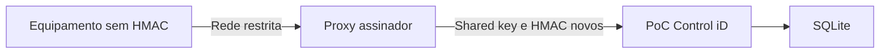

# ControlIdCallbackSigningProxy

> **Guia de ferramenta vivo** · Público: integração, AppSec e operação · Responsável: engenharia de integração · Última validação: 2026-08-03.

Proxy local para equipamentos Control iD que não conseguem gerar assinatura HMAC nativamente.

O proxy recebe chamadas do equipamento em uma interface de rede restrita, valida IP remoto e chave opcional de entrada, assina a requisição com `X-ControlID-Signature`, `X-ControlID-Timestamp` e `X-ControlID-Nonce`, injeta a chave compartilhada esperada pela PoC e encaminha para a aplicação.

Antes de encaminhar, o proxy remove headers sensíveis recebidos do cliente e insere uma assinatura nova. Assim a PoC continua exigindo `CallbackSecurity:RequireSignedRequests=true` mesmo quando o equipamento não sabe assinar. Respostas acima de `Proxy:MaxResponseBytes` são bloqueadas para reduzir risco de consumo excessivo de memória.

## Execução

Configure segredos fora do repositório:

```powershell
dotnet restore .\tools\ControlIdCallbackSigningProxy\ControlIdCallbackSigningProxy.csproj --locked-mode
dotnet user-secrets set --project .\tools\ControlIdCallbackSigningProxy\ControlIdCallbackSigningProxy.csproj "Proxy:SharedKey" "<mesmo-segredo-da-poc>"
dotnet user-secrets set --project .\tools\ControlIdCallbackSigningProxy\ControlIdCallbackSigningProxy.csproj "Proxy:ForwardBaseUrl" "http://localhost:5000"
dotnet user-secrets set --project .\tools\ControlIdCallbackSigningProxy\ControlIdCallbackSigningProxy.csproj "Proxy:AllowedRemoteIps:0" "<ip-do-equipamento>"
```

Depois execute:

```powershell
dotnet run --project .\tools\ControlIdCallbackSigningProxy\ControlIdCallbackSigningProxy.csproj --urls http://localhost:6700
```

Configure o equipamento para chamar o proxy, não a PoC diretamente. Mantenha firewall/rede permitindo que apenas o equipamento alcance o proxy.

## Topologia e fronteira de confiança



O proxy é um adaptador de compatibilidade, não um gateway público. Ele deve ficar
próximo do equipamento, aceitar somente IPs conhecidos e encaminhar apenas para
uma URL fixa da PoC. Em rede não confiável, TLS e autenticação de transporte
devem ser terminados por infraestrutura aprovada.

## Configuração

| Chave | Padrão | Finalidade |
| --- | --- | --- |
| `Proxy:ForwardBaseUrl` | `http://localhost:5000` | Destino fixo, sem credenciais nem query |
| `Proxy:SharedKey` | sem padrão | Segredo usado com a PoC; obrigatório |
| `Proxy:InboundSharedKey` | vazio | Defesa adicional entre equipamento e proxy |
| `Proxy:AllowedRemoteIps` | vazio | Allowlist de origens; fora de bancada, deve ser preenchida |
| `Proxy:AllowedPathPrefixes` | callbacks e Push oficiais | Reduz a superfície encaminhada |
| `Proxy:MaxBodyBytes` | 1 MiB | Limite normalizado entre 1 KiB e 10 MiB |
| `Proxy:MaxResponseBytes` | 5 MiB | Limite normalizado entre 1 KiB e 25 MiB |
| `Proxy:AllowLoopback` | `true` | Facilita bancada local; reavalie em host exposto |
| `Proxy:ForwardTimeoutSeconds` | 15 | Timeout de encaminhamento |

Os nomes de headers são configuráveis, mas só devem mudar em conjunto com a PoC.
Antes do encaminhamento, headers de autenticação recebidos são removidos e
substituídos por `X-ControlID-Callback-Key`, `X-ControlID-Signature`,
`X-ControlID-Timestamp` e `X-ControlID-Nonce` novos.

## Modelo de ameaça e limitações

| Risco | Controle | Limite residual |
| --- | --- | --- |
| Origem forjada | IP permitido e chave de entrada opcional | IP não substitui segmentação de rede |
| Replay | Nonce e timestamp assinados para a PoC | Relógios precisam estar sincronizados |
| SSRF | Destino fixo validado no startup | Comprometimento do host continua crítico |
| Payload excessivo | Limites de request e response | Valores precisam acompanhar o contrato real |
| Path arbitrário | Prefixos permitidos | Nova rota exige revisão explícita |
| Vazamento de segredo | User Secrets/variáveis fora do Git | Rotação é operacional e humana |

Não há alta disponibilidade, descoberta de serviço ou armazenamento de fila no
proxy. Se ele ficar indisponível, o equipamento não consegue entregar callbacks
por essa rota.

## Diagnóstico

| Sintoma | Verifique |
| --- | --- |
| Startup falha | `SharedKey`, URL absoluta e lista de prefixos |
| HTTP 403 | IP remoto, loopback e chave de entrada |
| HTTP 404 | Prefixo do caminho permitido |
| HTTP 413 | Limite do corpo recebido |
| HTTP 502/504 | Disponibilidade da PoC, timeout e limite da resposta |
| PoC rejeita HMAC | Mesmo segredo, relógio, bytes encaminhados e nomes dos headers |

Logs e tickets devem usar correlation ID, caminho e status; nunca inclua chaves,
headers de autenticação ou corpos pessoais completos.

## Verificações

```powershell
dotnet build .\tools\ControlIdCallbackSigningProxy\ControlIdCallbackSigningProxy.csproj --no-restore -v:minimal
dotnet format .\tools\ControlIdCallbackSigningProxy\ControlIdCallbackSigningProxy.csproj --verify-no-changes --no-restore -v:minimal
```

## Execução como serviço

O repositório não fornece unidade `systemd`, serviço Windows nem imagem exclusiva
do proxy. Ao promovê-lo, execute com identidade sem privilégio, reinício limitado,
TLS terminado em proxy confiável, segredo em cofre e acesso de rede somente entre
equipamento, assinador e PoC. Registre versão e configuração sem valores reais.

Não existe endpoint de saúde dedicado. A vivacidade deve observar o processo; a
prontidão deve usar uma chamada canário permitida e não sensível até a PoC, com
limite de frequência. Rotação exige atualizar assinador e PoC na mesma janela,
validar uma assinatura e revogar o segredo anterior sem registrá-lo.
